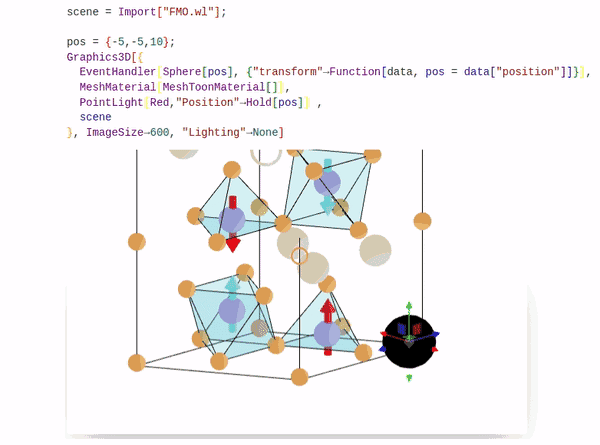
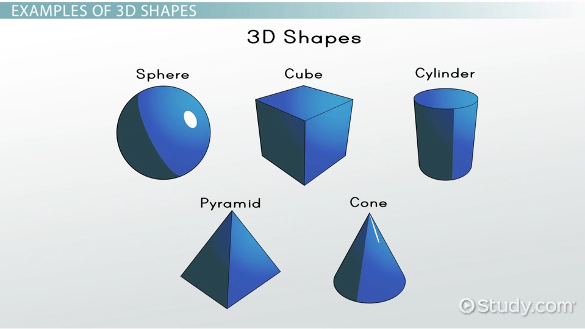
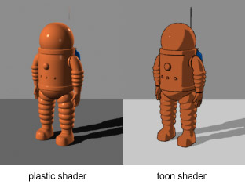
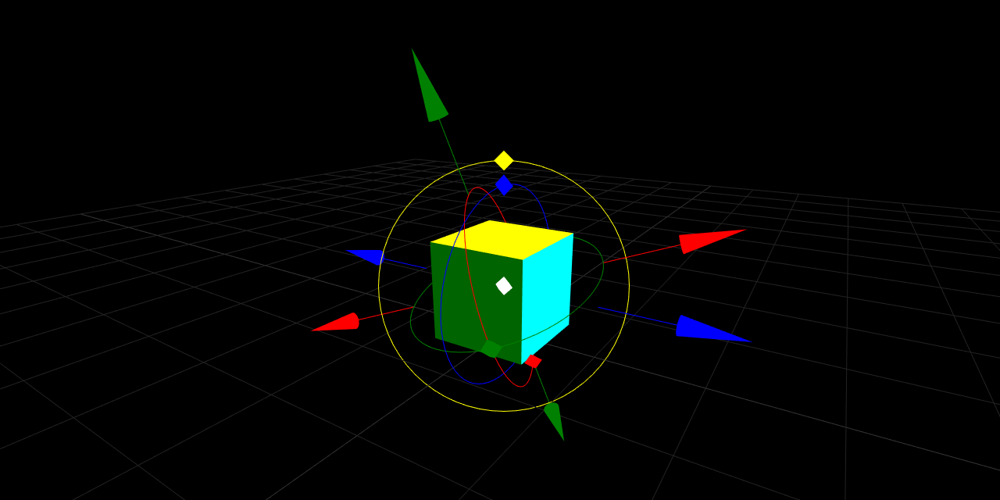
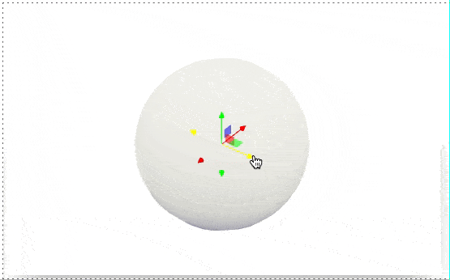

Every feature I introduce comes from the practicing on real-life cases. Recently I had an urge to make a nice figure for the Physical Review B paper.

In this post: __shadows__, __light-sources__, __toon-shading__, __transformation control__...

<!--truncate-->

import Component from '@site/src/components/wljs-notebook-react/includes';
import Notebook from '@site/src/components/wljs-notebook-react';

<Component>
https://cdn.statically.io/gh/JerryI/Mathematica-ThreeJS-graphics-engine/master/dist/kernel.js
</Component>

## Shadows
Firstly, to depict a crystallographic structure is not a big deal. Using materials.project one can obtain `.cif` file and easily parse it using Wolfram Language. With a bit of a crystallography knowledge one can show ions as sphere with arbitrary colors and sizer for your taste 

<Notebook code="H4sIAA1EwGQAA+1de2/bRhL/KoT+yR0gMvvi7jJNA7Tu43pwH0iDO+Bso6Ak2mYriwIlxwmCfPf7zVK0RJGSJduyc7iV3VrkLmdnZ+e1sz+2JycnPZbYkTY6C2MTn4cqZixMrByE6pwNY8GkVTLu9U96P5bp9DIfzuR3dHWcz+b09/fLdFTczHr9eXmdneHGb0U+mR/nF5eu+e31OOv1ey9+K2b5PC8mL5bPhnE/7vP47Iyeqsm9wwh/TbIZCApWNUxAYNmh+svoJ4qXT4ZxpLSRWqhYGWlia+N+KCMe69hKjov9eidRImRi7fIRGrH7boMy6+tIcsm1ljqpPnd3uPdoD5/1srPq4na3R9qc3kPA9x1qV4HesS67C8fp649ZcZXNy3z4rkwns/OivEpJvVc19W1xfXFZqbLT5LfZ+TgbzvP3+fwjbkXgbnI9Hrd0+6T36zQdLjrxhnXckv7x26NiXJTUI2bCKvyVyiol8CUxlsduZr9PL7NyxXpCHllBE+Qxj03Ckzhpz1HgViK01pBV9QGjbt6PwICMtFIJs5JJjkGTfqgipZhNBLwQPI8WsclCrvshi4yNpRRy8RHJ/bh4DK4XYhNggouYKWVqsWkJWTrhESkbCy1YLJUwSWIT/XwcV3LmDOxq/KMEzI9FjD4QfLXe0gijk34cscSgm+P7jqWGduBpq4VBmEgsJy1evcGwoizCAvNEM4PAwTFILDtZBDVGY8LYBMRrpe7zKI4To4kXY42QSvVNxESCCcfQDimIO/0k3GHJGWdaMWYEExwfPNqUXwxNYFAFAcdiQNWxyGFBT8elimKYpyT9s9wYmA1EmGjLoSBQxQRG/qz8tdZY9VVkcANi1UpwKGD8bEsMG9GQEYwJHMHpG9Wy6udjrrWyD11Y4kYaF1E2jAc3oCAOzXQsbYLUDKyaRHKRGDAgDEsQQ2GZGMxa7aKocxe1h64/92NAwvZhZ5YhCkgGhWmvBrSHw/vB7hDaFww4H7s/B/diESscG80ThSU1gkNzoM06RmBgBqFUCY2Hn5XDjlWER3DLCMaZYxEB/oDLyKOEx0IhpivDtEWe0Q48teM8IButpRJYGNKlmFtEFiGNZPx510pEBgNDbwQ4tAlTbqmwalIrMOxUCiagkXkY4/IgwRhIPZaI2uOryCpjRZLE8FC08Tvk8LgvGTQVaTpFWJhQR74tSCbIDmPkogbeGmlVlVU9KQ8WwyFI8FoKLgw8DgcxvLpBJo5UVyHnYQaL0J0PP5Yc7qkrCEZK61hYxiziEnlijWQYWyaYFLhV7MBrtRsLB1yqtr08pbnS1h/ylXDs5MIQIR9PtkTbRkwiSmjOdSKQnj2ipa9vrLHpaxmZOdjkdhz+cPPvqjwcbiXbYz3hylLAeL6F7Rz9kOvKMKAUlPjV1Jl5ar09IAddyvSUE+5cz0MysFOZJ46wn0OsQZxDKHg8Ye+WihwwIYtBRydSMpRfONbBbqzNHTQpbUV5LMuzZxpdPBw01WhxgI0mtjFUOFCLXOOpZdDm4IAS2KN+yWEljCntDJKqIKiI3isxXu2xUoHHrLaW++tjsaPiajrOPrTPqmgzimqXQhkn5tiLo/q9nroiQFI3eADYulTgF7LXcG3baHQaxjYiCwHy2zMAjj0HtuutyqbS8HbaUjEjkTHiJwrPCSpVUqglNbRBO6zEBhpbRgU9pBS1Y/yNkq+ORboqaeurRyu00z0iuHKE2DtOy4us1zxCWT1PVH2x4G/1LooFHXd5X3XclZ13eb/WuCZd3N0wZ8wmhgTpVIjOUMcfL1ZPk8DngqdWExjY1ITxNj8liHH6PPx4yEk9v8og8QeaSodS2ciiAmqxyTLQXRHz+nxom6I3jQVF5pat7E9i3d4Qqu802qbBIWiivgnX3XJldPyBXKbL4L5k83EK3WES3ebTZWrdBrjF1O5lPlsM4X6WheI0Md40nwcdbj44yvDIiAQRG+kjjgSQHWPrtT4+QB4YHrqtGekiBjYUMRt6b7UifUSYhyUq7cocVEBWUGGJ1DuW+xFwtas1CqR8m0mQnVEOnMC0kGwI5F8bIxTRNshFLQq6yMlRw1090wczCtksFWjgVLRcPEBVG6oPywQhEMzsTWRBQ6Kc7jLhuKqzr9P4kk3X6e/Oka/bzLuMtNugsZnppFvLqNm3i67e4D7q865m365ZxNT3Xu6DguWWEFux22rCnDd7lnqSrSbMc1MTDm42EcTcNhNE9NsQ6fdHNDzcT607CGdNDfeg2i6qARRqU2h5GBjkNhLrvpI79wmHgDs4XeWo8Cq4yu1EWn7BpeRrjqG6t9G5dNBY908CWcZW/7TuLp2D3pBf/K95qU3+qNvquz3aPilKtz/qGg0m3Dlat0/s4qG22PW+a4jIPZKcWi6tJuReCxY6mur5dTiV2vF3jFXPqTOh2kAQc9v0FPyhc88dCdV9UEwVmRVN406XvynL4uYyS0eEyUPm3vyQx3OGtSpynBKvrsa760HmqLQ9G7hNmOFCwHcKZuGbKm4B2uDwJ0CZYBsDp0BpGTAV5CPq9G85wu5EYuBNmkSo7sHdDn0Ll/D8Gj7CMirwcIACkF3B9WsF6gkQAjQAao9wFKKRourG1n8nGsC6cOR/VJ5yH+zqah6bUm75mrulDE/HLMAvlHlV8kGs0sZSBQh+FA4d43AqJAMDQH4eaC7gY/alAtTNWgjcS8ooZivkiwpYnlsJkdQA2YE/hmPHPRwnArzjmGxJ+M7ncWS/+vyKdJuqDue/+nFKTeDTlUiEH7ejWYK2HYg7n1zg6y8FfFTVmNlzmeohkOIoEhBcXIV2kPEwHiKYQGUybDMOARfHEnm4uIeLe7j4mm57uLiHi3u4uIeLe7i4h4t7uLiHi3u4uIeLe7i4h4t7uLiHi3u4uIeLe7i4h4t7uLiHi3u4uIeLe7i4h4t7uLiHi3u4uIeLe7i4h4t7uLiHi3u4uIeLe7i4h4t7uLiHi3u4uIeLN7n0cHEPF38QXByoChSnYxuK1IhQDYaDMDXyPOTnAy5HSToaDZw7e/T/ujhHeckDxj1g3APG13TbA8Y9YNwDxj1g3APGPWDcA8Y9YNwDxj1g3APGPWDcA8Y9YNwDxj1g3APGPWDcA8Y9YNwDxj1g3APGPWDcA8Y9YNwDxj1g3APGPWDcA8Y9YNwDxj1g3APGPWDcA8Y9YNwDxj1gvMmlB4x7wPj9AeNoPen9UBaT+feT0VGZpfPsKBuPCeP9ekbg1mISDMfpbPb1aW+IhvAG+cA0K4NzeiabjMJJMcpOe0Ewm38cZ+hVVJW2VwH/6rT35nQS4PN6lL+/JTMviiUZejqcZXNiaxambsDZkjj1nQXu32FJ3GOkoWubZ6N8ng7ckOfpeAYe3tBQQTVi/WmPjBu3fDV6Dq7n85XZDuaTNe7K7Kp4nxXX8+k18TH/OKXBq8e28tUezA04e38RvM+zm2+LD+jMAhYI+gWpWpY3+Wh+CUna6YevgsuMBFBfDcnSXgXlxSD9G7Q9QJIQwIsE8IJ/h+CD83w8BoUJ1hlXH67GE5rU5Xw+ffXy5c3NTXQjo6K8eAlDYi/ByUY2HavTdH4ZjEDg54CrQAfjILSBDdwVft1laB3nZfEXsT68LktIwzmE2/uhmxBaYYbLm2PEy2E6xe2yuJ6Mmg1/4v2DZcub1y+JlU0SpYl0Le3LapEqBVn53EcLpuP042FWn2v8glRa5ml4mY9GGc2cXsRYrueaWHdZ19u5jMr04g/c+uOP30m/Rj+B52/TWRZmaXI9/jNkwbJHfv3L2+K8QxXjhiq6qztUcTe9gh4JpLLW/gvAQToNPFKBiIS0TAQA1QC5C+lEOEkUMtDU0Vi0SwA5+TFHxmxxF3sdGR+BDk4bA4O0G6GVyNKljQCfEyKo+iY4ncN24bimxBE/AL0+uh0JhRbsRAJwJSNgJelLxd5/DqyEr1/CQTX6nE6qe/j7IDe6o5LSIGvs7+9Ed7aOLYaGN5UewXcK1vKdB/SOnAXyPVc/cxNw9g+56hAvSuc3vgxHeB/HB49EwjpE2IOpq02Or2boC/KB+4fjO7WnHmJeF2BeBbNhOs7+JiLm4rlTLwBshZEKzgxu0agjHaGIoRCJq2vnGDncm43oNl0DEM85OT8k7vExx+knUOsBZZk4ijjCNRDEcHMRknoDt4f9Ei4UaiRJfSEsdmrUMw5kRPhf182Rh6eGJ4VH1pK+HyXwntYki/uS2dh9h4NNyOOiOkXPEMJdwPMCfu98Oeo29ljgxQLAeOvmI4DzUEdZPi6AJgfE3pGGQ5ecETvgC88Bde/u09smODZesrm4vp3D7fVigjgAR41pOXtUjHBCVEvnGAAKnNmQNJ30KDg4Xki62KkhLCEesFXpN1bnrkixp5HWQWD9ug4YpxP6abnrhXnWkQKalJMq2cwMxLlNwvMRx/9USGUyxCGgDLMEMhEDBbURDbVdY2ba3BVMU1gNVQqXMWd5KyD1xcXFmuvfmZEwDPOJS7pJoNuC07hIR1np/GWw8j3MR2PySOsydM9flntxMsrG+dVp72WnbBYLcLs0iy3UG/ee7DezWTHMbyur9bu0+QitvRe7DP/CVdbqB2f5Bb2A23txcVnM5jdlPsd0hzYesmY/8tiunxNis22UzlPXNhtmkNnXwU9X06Kcn/yQj7Nf0qvsn4g6J5/qDeJ3eYkJFeXHk7M+VhUTyubIK+j7v4+rvz/8/Gt0Mz7tfT47++p0snzJ+OTT4tXik3fuzeJg+WLxySnKR9X7xKe98M2n2zeJP6Ob4+tzP6j3ruEb2rqeNWcxvMzHlRQX31YboYgwANdaf11tnmQfqsbqS+PJMntfPee+NJuK6WzbqlZhDD2ctje24S9G+Yx2ERXDiLFXOfb25drizrEVr1YNuos2R2HDTr1OGRfqt49xVtvZkDpuM9NMmUGKWnRoRJqGqGHIMB1kaZhlg0FsUzZKtYJx1JvjFTu9ta8dSSzs69azVX5tBwPahf4DDaia3gYLqtfm+w/Z8NrlQlDsXd7GP+39X6rzWf/T57P/Aivuq4wQnQAA" name="ghostwriter-c85c0">ghostwriter-c85c0</Notebook>

Ok, definitely, we __do not need spheres to cast shadows__...
Ah, by the way, some new features comes

:::info
```mathematica
Shadows[True]
```
Allows group of objects to cast shadows or receive them from the `PointLight`, `SpotLight`, `HemisphereLight` sources of light in the scene
:::

## Light sources
To define some custom light-source

:::info
```mathematica
PointLight[RGBColor[], intensity_:1, ..., "Position"->{x,y,z}]
```
Adds point light source ([see THREE.js](https://threejs.org/docs/#api/en/lights/PointLight))
:::

:::info
```mathematica
SpotLight[RGBColor[], intensity_:1, ..., "Position"->{x,y,z}, "Target"->{0,0,0}]
```
Adds spot light source ([see THREE.js](https://threejs.org/docs/#api/en/lights/SpotLight))
:::

:::info
```mathematica
HemisphereLight[SkyColor_RGBColor, GroundColor_RGBColor, intensity_:1]
```
Adds hemisphere light source ([see THREE.js](https://threejs.org/docs/#api/en/lights/HemisphereLight))
:::

The position and target object support dynamic updates, i.e. one can do
```mathematica
PointLight["Position"->(pos // Offload)]
```

:::tip
To have more control over the lighting, disable the default one in the scene
```mathematica
Graphics3D[..., Lighting->None]
```
:::

Let me continue with a figure. __No shadows__ and __only point-light source__

<Notebook code="H4sIALtGwGQAA+Vbe2/bRhL/KoT+SQ8Q6X1xd5mmAVr3cT24D6TFHXC2UdAibbOVRYGi7QRBvvv9ZilKpEjJkmzZOZR2YnG5nJ2dx29mZ1enp6cDlSTiUoapn8jowlfRpfatGnE/joyNWJKy8OJyMDwd/FDE0+tsNJPf0t1JNivp7695NilPsqtrd/fudpwOhoNXv+azrMzyyatlV5+zoR8OeXh+ft54/3eQ/GuSzmaDoWDVgwlILDtUfxn9BOHyTT8MlDZSCxUqI01obTj0ZcBDHVrJcbNb7yiIhIysXb5CI/a3tiizoQ4kl1xrqaPqerjD3qM9ftbLzqqP2+1e6XK6h4D3HWpbgT6gl+2F4+z1hzS/ScsiG/1exJPZZV7cxGTgTUt9l99eXVem7Cz5XXo5TkdldpeVH9AUgLvJ7Xjcse3TwS/TeDTvxFvesSD9wzfH+TgvqEfIhFX4K5VVSuAD/JSHbma/Ta/TouE9Pg+soAnykIcm4lEYdeco0BQJrTVkVV1g1M37CRiQgVYqYlYyyTFoNPRVoBSzkWCRDRnTIjSpz/XQZ4GxoZRCzi8R7cfFU3A9F5sAE1yETClTi01LyNIJj0jZUGjBQqmEiSIb6ZfjuJIzZ2BX458ScD8WMLog+Erf0gijo2EYsMigm+P7AVXDOvC21cKoEArjZMXNBgaNsgAK5pFmxip4HEjLXhZBjdGYcDYB8VqphzwIw8ho4sVYI6RSQxMwEWHCIaxDCuJOPwt3UDnjTCvGjGCC48KrbfmFsAQGUxAAFgOqjkUOD3o+LlUQwj0l2Z/lxsBtIMJIWw4DgSlGcPIX5a+jYzVUgUEDxKqV4DDA8MVUDB/RkBGcCRwB9I3qePXLMdfR7GMVS9xI4yLKmvEAAwri0EyH0kZIzcCqiSQXkQEDwrAIMRSeicGs1S6KOrioEbq+9mNAwvfhZ5YhCkgGg+lqA9bDgX7wO4T2OQMOY3fnYC8WoeHQaB4pqNQIDsuBNesQgYEZhFIlNF5+UQ57tAhEcGoE48yxiAB/QDXyIOKhUIjpyjBtkWd0A08NnAdko6MqAcWQLYXcIrIIaSTjL6srERgMDLsR4BArK+VUBa1JrcCwMym4gEbmYYzLgwRjIPVUIuqOrwKrjBVRFAKhBPRyyOHRLhksFWk6RVi4UE++LUgmyA5D5KIGaI20qsqqnpUHi+EQJHgtBRcGnoaDEKhukIkj1VXIeZiBEvrz4aeSw562gmCktA6FZcwiLhESayTDWDLBpcCtYgfW1XYsHFBVXX95TnelpT/kKwHsBGGIkE8nW6JtAyYRJTTnOhJIz57Q01cX1lj0dZzMHGxyWw5/uPn3VR4Op8nuWM+oWQoYL6fY3tEPqVeGAaWgxK+mzsxz2+0BOegzpueccK8+D8nAVmWeMMB6DrEGcQ6h4OmEvV0qcsCELAQdHUnJUH7h0INdW5s7aFLaifJQy4tnGn08HDTV6HCAhSaWMVQ4UPNc47ll0OXggBLYoX7J4SWMKe0ckqogqIjulRg3ezQq8JjVxnJ/vQ92nN9Mx+n77l4VLUZR7VIo44Qca3FUv1dTVwRI6gYEgK9LBX4hew1o20Sj1zE2EZkLkC/2ADjWHFiudyqbSgPttKViRiRDxE8UniNUqqRQS2p4BuuwEgtoLBkV7JBS1J7x10q+2hbpq6Stao80tFUbEWxsIQ5O4uIqHbS3UJr7iWoo5vw1W1Es6GnlQ9XTKntb+bC2uDZdtK6ZM2YTQoK0K0S7qOMPV83dJPA556nzCAyse4Tx1r8liHG6Hr895KSe3aSQ+CNdpceobGBRAbVYZBnYrgh5vT+0ydDbzoIic8dXdiex6m8I1Q86bdvhEDRR3wR0d6CMtj+Qy/Q53OfsPs6ge1yi3336XK3fATe42l7us8ER9vMsFKeJ8bb7PGpz89FRhgdGRIjYSB+xJYDsGEuv1fG1Gx62rRnZIgY2FDFbdm+1IntEmIcnKu3KHFRAVjBhidQ7lLsRcLWrFQpkfOtJkJ9RDhzBtZBsCORfayMU0TbIRS0KusjJUcNt7umDGYVslgo0ABUt5y9Q1YbqwzJCCAQzOxOZ05Aop7tMOKzq7Ks0PmfXdfa7deTrd/M+J+13aCxmeunWMmr37aOr18BHvd/V7ts3i5D67gUfFCw3hNiK3c4jzHk9stST7DzCPNc9wsbNOoKY23qCiH5rIv3uJxoej1OrAOG8qQUPqgtRrYNCXQodhIFDbiKxipXcwScAAS3YXeWo8CpA5WYiHVxwKfkKMFRta8Glh8YqPglkGRvxaRUuHUCvyS/+31BqHR71e30/ou2SovTjUd9ocOHe0foxsY+H2mNX+66ciNwhyanl0nmE3GvOQs+jen49oFIDf89Y9Zx6E6o1BDG3dW8BDx089yRU+5xiqsg0LI07W/66KPL76zRO6EweMvf2RYjnHKspcuwSN7Xx++1F6qh0kQ3cRsxwIYCdgllgU8UtDm1w4AlOmWAZA1CgtAxnKggj6vRvOcL2REKcN2kToboHdyv0DVwC+TUwwjIq8HAcCkB2BejXCtQjnBCgAVB7BFCIVoqqW0v/rWjgrAtH/kflKXdhVVfz2JZyB2seljKQjlkcfqHMq5IPYpXGCWWANHAUgI5xOBWScQaAcB6nuXA+ZlcqOHWzEgJ3kjKK2Qr5osJZnoWESGo4sgM8BrCjDduJOLzjmOxI+MH3sWXffL8h3bapA/yblzNqOnzaiET4cSua5bFtd4w7m1zh4885MKp6ejr4vsgn5XeT5LhI4zI9TsdjOuP9ZkaHW/OJNxrHs9lXZ4MRHvj3yAemaeFd0jvpJPEneZKeDTxvVn4Yp+iVV5W21x7/8mzw9mzi4XqTZHcLMmWeL8nQ2/4sLYmtmR+7AWdL4tR35rn//YK4x0gj96xMk6yML9yQl/F4Bh7e0lBeNWJ9dUdGw4KvVs+L27JszPainKxwV6Q3+V2a35bTW+Kj/DClwavXNvLVHcwNOLu78u6y9P6b/D06M495gn5BqpblfZaU15Cknb7/0rtOSQD13Yg87bVXXF3EX8DaPSQJHlDEAwr+A4L3LrPxGBQm0DPu3t+MJzSp67Kcvj46ur+/D+5lkBdXR3AkdgRO1rLpWJ3G5bWXgMBPHlee9saebz3ruTv8ulvfOs6L/C9ifXRbFJCGA4RFu+8mhKdww2XjGPFyFE/RXOS3k6T94E98/2D55O2bI2JlnURpIn2qPaqUVBlI49rHCqbj+MNhtM81fkEqLrLYv86SJKWZl8UtaXCuzxWxbqPXxVySIr76A01//PEb2VfyI3j+Jp6lfhpHt+M/feYte2S3P7/LL3tMMWyZort7wBS3syvYkUAqa+2/cXCQdgOPlScCIS0THg7V4OQupBNgJ1FIT1NHY/Fc4iAnP+HImC1asdaR4THoYLfRM0i7EVqJLN3aAMfnhPCqvhF257BcOKkpccQPHL0+XoyEQgtWIh64kgHOStKHir3/HtgI3xwBoFp9ziZVG/4+Cka3NFIaZIX93UF0a+/Y4GhxQg7/WOwUrIOdB0RHzjx5x9VP3Hic/VM2AfGqcLjxeQDhPsAHRCJhHSLswdXVOuCrGfqMMHD3cPyg9dRDlHUB5rU3G8Xj9AsRMBfPnXnhgK0wUgHMAItGHesARQyFSFzdO2DkgDcbUDPd40A85wR+SNzDE47dT5xa9yjLxFbEMe5xghgwFyCpN4A9rJdwo1AjieobYbFSo56hJwM6/+u6OfJAaiApEFlL+nwcAT2tiebtktnQfQbARoS4qE7RO3TCXQB5cfzeYTnqNvZE4IsFOMZbPz7G4TzUUZavC5wmxxF7RxqALjkjdsAX3sOpe9dO3zbBtvGSzfn9Yg6L+/kEsQGOGtNy9qgYYYeols4JDlBgz4ak6aRHwcHxQtLFSg1hCfGANaXf0s5DkWJHJ62DwOp9HTDOJvTTgeu5e9aRApaUkSklXF3IOIl8w0apr0Ym8qMLPcLXQ8VFInksLy2AqTHcCjPT9qpgGsNrqFK4jDnLJo/MFzdXK9C/NSO+72cTl3STQDcFp3EeJ2nh8NJrfPazZEyItCpD9/51sRMnSTrObs4GR72ymStgoZr5Euqt+57s17NZPsoWldX6u7RZgqeDV9sM/8pV1uoXZ9kVfQEXH27yvMSBCz+JdLrSieDadXISbD9L4jKuCIxSCOwr78ebaV6Up99n4/Tn+Cb9F0LO6cd6dfhtVmA2efHh9HwIlWI2aYmkgj7/56T6+/1PvwT347PBp/PzL88myy8Un35cfo349AzFourbw2cD/+3HxfeGP4GsY+TT0KtXqv5bWqiet9keXWfjSmbzT82HMDuYu3taf2w+nqTvq4fVh9abRXpXvec+tB/l09kmHVZBCz2cbbcW3a+SbEZrhophRNSbDCv5YkWVJRbelZpgqXjmKKxZl9cJ4tzYdnHFavHqU8dNTomjRwlgNfWjOBU+StDSv2CXwheXcZpwWCqK03CFeinc8MqFN21JYu5NCxyrUGwLd9mG/mPcpZrbGn+pFfPd+3R069IeWPU237M/G/wtbfl8+PHT+f8ABSfdFoxAAAA=" name="smoother-d96e5">smoother-d96e5</Notebook>

Now it's much better, however this old-school 3D look for me feels a bit off being printed next to sets of 2D plots.  

## MeshMaterials
Vector graphics has a minimal set of colors, I am looking for something like this one

<div style={{textAlign: 'center'}}>



*image from [CAHSEE - Properties of Shapes: Help and Review](https://study.com/academy/topic/cahsee-properties-of-shapes-help-and-review.html)*

</div>

Well, how one can archive that? It reminds me something

<div style={{textAlign: 'center'}}>



*image from [Cell shading](https://en.wikipedia.org/wiki/Cel_shading)*

</div>

Browsing through the materials on THREE.js docs, [I found one](https://threejs.org/docs/#api/en/materials/MeshToonMaterial) I was looking for and quickly applied that one

<Notebook code="H4sIAA1JwGQAA+VbbW/bRhL+K4S+pAeI9L7vMk0DtO7L9eC0RRrcAWcbBS3RNltZFCg6ThDkv98zS1ESRUqWZMvOobITi8vl7Oy8PDM7uzw9Pe2J5NKo1KqQJwMXKjMU4cVA2lBZ6/TlpZMiZr3+ae+nIplcZ4Op/J6uTrJpSX/fpNPrN0mZFlkyqq/f5fl43nZ+jtbf8mxcnmRX1/6Zt7ejtNfvvfgtn2Zllo9fLAiGnPVD3ef63D9Xj/IOA/81TqfTXl+w6sYYJBYdqr+MfiK9eDLUkTJWGqG0stJq53Q/lBHXRjvJcbFb7ziKhYydWzxCI3a3Niizvokkl9wYaeLqc3+HvUd7+KwXnVUXt9s90uZ0DwHvO9S2Ar1HL9sLx9vrT2l+k5ZFNnhXJOPpZV7cJGTgy5b6Nr+9uq5M2Vvy2/RylA7K7H1WfkRTBO7Gt6NRy7ZPe79OksGsE294x5z0T98d56O8oB6aCafwVyqnlMCX2Dqu/cx+n1ynxZL3hDxygibINdc25rGO23MUaIqFMQayqj5g1M/7ERiQkVEqZk4yyTFo3A9VpBRzsWCx04wZoW0actMPWQRQklLI2UfE+3HxGFzPxCbABBeaKWVrsRkJWXrhESmnhRFMSyVsHLvYPB/HlZw5A7sG/5SA+7GI0QeCr/QtrbAm7uuIxRbdPN/3qBrWgaedEVZpKIyTFS83MGiURVAwjw2zTsHjQFp2sghqjMaEswmI10nT55HWsTXEi3VWSKX6NmIixoQ1rEMK4s48CXdQOePMKMasYILjg0eb8tOwBAZTEAAWC6qeRQ4PejouVaThnpLsz3Fr4TYQYWwch4HAFGM4+bPy19Kx6qvIogFiNUpwGKB+NhXDRwxkBGcCRwB9q1pe/XzMtTT7UMUSN9L6iLJmPMCAgjgMM1q6GKkZWLWx5CK2YEBYFiOGwjMxmHPGR1EPFzVC15/9GJDwffiZY4gCksFg2tqA9XCgH/wOoX3GgMfY3TnYi0VoWFvDYwWVWsFhObBmoxEYmEUoVcLg4WflsEOLQASvRjDOPIsI8AdUI49iroVCTFeWGYc8ox14auA8IBstVQkohmxJc4fIIqSVjD+vrkRkMTDsRoBDFzPlVQWtSaPAsDcpuIBB5mGtz4MEYyD1WCJqj68ip6wTcayBUAJ6OeTwaJcMloo0nSIsXKgj3xYkE2SHGrmoBVojraqyqiflwWE4BAleS8GHgcfhQAPVLTJxpLoKOQ+zUEJ3PvxYctjTVhCMlDFaOMYc4hIhsUEyjCUTXArcKnZgXW3HwgFV1faXp3RXWvpDvhLAThCGCPl4siXaLmISUcJwbmKB9OwRPX11YY1FX8vJ7MEmt+Xwh5t/V+XhcJpsj/WEmqWA8XyK7Rz9kHplGFAKSvxq6sw+td0ekIMuY3rKCXfq85AMbFXm0RHWc4g1iHMIBY8n7O1SkQMmZBp0TCwlQ/mFQw9ubW3uoElpK8pDLc+eaXTxcNBUo8UBFppYxlDhQM1yjaeWQZuDA0pgh/olh5cwpox3SKqCoCK6V2K83GOpAo9ZbSz317tlx/nNZJR+aO9V0WIU1S6FMo7mWIuj+r2auiJAUjcgAHxdKvAL2RtA2yYanY6xichMgHy+B8Cx5sByvVXZVAZoZxwVM2KpET9ReI5RqZJCLajhHqzDSSygsWRUsENKUTvGXyv5alukq5K2qj3S0FZtRHBpC7F3khRXaa+5hbK8n6j6YsbfciuKBR2tvK86WmVnK+/XFteki9Y1c8ZsNCRIu0K0izr6eLW8mwQ+Zzy1boGBdbcw3vqnBDFOn4dvD3mpZzcpJP5AV+kwKhc5VEAdFlkWtis0r/eHNhl601lQZG75yu4kVv0Nofpep206HIIm6puA7haU0fYHcpkuh/uS3ccbdIdLdLtPl6t1O+AGV9vLfTY4wn6eheI0Md50nwdtbj44yvDIihgRG+kjtgSQHWPptTq+8cPDtg0jW8TAliJmw+6dUWSPCPPwRGV8mYMKyAomLJF6a7kbAV+7WqFAxreeBPkZ5cAxXAvJhkD+tTZCEW1LB1hQ0EVOjhru8p4+mFHIZqlAA1AxcvYAVW2oPixjhEAwszORGQ2JcrrPhHVVZ1+l8SW7rrffrSNft5t3OWm3Q2Mx00m3llGzbxddswY+6v2uZt+uWWjquxd8ULDcEGIrdlu3MOf1yFJPsnUL81x3Cxs36whibusJIvqtifS7n2h4OE6tAoT3pgY8qDZENQ4KtSm0EAYOuYnEKlZyD58ABLRgd5WjwqsAlZuJtHDBp+QrwFC1rQWXDhqr+CSQZWzEp1W49AC9Jr/4f0OpdXjU7fXdiLZLitKNR12jwYU7R+vGxC4eao9d7btyInKHJKeWS+sWcq8ZCx236vl1gEoN/B1j1XPqTKjWEMTc1j0FPPTw3JFQ7XOKqSKzZGnc2/K3RZHfXafJkM7kIXNvfgjxvGMtixy7xMvaeHd7kXoqbWQDtzGzXAhgp2AO2FRxi0MbHHiCUyZYxgAUKC3DmQrCiDr9W4ywPRGN8yZNIlT34H6FvoFLIL8BRjhGBR6OQwHIrgD9RoF6jBMCNABqjwAK0UhRTWPpvxUNnHXhyP+oPOU/WNXVPDal3MKa+6UMpGMOh18o86rkg1hlrKMKEHAUgI5xOBWScQaAcB6nuXA+ZlcqOHWzEgJ3kjKK2Qr5osJZnrmESGo4sgM8BrCjDduJOLzjmWxJ+N7nsWW//PySdJumDvBf/nijpsOnS5EIP35Fszi27Y9xZ+MrfP0lB0ZVd097Pxb5uPxhPDwuUpz9Pk5HOA/ee/FqSodb83EwGCXT6TdnvQFuhHfIByZpEVzSM+l4GI7zYXrWC4Jp+XGUoldeVdpeBvzrs97rs3GAz6th9n5OpszzBRl6OpymJbE1DRM/4HRBnPpOA/9/WBD3GGng75XpMCuTCz/kZTKagofXNFRQjVh/2iOjYc5Xo+fFbVkuzfaiHK9wV6Q3+fs0vy0nt8RH+XFCg1ePbeSrPZgfcPr+KnifpXff5R/QmQUsEPQLUrUs77JheQ1JusmHr4PrlARQXw3I014GxdVF8hWsPUCSEABFAqDgPyD44DIbjUBhDD3j6sPNaEyTui7Lycujo7u7u+hORnlxdQRHYkfgZC2bntVJUl4HQxB4E3AVmGAUhC5wgb/Cr78Mnee8yP8i1ge3RQFpeECYt4d+QrgLN1w0jhAvB8kEzUV+Ox42b/yJ9w8Wd16/OiJW1kmUJtKl2qNKSZWBLH32sYLJKPl4GO1zg1+QSvD2RXidDYcpzbwsbkmDM32uiHUbvc7nMiySqz/Q9Mcfv5N9DX8Gz98l0zRMk/h29GfIgkWP7PaXt/llhynqhin6q3tMcTu7gh0JpLLO/RsHB2k38FgFIhLSMRHgUA1O7kI6EXYShQwMdbQO9yUOcvITjozZoRVrHamPQQe7jYFF2o3QSmTp0kU4PidEUPWNsTuH5cJJTYkjfuDo9fF8JBRasBIJwJWMcFaSvlTs/ffARvjqCADV6HM2rtrw90EwuqWR0iAr7O8Oolt7xwZHS4bk8A/FTsFa2HlAdOQskO+5esNtwNk/5TIgXhUeN74MINwH+IBIJKxDhD24uloHfDVDXxAG7h6O77WeeoiyLsC8DKaDZJR+JSLm47k3LxywFVYqgBlg0apjE6GIoRCJq2sPjBzw5iJqpmsciOecwA+Juz7h2P3EqfWAskxsRRzjGieIAXMRknoL2MN6CRcKNZK4vhAOKzXqqQMZ0flf382TB1IDSYHIRtL34xjo6Ww8a5fMaf8dABsT4qI6Rc/QCXcB5MXxe4/lqNu4E4EXC3CMt759jMN5qKMsHhc4TY4j9p40AF1yRuyALzyHU/e+nd42wbbxgs3Z9XwO8+vZBLEBjhrTYvaoGGGHqJbOCQ5QYM+GpOmlR8HB80LSxUoNYQnxgC1Lv6Gd+yLFjk5aB4HV6zpgnI3ppwXXM/esIwUsKSNTukBMTBKuQ3r9IFQyNuEFFkQhTulgqSeHQmqA6dJwK8xMmquCSQKvoUrhIuYsmgIyX1xcrUD/1oyEYZiNfdJNAt0UnEZ5MkwLj5fB0vcwG44IkVZl6J+/LnbiZJiOspuz3lGnbGYKmKtmtoR67d+T/XY6zQfZvLJav0ubDXG392Kb4V/4ylr94DS7ohdw8aVMrsaebsgHl1o3uxFg+25ehs17w6RMKhKDFCL7Jvj5ZpIX5emP2Sj9JblJ/4Wgc/qpXh9+nxWYT158PD3vQ6mYT1oiraDv/zmp/v745tfobnTW+3x+/vXZePHi8emn5deNT1ffNT7FQjRYvGp8eoaCUvWG8VkvfP1p/m7xZ3TzrH7uB/VqNnxNi9nz5sQG19mokuvs2/JNmCZcwt+tvy7fHqcfqpvVl8aTRfq+es5/ad7KJ9NNeq4CG3p4+28szF8MsymtKyqGEXVvMqz2ixV1lxBWpUhYM+55CmvW7nUSOTPIXdy1WuCG1HGT46bcDOWFSEI6P42Xz1MXxuyC4VKJSzVI5NAouEu9XF7y3LnHbUli5nFzrKuQbguX2ob+w1yqmt0an6pV88OHdHDrkyPY9Tbv7J/1/pbWfN7/9Pn8f0ynV/TYQAAA" name="stagnation-1cf55">stagnation-1cf55</Notebook>

Here we go! Let me introduce you `MeshMaterials`

:::info
Use `MeshMaterial[]` for a group of object to specify the material for the geometry. By the default, all objects have `MeshPhysicalMaterial[]`. 

```mathematica
MeshMaterial[MeshPhysicalMaterial[]]
MeshMaterial[MeshToonMaterial[]]
MeshMaterial[MeshPhongMaterial[]]
MeshMaterial[MeshLambertMaterial[]]
```
:::

Well, I am not satisfied yet. 

## Transformation controls
Positioning the light is pain. At least there is a dynamic binding, i.e. no need in re-evaluating a cell every-time. I wish, one could drag a light source like in Blender or any other 3D software.

As usual, everything [was invented before](https://threejs.org/examples/#misc_controls_transform), one only needs to adapt and integrate the given technology



The next logical step will be - implement it as a `EventHandler`, like `drag` or `click` listeners attached to an SVG element in `Graphics`

:::info
To assign a draggable event handler used in 3D, apply handler for `transform` property
```mathematica
EventHandler[Sphere[], {"transform"->handler}]
```
`handler` function accepts an association with a current position of a dragged object
```mathematica
<|"position"->{x,y,z}|>
```
:::

To help with dragging an in-built gizmos will appear on-top of the attached object. Now it looks like this




Now one can finally feel the freedom of positioning the light sources in the scene to achieve the best look

<Notebook code="H4sIAJdBwGQAA+1cbW/bRhL+K4S+pAeIzL5zmaYBWrdpe+e0RRrcAScbBSVSNltZFCjZTi7If79nlqIkipQsy5ad3FlJG3G5nJ2dnXlmdnbEXq/XkdoOpEkSX6pY+yodCj+OLfeNDvVQpSIyNul0e50fi3hyng2m8nu6Os6mM/r3h6t0PKOLdJwW1PD75Dwt0mUXhj+cnZ6i4e3lCDc6z2ZFPJ4O8+LiGV0pEek45X1fJP3UVwMZ+1E/jPxICDPQCe+rvn3WcQTepNPzN/EsLbJ4RCPQ9bs8Hy/aXK/f8oxYOjt3DL798bujfJSDN068rPLxWz7NZlk+Bhu9zk/5CNPsTPIpqFCvaobvMOm/xul02ukK9/hxNl6Z3+o8WaCXT/o6UCaURiitQhlqa3XXlwHXRlvJcXG73lEQCRlZu3yERmxvrVFmXRNILrkx0kTl5+YOe49291kvO6s2bnd7pMnpHgLed6hdBXrDuuwuHKevP6b5RTorssG7yrxiUu5VTX2bX56dl6pcGkI6HKWDWXaVzT6gKQB348vRqKHbvc6vk3gw78Rr1rEgvTAzMMSEVfhXKquUwJcotFy7ma2jg88DK2iCXHMdRjzSUXOOAk2RMMZAVuUHjLp53wMDMjBKRcxKJjkGjbq+CpRiNhIsspoxI3SY+tx0fRaEVksp5Pwjov24uA+u52ITYIILzZQKK7EZCVk64REpq4URTEslwiiykXk8jks5cwZ2Df5TAubHAkYfCL5cbxmK0ERdHbAoRDfH9w1LDe3A09aIUGksGDA+AAvLBoYVZQEWmEeGhVbB4kBatrIIaozGhLEJiNdK0+WB1lFoiJfQhkIq1Q0DJiJMWEM7pCDuzINwhyVnnBnFWCiY4Pjg0br8NDSBQRUEgCUEVccihwU9HJcq0DBPSfpneRjCbCBChBAcCgJVjGDkj8pfY41VVwUhGiBWowSHAupHW2LYiIGMYEzgCKAfqoZVPx5zjZW968ISNzJ0HmXDeIABRIfWMKOljTRGVFEYSS6iEAyIkEXwobBMDGatcV7UwUWF0NVnPwYkbB92Zhm8gGRQmOZqQHs40A92B9c+Z8Bh7O052ItFrLAODY8UljQUHJoDbTYajoGFcKVKGDz8qBy2rCIQwS0jGGeORTj4Ay4jDyKuhYJPVyEzFnFG0/FUwHlANhpLJbAwpEuaW3gWIUPJ+OOulQhCDAy9EeDQRky5pcKqSaPAsFMpmIBB5BGGLg4SjIHUfYmoOb4KrAqtiCINhBJYl0MOj3bJoKkI08nDwoRa4m1BMkF0qBGLhkBrhFVlVPWgPFgMByfBKyk4N3A/HGigeohIHKGuQszDQixCezx8X3LYU1fgjJQxWljGLPwSIbFBMIwtE0wK3Cp24LXajYUDLlXTXh7SXGnrD/lKADtBGDzk/cmWaNuASXgJw7mJBMKze7T09Y01Nn0NIwsPNrkdhz/c/NsyD4dbyeZYD7iy5DAeb2FbRz/kujIMKAUFfhV1Fj603h6QgzZlesgJt67nIRnYKc2jA+zn4Gvg5+AK7k/Yu4UiBwzINOiYSEqG9AvHOtiNubmDBqUNL49lefRIo42Hg4YaDQ6w0cQ2hhIHah5rPLQMmhwcUAK3yF9yWAljyjiDpCwIMqJ7BcarPVYy8JjV1nR/dVJ3lF9MRun75lkVbUaR7VJI42iOvTiy3+uhKxwkdQMCwNalAr+QvQG0baPRahjbiMwFyBdnABx7DmzXG5lNZYB2xlIyI5Ia/hOJ5wiZKinUkhruQTusxAYaW0YFPaQQtWX8jZIvj0XaMmnrq0crtFMbEVw5Quwcx8VZ2qkfoayeJ6qumPO32opkQUsr76qWVtnayruVxtXponXDnDEbDQnSqRAdqo4+nK2eJoHPOU+NW2Bg0y2Mt/kpQYzT5+7HQ07q2UUKid/RVFqUygYWGVCLTVYI3RWaV+dD2xS9bixIMjds5fYk1u0NrvpGo60bHJwm8puA7gaU0fEHYpk2g/uczccpdItJtJtPm6m1G+AWU9vLfLYYwn6WheQ0MV43nzsdbt7Zy/AgRPUI6kgwGmK4SGDrtT6+ccNDtw0jXcTAIXnMmt5bo0gf4eZhicq4NAclkBVUWCL01vJ2BFzuao0CKd9mEmRnFANHMC0EGwLx10YPRbRDxKIWCV3E5Mjhrp7pgxmFaJYSNAAVI+cPUNaG8sMyggsEM7cmMqchkU53kbAu8+zrND5n03X6u7PnazfzNiNtN2hsZlrpVjKq922jazbAR3XeVe/bNgtNffeCD3KWW1xsyW7jFua8GVmqSTZuYZ6bbuHgZhNBzG0zQXi/DZ7+9hUNd8epdYBw1lSDB9WEqFqhUJNCA2FgkNtIrGMld/AJQEALTlc5MrwKULmdSAMXXEi+Bgxl20ZwaaGxjk8CUcZWfFqHSwfQG+KLLw2lNuFRu9W3I9ptQpR2PGobDSbcOlo7JrbxUFnset95hdkeQU4ll8YtxF5zFlpuVfNrAZUK+FvGqubUGlBtIIi5bXoKeOjguSWg2qeKqSSzomkoikXDt0WRX5+ncUI1eYjc6x9CPGdYqyLHKfHqary77KeOShPZwG3EQi4EsFMwC2wquUXRBgeeoMoE2xiAAoVlqKkgjKjCv+UIuxPRqDepE6G8B3c79C1cAvkNMMIySvBwFAUgugL0GwXqESoEaADkHgEUohaimtrWfycaqHXhiP8oPeU+2NVVPNal3MCam6UMpGMWxS8UeZXyga8yoaUMEHAUgI5xOCWSUQNAOI9qLtTH3JYKqm7WXOCtpIxktkK8qFDLs5AQSQ0lO8BjADvacJyI4h3HZEPCNz6PI/vV51ekW1d1gP/qxyk1FZ+ueCL8cTuaZcn2zxfxWfp79h98x/Ortdyu3jsbn1FJ+S854Kt8sNd5XeTj2Q/j5KhIUSV+lI5QOd559nJKda/52BuM4un0m5POADf8a4QKk7TwhvRMOk78cZ6kJx3Pm84+jFL0yssk3AuPf33SeXUy9vB5mWRXCzKzPF+Soaf9aTojvqZ+7AacLolT36nn/u8XxD5GGrh7szTJZnHfDTmMR1Pw8IqG8soRq09zZDQs+Kr17F/OZiuz7c/Ga9wV6UV+leaXs8kl8TH7MKHBy8e28tUczA04vTrzrrL0+rv8PTozj3mC/oJUJcvrLJmdQ5J28v5r7zwlAVRXAzLCF15x1o+/giF4iB88AIwHgPwbBO8Ns9EIFMZYZ1y9vxiNaVLns9nkxfPn19fXwbUM8uLsOWyMPQcnG9l0rE7i2bmXgMAbjyvPeCPPt5713BX+ukvfOs6L/C9ifXBZFJCGw4pFu+8mhLuw0GXjCK50EE/QXOSX46R+40/8UmF559XL58TKJonSRNqW9nm5SKWCrHz20YLJKP5wmNXnBn9BKsbvNPzzLElSmvmsuKQVnK/nmlh3WdfFXJIiPvsDTX/88TvpV/IzeP4unqZ+GkeXoz995i17ZJe/vM2HLaqoa6rorm5Qxd30CnokEOVa+0/UFNJB4ZHyRCCkZcJDvQ2KeiGdAIeMQnqGOoYW9yVqPPkxRzBt0YptkNRHoIODSC9ERA6vS2Tp0gaorBPCK/tGOLjDTuK4osThWlCVfbQYCTkYbFI8cCUDlFHSl5K9fx9YCV8+B0DV+pyMyzb8eycY3VFJaZA19m8PojtbxxZDixMy+Ltip2AN7DwgOnLmySuu3vDQ4+wnuQqIZ4XDjc8DCPcBPiASCesQbg+mrjYBX8VQhoHmNz8jOLy9Z75RkaohFj8BfOFNB/Eo/UoEzLl2p2kowxWhVMA1IGSojkyAVIeCUy6vHUZyIJ0NqJmuUTbPOeEgwnt9zHFGitp2j2JRHFgc4Rp1xkC8AKF/CATErgoXCpmUqLoQFvs56qk9GVCVsOvmyAO0AaoAZyPp+1EEILVhNG+XzGr3HVgbEfgih0XPUB28AAijSN/BOrI79ljg5wco9q1uH6GED9mW5eMCNecoxHekge2SM2IHfOE51Oa7dvpNCg6Xl2zOrxdzWFzPJ4hjcmSilrNHXgnnSJV0jlFmgZMdkqaTHvkJxwtJF/s5eCi4BrYq/drq3OQ0bmmvlT9Yv658x8mY/jSQe26pldOAJmWkSvEw6mOPMvCxR8GPSwV+ZhrjLNG3YSp5f4gfuA4HNbVdY2ZS3yBMYlgN5ROX7mfZ5LkuCysmAztbcwg78+T7fjZ2oTjJdpvLGuVxkhYORb2V736WjAin1sXpnj8vbsVJko6yi5PO81YxzddisUrzjdUr96Pab6fTfJAtUrHVZi1L3C9/dxkev/xdeXCandGvdTvPBvEYiJyN8FiSGl3vRSjuejkR1u8l8Sx294KL5GQsv/fqCWPvXTpde2Jwno1KfuffVm9i9aF17m71dfX2OH1f3iy/1J4s0qvyOfelfiufTLfJr9Qx9CA3UtsgP0uyKQXxJb9wcRcZdt3FmhRn2AmXAoKS0G+r6e6GjXIVsc3X+TYGUe4mfeq41R7olDqOla+HA6xnHA19Gw+M39cxi/F7jH4qLLSw2puuGMRSkXcjMVfkBZqUWLKLpu5A/06aWk5ug6p++Xrq1nuzol7ExV9Jfo2ee6vpUz7nKZ/zlM95yuc85XOe8jlP+ZynfM7j5nM+Iwx8SuI8JXG+8CSOTfsJKq1Tvz8cDJEnCI0fC5n6SZxG0sbxQA8ApveUxNm2U92FkYfJ3OzIyaEyN7sMf7DMzXSAd81533g/X0zyYtZ7DVq/xBfp3+Fzeh+r7eH3WYHp5MWH3mkXa4rppDNEFfT9X8flv6/f/BpcIzPx6fT060oqJ2O8AA60P5avrfv09VJYy/ff9T5Sd/fmu5/iMVar6JU/F+rhYQz3cQUaTzr+q9eXYyfZHk2h65Uj0PfeCb1vzr2D7gTb20/EKiivvuaut/6Oux52wdRp+Za73ts06Z6ggKmi5L+il9k5Zk4919mJ7GT8qQuhzSso/FeooCAxVJUT9BxVTpz+z6QVvpD8V5LiXT9JzPHuQ933lUwT5JVS6yehGTKdyNiEwxvyXzuS2Dv/tQv9w+W/qpX54X06uHSBGwxnl9dWwqj+H5X5tPvRvcfyBd6QmU2nsG26/Y/0w7f9aTXDUriAnP8CrxMTLQNUAAA=" name="cantabile-4de65">cantabile-4de65</Notebook>

Probably it won't work in the preview here in the post. To see it in action have a look at the thumbnail of this blog post or evaluate those three rows of a single cell in your notebook.

Now I could finally overlay it with some notes and finished the look of a printed version


Thanks for reading! See you soon 