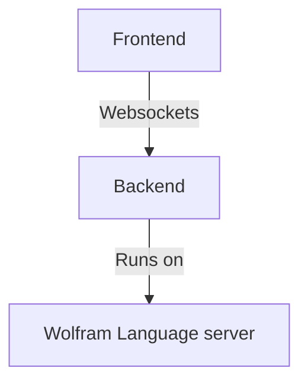

## Tips

### Ask to fix any errors
When your cursor is inside a cell (no matter *javascript*, *wolfram language* or whatever), AI can have an access to it. Ask it to fix errors. 

### Say "do it" in a single message
if assistant hesitates to apply changes to your cell and prints changes to a chat

### Mention "current cell" or "in my cell"
to force AI assistant to check the current cell, where the cursor is located rather than a context of a chat

### Ask to print a new cell one
if your assistant shows a code example or solution in the chat, but not to the notebook

## Note on cell types
An assistant is aware of being in a notebook environment. The following cell types are described well in the initial system prompt

- [Wolfram Language](frontend/Cell%20types/Wolfram%20Language.md)
- [Javascript](frontend/Cell%20types/Javascript.md)
- [HTML](frontend/Cell%20types/HTML.md)
- [Slides](frontend/Cell%20types/Slides.md)
- Mermaid diagrams

We also include the differences between Wolfram Mathematica and WLJS Notebook to the initial prompt including [Dynamics](frontend/Dynamics.md), [InputButton](frontend/Reference/GUI/InputButton.md), [InputRange](frontend/Reference/GUI/InputRange.md), [ManipulatePlot](frontend/Reference/Plotting%20Functions/ManipulatePlot.md) and some of the [Events](frontend/Reference/Misc/Events.md) system features.

:::warning
An initial prompt costs $\sim 3500$ tokens. You can disable it in the settings, but the quality of assistance will drop drastically. 
:::

## Prompt examples
Here is a few typical examples 

### Fixing errors
For instance you typed something

```mathematica title="cell"
Plot[x, {x,0,1,0.1}]

               ^^^
```

Then, keeping your cursor in the cell, __open command palette__ by `Cmd/Ctrl+P` and typing 

```
fix my errors
```

or if an assistant hesitates to make changes, write in addition `apply changes` or `fix it in my cell`

:::note
Assistant can help you with any kind of used languages. Make sure that your cursor inside the correct cell
:::

### Fixing grammar
Simply ask

```
fix my grammar in the current cell
```

and then if it does not apply changes to the current cell - ask as well

```
apply changes
```

### Helping with Dynamics
An assistant is aware of new libraries used here. For example

```
make an dynamic example, where a green ball follows your cursor on a 2d graph
```

```mathematica title="sample output"
pt = {0.,0.};

Graphics[{
  White, EventHandler[Rectangle[{-10,-10}, {10,10}], {
    "mousemove" -> Function[pos,
        pt = pos
    ]
  }],
  Green, Disk[pt // Offload, 0.5]
}, PlotRange -> {{-10, 10}, {-10, 10}}]
```


### Make *something*
Ask directly from the command palette what you want

``` title="prompt"
make an example slide
```

it will print a new [Slides](frontend/Cell%20types/Slides.md) cell

```jsx title="sample output"
.slide
# Welcome to the Presentation

This slide introduces you to the world of presentations in notebooks.

---

# The Power of Slides

Slides can convey complex ideas succinctly and engagingly.

---

# Thank You!

We hope you found this introduction useful.
```


Or __to write Javascript code example__

``` title="prompt"
write some javascript example with animation
```

```js title="sample output"
.js
let canvas = document.createElement('canvas');
canvas.width = 200;
canvas.height = 200;
let ctx = canvas.getContext('2d');

let posX = 0;
let speed = 2;

function draw() {
  ctx.clearRect(0, 0, canvas.width, canvas.height);
  ctx.fillStyle = 'red';
  ctx.fillRect(posX, 75, 50, 50);
  posX += speed;
  if (posX > canvas.width || posX < 0) speed *= -1;
}

let animFrame;
function animate() {
  draw();
  animFrame = requestAnimationFrame(animate);
}

animate();

this.ondestroy = () => {
    cancelAnimationFrame(animFrame);
};

return canvas;
```


Or HTML

```
show me example with HTML language. Print it to a new cell
```

```html title="sample output"
.html
<div>
    <h1 class="text-2xl font-bold">My First Heading</h1>
    <p>This is a paragraph in a div element.</p>
</div>
```


Or mermaid diagram

```
write a mermaid flow-type diagram with the following data: Frontend, which is connected to Backend using Websockets and on the backend Wolfram Language server is running
```




### Asking to write an entire program
Quite often it is quite risky, but with more popular languages like Javascript it can work very well. For example

```
how to capture data from webcam in Javascript and draw it to canvas. Print it to a new cell
```

which produces a fully working code

```js title="sample output"
.js
// First, create elements for the video and canvas
const video = document.createElement('video');
const canvas = document.createElement('canvas');
const context = canvas.getContext('2d');

// Set video constraints
canvas.width = 640;
canvas.height = 480;

// Use getUserMedia to access the webcam
if(navigator.mediaDevices && navigator.mediaDevices.getUserMedia) {
    navigator.mediaDevices.getUserMedia({ video: true })
        .then(function(stream) {
            video.srcObject = stream;
            video.play();
        })
        .catch(function(error) {
            console.log("Error accessing webcam: ", error);
        });
}

// Draw the video frame to the canvas
document.body.appendChild(video);
video.addEventListener('play', function() {
    (function draw() {
        context.drawImage(video, 0, 0, canvas.width, canvas.height);
        requestAnimationFrame(draw);
    })();
});

// Return the canvas element to be rendered
return canvas;
```


:::warning
This code does not stop even if you remove a cell. Please ask AI in addition

```
please modify it so that when i remove a cell it will also stop streaming
```
:::

### Describe the code
For example asking

```
describe the code in the current cell
```

will give a rich description generated by AI, that you can also ask to print to a next cell in Markdown format.

### Restart session
If you need to flush the session, simply type in the chat window

```
reset chat
```

