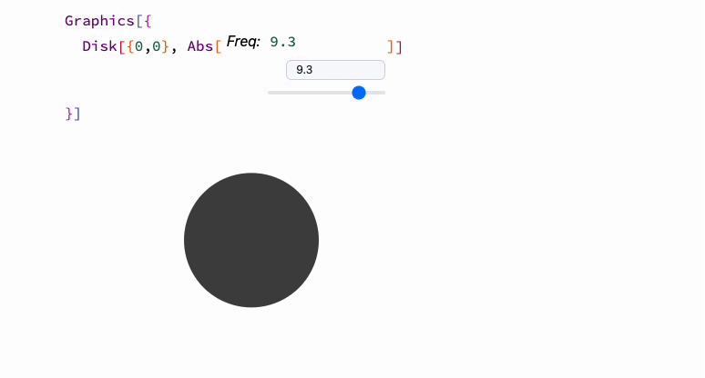

One can combine the power of [Interpretation](frontend/Reference/Decorations/Interpretation.md) and [Offload](frontend/Reference/Interpreter/Offload.md) to generate dynamic symbols, which can be controlled by its syntax sugar or decoration box!

## Easy solution
Use [``Offload`FromEventObject``](frontend/Reference/Interpreter/OffloadFromEventObject.md) expression to transform any [InputRange](frontend/Reference/GUI/InputRange.md), [InputText](frontend/Reference/GUI/InputText.md), [InputJoystick](frontend/Reference/GUI/InputJoystick.md) into a dynamic symbol

It feels similar to what Mathematica's dynamic keyword produce

```mathematica title="evaluate"
Offload`FromEventObject[InputRange[-1,1,0.1]]
```

__cut and paste it into__

```mathematica
Rectangle[{-1,-1}, {(*here*), 1}]
```


Consider to use the following symbols as well to trick a user or yourself

- [FrontEditorSelected](frontend/Reference/Interpreter/FrontEditorSelected.md)
- [Interpretation](frontend/Reference/Decorations/Interpretation.md)
- [MakeBoxes](frontend/Reference/Decorations/MakeBoxes.md)
- [ViewBox](frontend/Reference/Decorations/ViewBox.md)
- [Offload](frontend/Reference/Interpreter/Offload.md)


## Advanced
One can try similar approach as it was described is in a series of guides 
- [Creating new type](frontend/Advanced/Objects/Creating%20new%20type.md)
- [Dynamic decorations](frontend/Advanced/Objects/Dynamic%20decorations.md)

### Oscillators

Here we will make set of oscillators objects, which can be hooked to a various dynamic primitives for making animations.

Firstly we need to create a new type assisted by ``KirillBelov`Objects`` library, which gives a nice interface similar to what you usually see in OOP

```mathematica
CreateType[oscillator, init, {"Freq"->1.0}]

(* constructor *)
init[o_] := LeakyModule[{count = 0, symbol = 0.0},
  o["UId"] = CreateUUID[];
  
  (* our dynamic symbol *)
  o["Symbol"] = Offload[symbol];

  (* a function to update its value based on frequency *)
  o["Handler"] = Function[Null,
    symbol = Sin[2.0 Pi o["Freq"] count / 255.0];
    If[count > 255, count = 0];
    count++;
  ];
  o["Task"] = Null;
];

(* integrate it to an event system *)

oscillator /: oscillatorSet[s_oscillator, freq_?NumericQ] := With[{},
  s["Freq"] = freq;  
  EventFire[s, "Freq", freq];
  s
]

oscillator /: EventFire[s_oscillator, opts__] := EventFire[s["UId"], opts]

oscillator /: EventHandler[s_oscillator, opts__] := EventHandler[s["UId"], opts]

oscillator /: EventClone[s_oscillator] := EventClone[s["UId"]]
oscillator /: EventRemove[s_oscillator] := EventRemove[s["UId"]]
```

The most interesting part is in forming an output form, once a symbol revealed in the output cell

```mathematica
oscillator /: MakeBoxes[s: oscillator[_Symbol?AssociationQ], form: (StandardForm | TraditionalForm)] := Module[{
	freq = s["Freq"] // ToString,
    instances = 0,
    eventObject, construct, destruct, slider
}, With[{
	textField = EditorView[freq // Offload],
	controller = CreateUUID[],
    f = s["Freq"],
    win = CurrentWindow[],
    symbol = s["Symbol"]
},

	(* add a slider for a user to drag *)
    slider = InputRange[0.1, 10, 0.1, f];
    EventHandler[slider, Function[n, 
      oscillatorSet[s, n]
    ]];

    (* if a notebook was closed - destroy *)
    With[{socket = EventClone[win]},
      EventHandler[socket, {
        "Closed" -> Function[Null, 
          EventRemove[socket];
          destruct;
        ]
      }]
    ];

	(* CONSTRUCTOR *)
    construct := With[{},
      (* subscribe to object events and update decorations *)
      eventObject = EventClone[s];
      EventHandler[eventObject, {
        "Freq" -> Function[new, freq = new // ToString]
      }];    
      
      Echo["Construct!"];
      s["Task"] = SetInterval[s["Handler"][], 100]; 
    ];

	(* DESTRUCTOR *)
    destruct := With[{},
      Echo["Removed"];
	  EventRemove[eventObject];    
      TaskRemove[s["Task"]];
    ];

	(* LISTEN TO WIDGETS Events *)
	EventHandler[controller, {
		"Mounted" -> Function[Null,

          If[instances === 0, construct];
          instances = instances + 1;

		],
		
		"Destroy" -> Function[Null, 
			instances = instances - 1;
			
	        (* unsubscribe when there is no instances *)
	        If[instances === 0, destruct];
          ]
	}];

	With[{
		summary = {
          {Style["Freq: ", Italic], textField},
          {Style["", Bold], slider}
        } // TableForm
	},
		(* an output form *)
		ViewBox[symbol, EditorView[ToString[summary, StandardForm], "ReadOnly"->True], "Event"->controller]
	]
] ]
```

Now we can create an instance of this in a new cell

```mathematica
oscillator[]
```


Or if we need many copies of the same oscillator we would recommend you to

```mathematica
With[{osc = oscillator[]},
	Table[osc, {i,4}]
]
```


And because we use [events system](frontend/Reference/Misc/Events.md) everything is in sync


Now just __cut and past it__ to the place, where you want to use it. For example

```mathematica
Graphics[{
  Disk[{0,0}, Abs[(* here *)]]
}]
```

and then evaluate i.e.



By dragging a slider, one can change the frequency in real time. Once there is no visible instances of widgets, Wolfram Kernel stops all timers and tasks.
