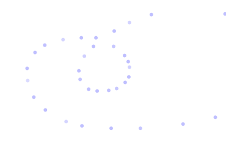

In this section, we discuss how a user can interact with dynamic elements, providing different types of input.

## UI Elements
A core package, [wljs-inputs](https://github.com/JerryI/wljs-inputs/), provides a set of basic UI elements used for creating buttons, sliders, text fields, and more.

:::info
If you need a custom element, you can create it directly in the notebook using [WLX](frontend/Cell%20types/WLX.md) or [JavaScript](frontend/Cell%20types/Javascript.md) cell types. Please see the guide: [Emitting events](frontend/Advanced/Javascript/Communication.md#Emitting%20events).
:::

The following elements are available out of the box:

- [InputButton](frontend/Reference/GUI/InputButton.md)
- [InputRange](frontend/Reference/GUI/InputRange.md)
- [InputText](frontend/Reference/GUI/InputText.md)
- [InputSelect](frontend/Reference/GUI/InputSelect.md)
- [InputFile](frontend/Reference/GUI/InputFile.md)
- [InputCheckbox](frontend/Reference/GUI/InputCheckbox.md)
- [InputEditor](frontend/Reference/GUI/InputEditor.md)
- [InputJoystick](frontend/Reference/GUI/InputJoystick.md)

And for grouping elements:

- [InputGroup](frontend/Reference/GUI/InputGroup.md)

#### Examples
Each standard input element is an [`EventObject`](frontend/Reference/Misc/Events.md#`EventObject`), to which you can assign any handler function. You don't necessarily need to assign it to a variable. For example (see [InputButton](frontend/Reference/GUI/InputButton.md)):

```mathematica
EventHandler[InputButton["Click"], Beep]
```

is equally valid as:

```mathematica
btn = InputButton["Click"];
EventHandler[btn, Beep];

btn
```

Here are some other examples:

```mathematica
EventHandler[InputRange[0, 1, 0.1], Function[value, radius = value]]
% // EventFire; (* just to initialize `radius` *)

Graphics[{LightBlue, Disk[], Pink, Disk[{0,0}, radius // Offload]}]
```

:::tip
Apply `EventFire` to any `EventObject` to manually fire an event with a default value to initialize your variables, if needed.
:::

You can also add a label to an [InputRange](frontend/Reference/GUI/InputRange.md):

```mathematica
InputRange[0, 1, 0.1, "Label" -> "Radius"]
```

And an initial value as the fourth argument:

```mathematica
InputRange[0, 1, 0.1, 0.7, "Label" -> "Radius"]
```

Here is an example using [InputSelect](frontend/Reference/GUI/InputSelect.md):

```mathematica
angle = 45 Degree;
EventHandler[InputSelect[{Pi/2 -> "90", Pi/4 -> "45", 0 -> "0"}, Pi/4], Function[value, angle = value]]

Graphics[{Rotate[Rectangle[{0,0}, {1,1}], angle // Offload]}]
```

Here is a simple text input:

```mathematica
text = "Example";
EventHandler[InputText[], Function[value, text = value]]

Graphics[Table[{
  Hue[i/10., 1., 1.], Rotate[Text[Style[text // Offload, FontSize -> RandomInteger[{12, 24}]], RandomReal[{-1,1}, 2]], RandomChoice[{Pi, Pi/4, Pi/2, 0}]]
}, {i, 10}]]
```

#### Grouping Input Elements
If you only need visual grouping, consider using [Grid](frontend/Reference/Formatting/Grid.md), [Row](frontend/Reference/Formatting/Row.md), or [Column](frontend/Reference/Formatting/Column.md), e.g.:

```mathematica
slider = InputRange[0, 1, 0.1]; 
button = InputButton[];

{slider, button} // Column 
```

Another way to group at the event level is using [InputGroup](frontend/Reference/GUI/InputGroup.md):

```mathematica
slider = InputRange[0, 1, 0.1]; 
button = InputButton[];

joined = InputGroup[<|"Button" -> button, "Slider" -> slider|>, "Label" -> "Group"];
EventHandler[joined, Print]
```

It merges an association (as above) or a list of `EventObjects` into a new one. You do not need to assign separate `EventHandler`s—__just one__ `joined` handler is enough. It fires an event preserving the original structure of the association or list:

```mathematica title="Payload"
<|"Slider" -> 0.5, "Button" -> True|>
```

#### Joining Different Events
You can also merge event objects underlying UI elements using `Join`. Here’s a simple example:

```mathematica
button = InputButton[]
slider = InputRange[0, 1, 0.1]

EventHandler[Join[button, slider], Function[data,
  Print[data]
]];
```

You’ll get either:
```mathematica
True
```
Or:
```mathematica
0.5
```
Depending on which element triggered the event. To distinguish them, use topics (see [`EventObject`](frontend/Reference/Misc/Events.md#`EventObject`)):

```mathematica
button = InputButton["Topic" -> "Button"]
slider = InputRange[0, 1, 0.1, "Topic" -> "Slider"]

EventHandler[Join[button, slider], {type_ :> Function[data,
  Print[type <> ":" <> ToString[data]]
]}];
```

Or capture them individually:

```mathematica
button = InputButton["Topic" -> "Button"]
slider = InputRange[0, 1, 0.1, "Topic" -> "Slider"]

EventHandler[Join[button, slider], {
  "Button" -> Beep,
  "Slider" -> Print
}];
```

The slider prints a message; the button triggers a *beep*.

#### Chaining Events
Most GUI elements support chaining, where each reuses the same `EventObject`. It’s passed as the first argument:

```mathematica
ev = EventObject[];

InputButton[ev, "Topic" -> "Button"]
InputRange[ev, 0, 1, 0.1, "Topic" -> "Slider"]

EventHandler[ev, {
  "Button" -> Beep,
  "Slider" -> Print
}];
```

With this approach, there's no need to create and join new events. This leaves a smaller footprint and reduces overhead.

## 2D Graphics
Some primitives, as well as the entire canvas, support the `EventHandler` method. Let's start with `Graphics` itself.

### Graphics as an Event Generator
You can attach event handlers to a `Graphics` expression, which represents the SVG container of your 2D graph.

This approach offers some benefits over using [Primitives](#Primitives). For instance, events like `"mousemove"` or `"click"` are captured even if other objects are layered on top. The following event patterns (or topics for [`EventHandler`](frontend/Reference/Misc/Events.md#`EventHandler`)) are supported:

- `"keydown"`: Captures keyboard input after the canvas is clicked
- `"capturekeydown"`: Same as above but also prevents page scrolling
- `"mousemove"`: Captures mouse movement
- `"click"`: Captures clicks (without the Alt key)
- `"altclick"`: Captures clicks with the Alt key held

Example:

```mathematica
pt = {};
EventHandler[
  Graphics[{
    PointSize[0.05], Blue, Opacity[0.5],
    Point[pt // Offload]
  }, PlotRange -> {{-1, 1}, {-1, 1}}],
  {"mousemove" -> Function[xy, pt = Append[pt, xy]]}
]
```



One can do the same with [Plot](frontend/Reference/Plotting%20Functions/Plot.md), since it produces `Graphics` symbol.

#### Alternative Way
An alternative approach to assigning handlers:

```mathematica
pt = {};
Graphics[{
  PointSize[0.05], Blue, Opacity[0.5],
  Point[pt // Offload],
  EventHandler[Null, {"mousemove" -> Function[xy, pt = Append[pt, xy]]}]
}, PlotRange -> {{-1, 1}, {-1, 1}}]
```

When `EventHandler` has `Null` as its argument, it attaches to the nearest parent. Similarly, you can attach handlers using `Epilog` or `Prolog`.

### Primitives
Certain graphic primitives also support `EventHandler`. Supported primitives include:

- [Point](frontend/Reference/Graphics/Point.md)
- [Disk](frontend/Reference/Graphics/Disk.md)
- [Rectangle](frontend/Reference/Graphics/Rectangle.md)

They support these patterns:

- `"drag"`: Makes the primitive draggable and returns coordinates
- `"dragall"`: Like `"drag"`, but also fires events at drag start and end
- `"click"`: Captures clicks without the Alt key
- `"altclick"`: Captures clicks with the Alt key
- `"mousedown"`: Fires on mouse press
- `"mouseup"`: Fires on mouse release
- `"mousemove"`: Captures movement
- `"mouseover"`: Captures entry into element area
- `"zoom"`: Captures mouse wheel input

For example, combining `"zoom"` and `"drag"`, you can manually fit Gaussian curves:

```mathematica @
getGauss[x0_, A_, width_] := (
  Table[{x, A * Exp[-((x - x0)^2) / (2 * width^2)]}, {x, -1, 1, 0.01}] // Quiet
);
getGauss[{x0_, A_}, width_] := getGauss[x0, A, width];
getGauss[{x0_, A_, width_}] := getGauss[x0, A, width];
```

```mathematica @
LeakyModule[{line, initial},
  initial = {-0.2, 0.8, 0.1};
  line = getGauss[initial];

  Graphics[{
    Red, PointSize[0.1],
    EventHandler[
      Point[initial[[1 ;; 2]]],
      {
        "drag" -> Function[c, initial[[1 ;; 2]] = c; line = getGauss[initial]],
        "zoom" -> Function[k, initial[[3]] = k/10.0; line = getGauss[initial]]
      }
    ],
    Cyan, Line[line // Offload]
  }, PlotRange -> {{-1, 1}, {0, 1}}, Axes -> {True, False}]
]
```

*Try moving your mouse wheel on the red dot and then drag it.*


You can also create a basic mouse follower using a white rectangle with a `"mousemove"` pattern:

```mathematica
pt = {0, 0};
Graphics[{
  White,
  EventHandler[
    Rectangle[{-2, -2}, {2, 2}],
    {"mousemove" -> Function[xy, pt = xy]}
  ],
  PointSize[0.05], Cyan,
  Point[pt // Offload]
}]
```

*a mouse follower*


## 3D Graphics
Currently, event listeners in [Graphics3D](frontend/Reference/Graphics3D/Graphics3D.md) are limited.

### Primitives
The following 3D primitives support `EventHandler` methods:

- [Sphere](frontend/Reference/Graphics3D/Sphere.md)

They support:

- `"transform"`: Makes the object draggable and sends an association with a `"position"` field

This is especially useful for dynamic lighting systems. For example:

```mathematica
point = {1, 1, 1};

Graphics3D[{
  Shadows[True],
  Polygon[{{-5, 5, -1}, {5, 5, -1}, {5, -5, -1}, {-5, -5, -1}}],
  White,
  Cuboid[{-1, -1, -1}, {1, 1, 1}],
  Shadows[False],
  PointLight[Red, {1.5075, 4.1557, 2.6129}, 100],
  Shadows[True],
  SpotLight[Cyan, point // Offload],

  EventHandler[Sphere[point, 0.1], {
    "transform" -> Function[assoc, point = assoc["position"]]
  }]
}, "Lighting" -> None]
```


