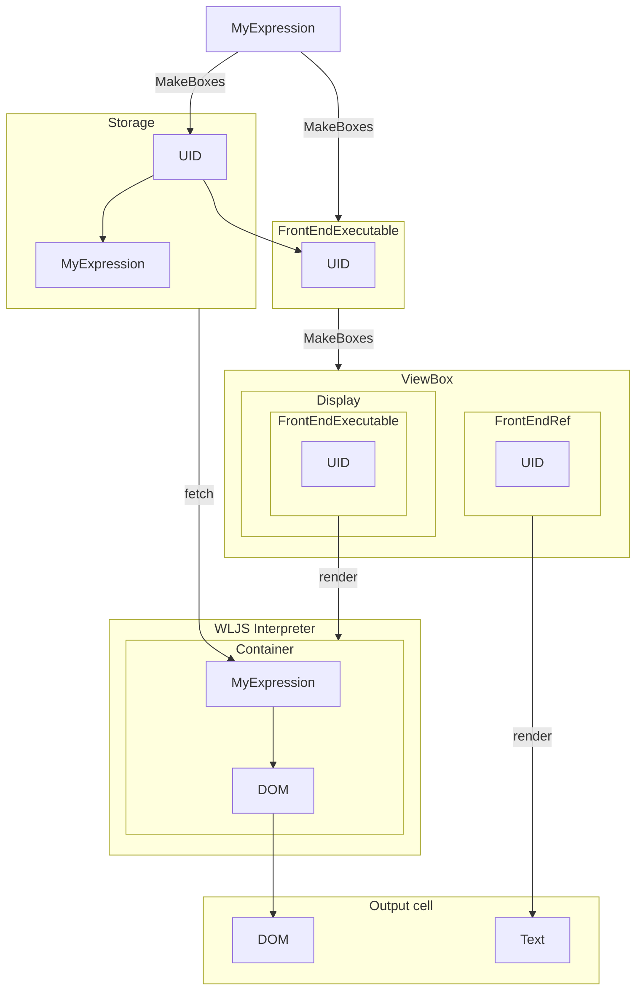

This is a core concept of all interactive elements on frontend
## Motivation

### Compress and reuse large expressions
Is intended to reduce the load to on the frontend by packing a large Wolfram Expressions like [Graphics](frontend/Reference/Graphics/Graphics.md) with all its data to a single line reference [FrontEndExecutable](frontend/Reference/Frontend%20Objects/FrontEndExecutable.md) or [FrontEndRef](frontend/Reference/Frontend%20Objects/FrontEndRef.md), which can be interpreted later by the editor in the cell. 

Such expressions like

```mathematica
Plot[x, {x,0,1}]
```

are evaluated automatically to just a pointer (using [CreateFrontEndObject](frontend/Reference/Frontend%20Objects/CreateFrontEndObject.md)) in the output cell as a display value of a [ViewBox](frontend/Reference/Decorations/ViewBox.md)

```mathematica
FrontEndExecutable["746fa2e0-24f7-4003-a7cc-4c77f8b4891d"]
```

This expression will be interpreted by the editor.

This behavior is controlled by [MakeBoxes](frontend/Reference/Decorations/MakeBoxes.md) and represents [StandardForm](frontend/Reference/Decorations/StandardForm.md) of any [Graphics](frontend/Reference/Graphics/Graphics.md), [Image](frontend/Reference/Graphics/Image.md) or other heavy expressions, that demand visual representation.

### Evaluate expressions on frontend
Some expressions, such as [ListPlay](frontend/Reference/Sound/ListPlay.md), or [Graphics3D](frontend/Reference/Graphics3D/Graphics3D.md) can be displayed only outside the Wolfram Kernel, i.e. on the frontend. The last one is browser with Javascript engine in our case. 

For such reason the resulting expressions of interactive or graphical elements are evaluated on Javascript using a tiny Wolfram Language interpreter (WLJS). Every [FrontEndExecutable](frontend/Reference/Frontend%20Objects/FrontEndExecutable.md) is executed using WLJS Interpreter using data requested on demand from Wolfram Kernel and outputs to the DOM element in the output cell. 

:::info
See more about [WLJS Functions](frontend/Advanced/Frontend%20interpretation/WLJS%20Functions.md)
:::

Let us have a loot at the example

```js title="cell 1"
.js
core.MyExpression = async (args, env) => {
	env.element.innerText = "Hello World"
}
```

```mathematica
MyExpression[] // CreateFrontEndObject
```

will result 


This entity behaves like a single symbol. Basically, thats how [Graphics](frontend/Reference/Graphics/Graphics.md), [Graphics3D](frontend/Reference/Graphics3D/Graphics3D.md), [InputRange](frontend/Reference/GUI/InputRange.md) and others are made.

You __can remove an extra step__ by defining a [StandardForm](frontend/Reference/Decorations/StandardForm.md) for your symbol

```mathematica
MyExpression /: MakeBoxes[m_MyExpression, StandardForm] := With[{
	o = CreateFrontEndObject[m]
},
	MakeBoxes[o, StandardForm]
]
```

and then evaluate it as a normal one

```mathematica
MyExpression[] (* no need in CreateFrontEndObject anymore *)
```


#### Remarks on containers
By the default each [FrontEndExecutable](frontend/Reference/Frontend%20Objects/FrontEndExecutable.md) will be evaluated inside a so-called [container](frontend/Advanced/Frontend%20interpretation/WLJS%20Functions.md#Containers%20Executables), that provides al local memory to the function and allows them to be destroyed or updated based on changes of child element. See more in [WLJS Functions](frontend/Advanced/Frontend%20interpretation/WLJS%20Functions.md) 


## Inner structure
Here is a diagram to see the underlying structure and how expressions are transformed



## Properties
1. Despite the fact, that this is separate entity, it can still be evaluated again on Wolfram Kernel. [FrontEndRef](frontend/Reference/Frontend%20Objects/FrontEndRef.md) will be replaced back to its normal form once you submit a cell for evaluation. 
2. All working objects are synchronized between the notebook and a Kernel. Once you __saved__ a notebook they are serialized to a file as well. So that even with no running Wolfram Kernel they can be displayed.
3. All working objects are exported to [HTML](frontend/Export/HTML.md)
4. All objects are embedded automatically to [Slides](frontend/Cell%20types/Slides.md) or [WLX](frontend/Cell%20types/WLX.md)
5. [StandardForm](frontend/Reference/Decorations/StandardForm.md) for all [FrontEndExecutable](frontend/Reference/Frontend%20Objects/FrontEndExecutable.md) is [ViewBox](frontend/Reference/Decorations/ViewBox.md) 
6. [WLXForm](frontend/Reference/Decorations/WLXForm.md) for all [FrontEndExecutable](frontend/Reference/Frontend%20Objects/FrontEndExecutable.md) is a sort of view-box as well


