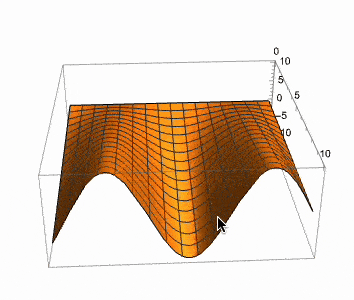
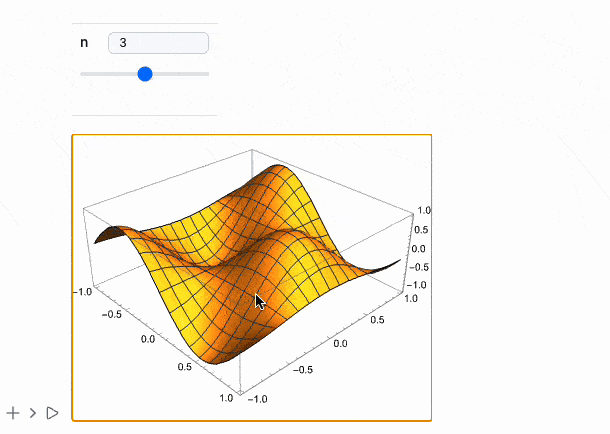

# Fallback to Mathematica's Rendering

Using [MMAView](frontend/Reference/GUI/MMAView.md), you can bypass the WLJS pipeline and directly render an expression as it would appear in Wolfram Mathematica.

```mathematica
(1/2 + a)2 // MMAView
```


**Note:** The output will be displayed as a raster image, which adds system overhead and results in limited interactivity and non-scalable rendering.

However, [MMAView](frontend/Reference/GUI/MMAView.md) defines special `UpValues` for 3D graphics, as well as for [Manipulate](frontend/Reference/GUI/Manipulate.md) and [Animate](frontend/Reference/GUI/Animate.md), making it *partially interactive*.

```mathematica
With[{p = Plot3D[f[x] y, {x, 0, 10}, {y, 0, 10}]},
  MMAView[p]
]
```



## Manipulate
[MMAView](frontend/Reference/GUI/MMAView.md) can be used as a special wrapper for [Manipulate](frontend/Reference/GUI/Manipulate.md)

```mathematica
Manipulate[Plot3D[Sin[n x] Cos[n y], {x,-1,1}, {y,-1,1}], {n, 1, 5, 1}] // MMAView
```



## Animate
[MMAView](frontend/Reference/GUI/MMAView.md) is also defined for [Animate](frontend/Reference/GUI/Animate.md)

```mathematica
Animate[Plot[Sin[x y], {x,0,1}], {y,0,5}] // MMAView
```

