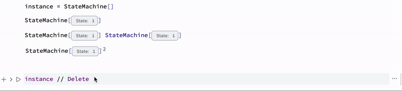
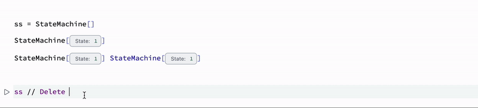

# 3. Dynamic decorations

In this part we will try to synchronize the state of our symbols or objects with corresponding decorations we created in the previous part.

## Dynamic summary item
We have already explored the possibility of animated icons in [Animated decoration in Summary Item](frontend/Advanced/Objects/Static%20decorations.md#Animated%20decoration%20in%20Summary%20Item), therefore there is no obstacles in doing the same in sync with state changes of our object.

```mathematica
StateMachine /: MakeBoxes[s: StateMachine[symbol_Symbol?AssociationQ], form: (StandardForm | TraditionalForm)] := Module[{
	state = s["State"] // ToString,
    instances = 0,
    eventObject, construct, destruct
}, With[{
	textField = EditorView[state // Offload],
	controller = CreateUUID[],
    notebook = EvaluationNotebook[]
},

    (* if notebook was closed *)
    With[{clonedEv = notebook // EventClone},
      EventHandler[clonedEv, {"OnClose" -> Function[Null,
          Print["All removed"];
          EventRemove[clonedEv];
          destruct;
      ]}];
    ];

    construct := With[{},
      (* subscribe to object events and update decoration *)
      eventObject = EventClone[s];
      EventHandler[eventObject, {
        "State" -> Function[new, state = new // ToString]
      }];     
    ];

    destruct := With[{},
      Echo["Removed"];
	  EventRemove[eventObject];  
	  instances = 0;  
    ];

	EventHandler[controller, {
		"Mounted" -> Function[Null,

          If[instances === 0, construct];
          instances = instances + 1;

		],
		
		"Destroy" -> Function[Null, 
			instances = instances - 1;
			
	        (* unsubscribe when there is no instances *)
	        If[instances === 0, destruct];
          ]
	}];

	With[{
		summary = {BoxForm`SummaryItem[{"State: ", textField}]}
	},
		BoxForm`ArrangeSummaryBox[
			StateMachine,
			s,
			None,
			summary,
            Null,

			"Event" -> controller
		]
	]
] ]
```

The idea is the same, but instead of static value, we substituted to  ``BoxForm`SummaryItem`` a dynamic element [EditorView](frontend/Reference/GUI/EditorView.md) which is updated by the a handler function subscribed to updates of our instance.

Let us test it
```mathematica
instance = StateMachine[]
```

*you can copy and paste instances with no issues, since it is tracked by a variable in the box decoration code*

and change the state

```mathematica
StateMachineChange[instance, RandomInteger[{1,10}]];
```


## Controllers
We can also mutate our object from the decoration by substituting [InputRange](frontend/Reference/GUI/InputRange.md) or something like this to a widget. Right..?

```mathematica
StateMachine /: MakeBoxes[s: StateMachine[symbol_Symbol?AssociationQ], form: (StandardForm | TraditionalForm)] := Module[{
	state = s["State"] // ToString,
    instances = 0,
    eventObject, construct, destruct, slider
}, With[{
	textField = EditorView[state // Offload],
	controller = CreateUUID[],
    notebook = EvaluationNotebook[]
},

    (* if notebook was closed *)
    With[{clonedEv = notebook // EventClone},
      EventHandler[clonedEv, {"OnClose" -> Function[Null,
          Print["All removed"];
          EventRemove[clonedEv];
          destruct;
      ]}];
    ];

    slider = InputRange[0, 10, 1, s["State"]];
    EventHandler[slider, Function[n, 
      StateMachineChange[s, n]
    ]];

    construct := With[{},
      (* subscribe to object events and update decoration *)
      eventObject = EventClone[s];
      EventHandler[eventObject, {
        "State" -> Function[new, state = new // ToString]
      }];     
      
    ];

    destruct := With[{},
      Echo["Removed"];
	  EventRemove[eventObject];    
	  instances = 0;
    ];

	EventHandler[controller, {
		"Mounted" -> Function[Null,

          If[instances === 0, construct];
          instances = instances + 1;

		],
		
		"Destroy" -> Function[Null, 
			instances = instances - 1;
			
	        (* unsubscribe when there is no instances *)
	        If[instances === 0, destruct];
          ]
	}];

	With[{
		summary = {
          BoxForm`SummaryItem[{"State: ", textField}],
          BoxForm`SummaryItem[{"", slider}]
        }
	},
		BoxForm`ArrangeSummaryBox[
			StateMachine,
			s,
			None,
			summary,
            Null,

			"Event" -> controller
		]
	]
] ]
```

We added only a few line for `slider`. The rest is the same


:::warning
[InputRange](frontend/Reference/GUI/InputRange.md) does not support multiple instances and might have a conflict with DOM ids if copied and pasted from the same generated output.

To solve this issue, we your own slider, which is generated purely from Javascript on each run. See how in [Communication](frontend/Advanced/Javascript/Communication.md)
:::

## Mutability
Each decoration box based on [ViewBox](frontend/Reference/Decorations/ViewBox.md) does support mutations of inner and outer content - see [From Wolfram Kernel](frontend/Reference/Decorations/ViewBox.md#From%20Wolfram%20Kernel).

The easies example would be to remove all instances from all code editors, once our object does not exists anymore. We will start from writing the corresponding method

```mathematica
StateMachine /: Delete[s_StateMachine] := With[{},
  EventFire[s, "Destroy", Null];
  DeleteObject[s]
]
```

Then we need to track all spawned instances of a widget in order to kill all of them. [ViewBox](frontend/Reference/Decorations/ViewBox.md) provides pattern for events handling `"Mounted"` with an ID of a widget. Let us harvest it

```mathematica
	EventHandler[controller, {
		"Mounted" -> Function[uid,
		  (* collect instances *)
          s["Instances"] = If[ListQ[s["Instances"]], Append[s["Instances"], uid], {uid}];
          
          If[instances === 0, construct];
          instances = instances + 1;

		],
		
		"Destroy" -> Function[uid, 
            s["Instances"] = s["Instances"] /. {uid -> Nothing};
            
			instances = instances - 1;
			
	        
	        If[instances === 0, destruct];
          ]
	}];
```

The collected IDs are valid to use together with [MetaMarker](frontend/Reference/Frontend%20IO/MetaMarker.md) and [FrontSubmit](frontend/Reference/Frontend%20IO/FrontSubmit.md). To destroy them one by one we need to submit a command

```mathematica
FrontSubmit[ViewBox`OuterExpression[""], MetaMarker[#]] &/@ s["Instances"]
```

Here is __the full code__

```mathematica
StateMachine /: MakeBoxes[s: StateMachine[symbol_Symbol?AssociationQ], form: (StandardForm | TraditionalForm)] := Module[{
	state = s["State"] // ToString,
    instances = 0,
    eventObject, construct, destruct
}, With[{
	textField = EditorView[state // Offload],
	controller = CreateUUID[],
    window = CurrentWindow[],
    notebook = EvaluationNotebook[]
},

    (* if notebook was closed *)
    With[{clonedEv = notebook // EventClone},
      EventHandler[clonedEv, {"OnClose" -> Function[Null,
          Print["All removed"];
          EventRemove[clonedEv];
          destruct;
          s["Instances"] = {};
      ]}];
    ];

    construct := With[{},
      (* subscribe to object events and update decoration *)
      eventObject = EventClone[s];
      EventHandler[eventObject, {
        "State" -> Function[new, state = new // ToString],
        "Destroy" -> Function[Null,
          FrontSubmit[ViewBox`OuterExpression[""], MetaMarker[#], "Window"->window] &/@ s["Instances"];
        ]
      }];     
    ];

    destruct := With[{},
      Echo["Removed"];
	  EventRemove[eventObject];    
	  instances = 0;
    ];

	EventHandler[controller, {
		"Mounted" -> Function[uid,
          s["Instances"] = If[ListQ[s["Instances"]], Append[s["Instances"], uid], {uid}];
          
          If[instances === 0, construct];
          instances = instances + 1;

		],
		
		"Destroy" -> Function[uid, 
            s["Instances"] = s["Instances"] /. {uid -> Nothing};
            
			instances = instances - 1;
			
	        (* unsubscribe when there is no instances *)
	        If[instances === 0, destruct];
          ]
	}];

	With[{
		summary = {BoxForm`SummaryItem[{"State: ", textField}]}
	},
		BoxForm`ArrangeSummaryBox[
			StateMachine,
			s,
			None,
			summary,
            Null,

			"Event" -> controller
		]
	]
] ]
```



### CSS effects
One can apply some visuals as well

```html
.wlx

<style>
.desintegrate-animation {
  animation-duration: 2.6s;
  animation-name: bounceOutRight;
}
@keyframes bounceOutRight {
  50% {
    opacity: 1; transform: translate3d(0, 0, 0);
  }
  60% {
    opacity: 1;
    transform: translate3d(-20px, 0, 0);
  }

  to {
    opacity: 0;
    transform: translate3d(200px, 0, 0);
  }
}
</style>
```

```js
.js

core.Desintagrate = async (args, env) => {
  env.element.parentNode.classList.add('desintegrate-animation');
}
```

And add an animation call to our boxes

```mathematica
StateMachine /: MakeBoxes[s: StateMachine[symbol_Symbol?AssociationQ], form: (StandardForm | TraditionalForm)] := Module[{
	state = s["State"] // ToString,
    instances = 0,
    eventObject, construct, destruct
}, With[{
	textField = EditorView[state // Offload],
	controller = CreateUUID[],
    window = CurrentWindow[],
    notebook = EvaluationNotebook[]
},

    (* if notebook was closed *)
    With[{clonedEv = notebook // EventClone},
      EventHandler[clonedEv, {"OnClose" -> Function[Null,
          Print["All removed"];
          EventRemove[clonedEv];
          destruct;
          s["Instances"] = {};
      ]}];
    ];

    construct := With[{},
      (* subscribe to object events and update decoration *)
      eventObject = EventClone[s];
      EventHandler[eventObject, {
        "State" -> Function[new, state = new // ToString],
        "Destroy" -> Function[Null,
          FrontSubmit[{Desintagrate[], Pause[2.6], ViewBox`OuterExpression[""]} // Offload, MetaMarker[#], "Window"->window] &/@ s["Instances"];
        ]
      }];     
    ];

    destruct := With[{},
      Echo["Removed"];
	  EventRemove[eventObject];
	  instances = 0;    
    ];

	EventHandler[controller, {
		"Mounted" -> Function[uid,
          s["Instances"] = If[ListQ[s["Instances"]], Append[s["Instances"], uid], {uid}];
          
          If[instances === 0, construct];
          instances = instances + 1;

		],
		
		"Destroy" -> Function[uid, 
            s["Instances"] = s["Instances"] /. {uid -> Nothing};
            
			instances = instances - 1;
			
	        (* unsubscribe when there is no instances *)
	        If[instances === 0, destruct];
          ]
	}];

	With[{
		summary = {BoxForm`SummaryItem[{"State: ", textField}]}
	},
		BoxForm`ArrangeSummaryBox[
			StateMachine,
			s,
			None,
			summary,
            Null,

			"Event" -> controller
		]
	]
] ]
```

The result should be following

