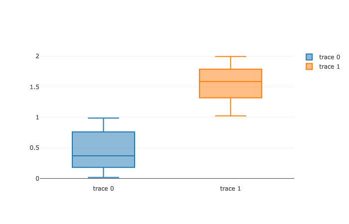

# Library functions

If you developed a nice library, that helps to view tables or adds new plotting features or whatever, and you want to ship it as shared library this guide is for you.

## Developing process
Usually it is easier to do everything inside the notebook first. Let us have look at the following example

### Box bar plot using Plotly.js
Originally this was an example for one of the developer @KirillBelovTest to highlight the main features of `.js` cells, but it fits the purpose of this guide as well.

#### Playground
If you need JS libraries, you can import them directly. Like in our case

*cell 1*
```html
.html
<script src="https://cdn.plot.ly/plotly-2.26.0.min.js" charset="utf-8"></script>
```

Then you should try for sure to recreate some examples from the official page to make sure that everything is working as intended

*cell 2*
```js
.js
const canvas = document.createElement('div');
var y0 = [];
var y1 = [];
for (var i = 0; i < 50; i ++) {
	y0[i] = Math.random();
	y1[i] = Math.random() + 1;
}

var trace1 = {
  y: y0,
  type: 'box'
};

var trace2 = {
  y: y1,
  type: 'box'
};

var data = [trace1, trace2];

Plotly.newPlot(canvas, data);

return canvas;
```



#### WLJS Functions
Now let us write an proper WLJS function to be used by frontend

*cell 3*
```js
.js

core.BarPlotly = async (args, env) => {
  const data = await interpretate(args[0], env);
  var trace = {
    y: data,
    type: 'box'
  };

  Plotly.newPlot(env.element, [trace], {autosize: true, width: 350, height: 250, margin: {
          l: 30,
          r: 30,
          b: 30,
          t: 30,
          pad: 4
        }});
}
```

And now let us __test it__

*cell 4*
```mathematica
BarPlotly[RandomReal[{0,1}, 10]] // CreateFrontEndObject
```

:::note
Since it is not known by Wolfram Kernel, we had to use `CreateFrontEndObject` expression on it to tell that it will be executed in a browser using [WLJS interpreter](../../../interpreter/intro.md), but we will fix it later
:::

__Optional__
You can provide `update` methods to it, if you want to support dynamic updates using `Offload` directive (see [Dynamics](../../Tutorial/Dynamics.md))

*cell 5*
```js
.js
core.BarPlotly = async (args, env) => {
  const data = await interpretate(args[0], env);
  const trace = {
    y: data,
    type: 'box'
  };

  env.local.element = env.element;

  Plotly.newPlot(env.element, [trace], {autosize: true, width: 350, height: 250, margin: {
          l: 30,
          r: 30,
          b: 30,
          t: 30,
          pad: 4
        }});
}

core.BarPlotly.update = async (args, env) => {
  const data = await interpretate(args[0], env);
  const trace = {
    y: data
  };

  console.log(env.local.element);

  Plotly.animate(env.local.element, {
        data: [trace],
      }, {
        transition: {
          duration: 100,
          easing: 'cubic-in-out'
        },
        frame: {
          duration: 100
        }
      });     
}

core.BarPlotly.destroy = async (args, env) => {
  await interpretate(args[0], env);
}
```

And to test it

```mathematica
LeakyModule[{dt},
  dt = RandomReal[{0,1}, 10];
  task = SetInterval[dt = RandomReal[{0,1}, 10], 500];
  SetTimeout[TaskRemove[task], 5000];
  
  BarPlotly[dt // Offload] // CreateFrontEndObject
]
```

When we change here the variable `dt` it updates our plot automatically.

:::tip
Use `LeakyModule` to force dynamic symbols to have `Temporary` attribute, therefore they will be purged if there is no references left.

In general it is always a better idea to scope your dynamics
:::

__The link to a notebook is below__
- [Dev](imgs/Dev.wln)

## Packing into a plugin
If you are done with developing, the first step is to locate `Packages` folder

:::note
Use `File` $\rightarrow$ `Locate AppData` for desktop version
:::

```bash
cd Packages
git clone https://github.com/JerryI/wljs-template
mv wljs-template wljs-youpackagename
cd wljs-youpackagename
rm -rf .git
git init
```

Now you have your workspace. Then for our purpose we need the following structure

```
package.json
rollup.conf.mjs
README.md
src/
	kernel.js
	kernel.wl
	autocomplete.js
dist/
```

### `kernel.js`
Let us move to our first file in `src` directory

*kernel.js*
```js
let Plotly = false;

core.BarPlotly = async (args, env) => {
  //import it dynamically, so it does not load the frontend
  if (!Plotly) Plotly = await import('plotly.js-dist-min');
  
  const data = await interpretate(args[0], env);
  const trace = {
    y: data,
    type: 'box'
  };

  env.local.element = env.element;

  Plotly.newPlot(env.element, [trace], {autosize: true, width: 350, height: 250, margin: {
          l: 30,
          r: 30,
          b: 30,
          t: 30,
          pad: 4
        }});
}
```

The first difference here is 
```js
if (!Plotly) Plotly = await import('plotly.js-dist-min');
```

:::tip
In general it is better idea to import libraries dynamically using `await import`, when it is needed, therefore it will not add extra payload when the function is not used.
:::

And do not forget to install it beforehand
```bash
npm i plotly.js-dist-min
```

#### Building
If your package is using external Javascript libraries you need to bundle them into a thick (hopefully not) `.js` file

```bash
npm run build
```

a bundled file will appear in `dist` directory.

### `kernel.wl`
This is a file which will be loaded to your running secondary Wolfram Kernel. If you want to use some external paclets, one can keep a standard `BeginPackage` structure

*kernel.wl*
```mathematica
PacletInstall["JerryI`WLX`"]

BeginPackage["JerryI`WolframJSFrontend`PlotlyBar`", {"JerryI`WLX`"}];
Begin["`Private`"];

End[]
EndPackage[]
```

:::tip
In general it is better to scope used packages using [LPM manager](https://github.com/JerryI/wl-localpackages). Therefore they will be installed locally
:::

*kernel.wl* scoped
```mathematica
PacletRepositories[{
    Github -> "https://github.com/JerryI/wl-wlx"
}, "Directory"->ParentDirectory[DirectoryName[$InputFileName]]]

BeginPackage["JerryI`WolframJSFrontend`PlotlyBar`", {"JerryI`WLX`"}];
Begin["`Private`"];

End[]
EndPackage[]
```

:::tip
If you do not have many thing to declare, keep your `kernel.wl` simple
:::

In our case we need only to register `BarPlotly`, so that we do not need to use `CreateFrontEndObject` on it. I.e,

*kernel.js* simple (__our case__)
```mathematica
JerryI`WolframJSFrontend`Extensions`RegisterFrontEndObject[BarPlotly]
```


### `autocomplete.js`
Now we can extend our editor's autocomplete list

*autocomplete.js*
```js
window.EditorAutocomplete.extend([  
    {
        "label": "BarPlotly",
        "type": "keyword",
        "info": "our defined function"  
    }
]
```

### `package.json`
Now the last modifications

```json
{
  "name": "wljs-youpackagename",
  "version": "0.0.1",
  "description": "A nice package",
  "scripts": {
    "build": "node --max-old-space-size=8192 ./node_modules/.bin/rollup --config rollup.config.mjs"
  },
  "wljs-meta": {
    "jsmodule": "dist/kernel.js",
    "wlkernel": "src/kernel.wl",
    "autocomplete": "src/autocomplete.js"
  },
  "repository": {
    "type": "git",
    "url": "https://github.com/User/wljs-youpackagename"
  },
  "author": "YourName",
  "license": "GPL",
  "bugs": {
    "url": "https://github.com/User/wljs-youpackagename/issues"
  },
  "homepage": "https://github.com/User/wljs-youpackagename#readme",
  "dependencies": {
    "@rollup/plugin-commonjs": "^24.0.1",
    "@rollup/plugin-json": "^6.0.0",
    "@rollup/plugin-node-resolve": "15.0.1",
    "plotly.js-dist-min": "^2.18.2",
    "rollup": "^3.20.6",
    "rollup-plugin-combine": "^2.1.1"
  }
}
```

:::danger
The __directory name__ of the package must match 

```json
"name": "wljs-youpackagename",
```
:::

## Shipping
The last step is to save all changes by
```bash
git commit -m "done"
git push
```

:::info
At the startup WLJS Frontend fetches the `packages.json` from all installed plugins and compares it to the remote versions. If you increase the version number all users will automatically receive an update from `master` branch.
:::