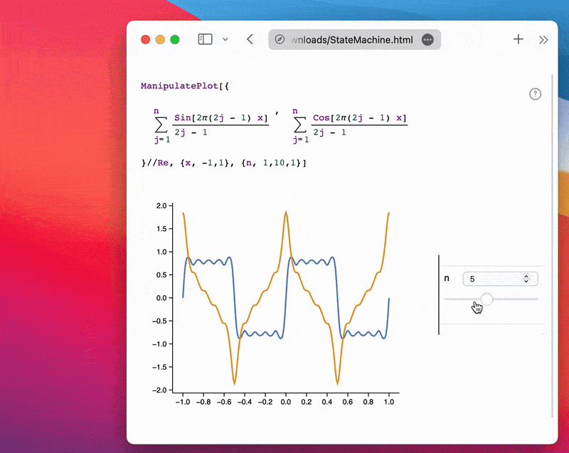

__A user doesn't need any app installed to interact with sliders in your notebook__

:::tip
Please read the manual carefully.
:::

This is a dynamic version of the [Static HTML](frontend/Exporting/Static%20HTML.md) exporter, designed to recreate the full interactivity of normal notebooks.


## Use Cases
- All use cases from [Static HTML](frontend/Exporting/Static%20HTML.md)
- Demonstration projects
- Live animations of physical processes
- Interactive presentations / lecture notes

## How It Works
To make the system more general and support features like [ManipulatePlot](frontend/Reference/Plotting%20Functions/ManipulatePlot.md), combinations of [InputRange](frontend/Reference/GUI/InputRange.md), [InputButton](frontend/Reference/GUI/InputButton.md), [Offload](frontend/Reference/Interpreter/Offload.md), [FrontSubmit](frontend/Reference/Frontend%20IO/FrontSubmit.md), [EmitSound](frontend/Reference/Sound/EmitSound.md), and many more are abstracted from their controlling elements. The system purely analyzes events and symbol mutations.

> Your dynamic system must follow a *call and response* architecture. That means it must generate events (via user interaction or code) and produce a response (e.g., symbol mutation or [FrontSubmit](frontend/Reference/Frontend%20IO/FrontSubmit.md)).

:::note
**TL;DR:** We record calculated data for all possible combinations of input elements and store them in a large table. See the [How to Use](#how-to-use) section.
:::

<details>

### Analysis

To analyze the bindings between input elements, symbols, and commands executed by the Wolfram Kernel, __we inject a spy into the evaluation kernel__ by modifying `DownValues` of WLJS I/O symbols. This captures symbol mutations triggered by external events and submitted commands like [FrontSubmit](frontend/Reference/Frontend%20IO/FrontSubmit.md) or [EmitSound](frontend/Reference/Sound/EmitSound.md). For instance, [PlotlyAnimate](frontend/Reference/Plotly/PlotlyAnimate.md) also uses [FrontSubmit](frontend/Reference/Frontend%20IO/FrontSubmit.md) and can be tracked.

After capturing all data, it's forwarded to samplers or virtual state machines.

### Processing
We use different processing techniques based on the use case, selected automatically. These are known as *Black Boxes* or virtual machines.

> Similar to airplane black boxes that record all data for post-crash analysis.

There are three types of virtual machines (automatically chosen) with fun names:

#### State Machine
This tracks system state based on input element combinations. It samples all possible states and dispatches the corresponding symbol mutations.

#### Pavlov Machine
Like [Pavlov's Dog](https://en.wikipedia.org/wiki/Classical_conditioning), it doesn't track state but records *event → FrontSubmit* pairs.

#### Animation Machine
Detects series of symbol mutations from the same event, typically used for animations (e.g., via `AnimationFrameListener`). It tracks only abstract frame numbers.

> We're planning to add small CNNs to compress mutations more efficiently in the future.

</details>

## How to Use
Please follow the steps below:

### Prepare the Notebook
Connect to the Wolfram Kernel and evaluate your dynamics. Minimize the number of input elements and their states. For example, avoid 3 sliders ([InputRange](frontend/Reference/GUI/InputRange.md)) with 100 steps each. For [ManipulatePlot](frontend/Reference/Plotting%20Functions/ManipulatePlot.md), explicitly set `step` values. Limit the number and complexity of dynamic symbols.

:::ti[]
If you're recording an animation with [AnimationFrameListener](frontend/Reference/Graphics/AnimationFrameListener.md), start it __right before the next step__. Note: [`SetInterval`](frontend/Reference/Misc/Async.md#`SetInterval`) effects are not captured.
:::

Example using a single slider:

```mathematica
ManipulatePlot[{
  Sum[(Sin[2π(2j - 1) x])/(2j - 1), {j, 1, n}],
  Sum[(Cos[2π(2j - 1) x])/(2j - 1), {j, 1, n}]
} // Re, {x, -1, 1}, {n, 1, 10, 1}]
```

### Sniffing Phase
Click `Share` → `Dynamic Notebook` to begin recording. A widget will appear in the top-right corner.

:::info
If you're recording an animation, evaluate the cell, wait for your desired number of frames, then click `Continue` in the widget.
:::


Move each slider across its full range. This is necessary, as the sampling phase will only use values seen during sniffing.

:::tip
For multiple inputs (2–3 sliders), move each fully once. Cross-combinations are not needed—they will be sampled recursively.
:::

### Sampling Phase (State Machine)
Now the system automatically samples all input combinations. This may take time, depending on state count and symbol complexity.


This is the final stage. Afterward, the notebook is exported with the collected data to your drive. Click `Continue`.

### Result
File sizes typically range from `7–20 MB`, or `3–15 MB` with `CDN` settings (see [Static HTML](frontend/Exporting/Static%20HTML.md)). The example above is just `165 kB` uncompressed and `50 kB` compressed.

The result is a fully interactive widget, working offline without an internet connection or the Wolfram Kernel ✨



:::note
This works with [Slides](frontend/Cell%20types/Slides.md) and [WLX](frontend/Cell%20types/WLX.md) cells too.
:::

## What Else Can Be Exported?
Here's a list of supported exports:

### State Machine
```mathematica
Manipulate[Series[Sin[x], {x, 0, n}], {n, 1, 10, 1}]
```

```mathematica
ManipulatePlot[f[w x], {x, -10, 10}, {w, 0, 10}, {f, {Sinc, Sin}}]
```

Or custom dynamics:

```mathematica
radius = 1.0;
Graphics[{Hue[radius // Offload], Disk[{0, 0}, radius // Offload]}, ImageSize -> Small]

EventHandler[InputRange[0, 1, 0.1], (radius = #)&]
```

### Pavlov Machine
```mathematica
EventHandler[InputButton[], (Sound[SoundNote["C5"]] // EmitSound)&]
```

Even [Plotly](frontend/Reference/Plotly/Plotly.md):

```mathematica
p = Plotly[{<|
  "values" -> {19, 26, 10},
  "labels" -> {"Residential", "Non-Residential", "Utility"},
  "type" -> "pie"
|>}]

EventHandler[InputRange[0, 100, 10], PlotlyAnimate[p,   
  <|"data" -> {<|"values" -> {19, 26, #}|>},
    "traces" -> {0}
  |>, <||>]&
]
```

### Animation Machine
Example: balls falling down a staircase

```mathematica @
ballsteps = 
  NDSolve[{x''[t] == 0, y''[t] == -9.8, y[0] == 6, y'[0] == 0, 
    x[0] == 0, x'[0] == 1, a[0] == 5, 
    WhenEvent[Mod[x[t], 1] == 0, 
     If[a[t] > 0, a[t] -> a[t] - 1, "RemoveEvent"]], 
    WhenEvent[
     y[t] == a[t], {x'[t], y'[t]} -> .9 {x'[t], -y'[t]}]}, {x, y, 
    a}, {t, 0, 15}, DiscreteVariables -> {a}];
trajectory = {x, y} /. ballsteps[[1]];

staircase = 
 Plot[Clip[Floor[6 - x], {0, Infinity}], {x, -1, 15}, Filling -> 0, 
  Exclusions -> None];

Module[{
  frame = CreateUUID[],
  pos = {0.,0.},
  t = 0.
},
  EventHandler[frame, Function[Null,
    pos = #[t] &/@ trajectory;
    t = If[t >= 15.0, 0., t + 0.1];
  ]];

  Show[staircase, Graphics[{
    (*VB[*)(RGBColor[1, 0, 0])(*,*)(*"1:eJxTTMoPSmNkYGAoZgESHvk5KRCeGJAIcndyzs/JLwouTyxJzghJzS3ISSxJTWMGyXMgyRcxgMEHeyiDgQHOAAALpBNd"*)(*]VB*), Disk[pos // Offload, 0.12]
  }], Epilog->{
    AnimationFrameListener[pos // Offload, "Event"->frame]
  }]
]
```

## Online Examples
Check out some interactive examples from our blog and demo projects:
- [TDS-THz in 10 lines](https://jerryi.github.io/wljs-docs/wljs-demo/mid-thz-tds/)
- [Why fitting raw data matters](https://jerryi.github.io/wljs-demo/fitting_tds_ppt.html)

