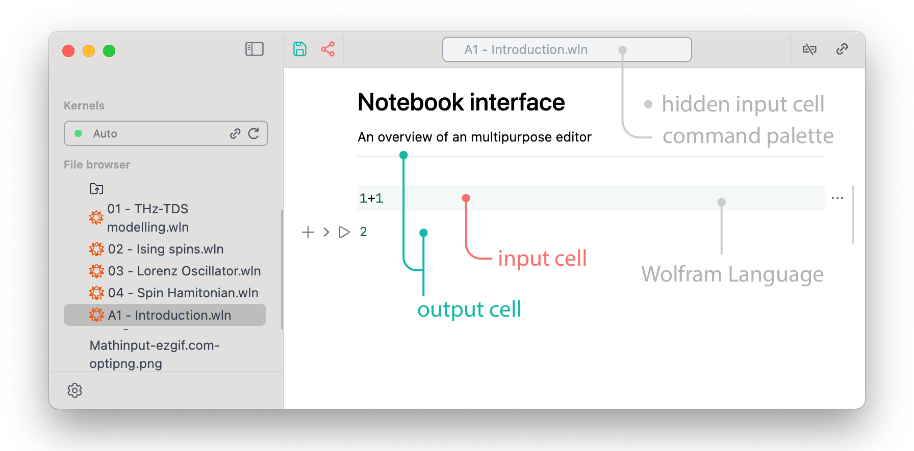
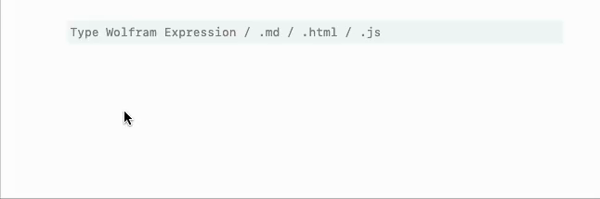
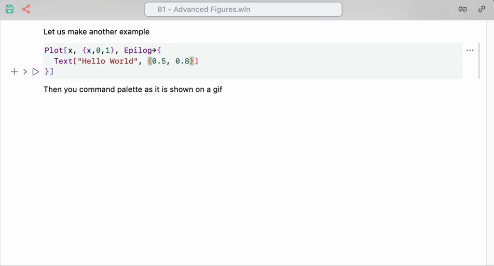
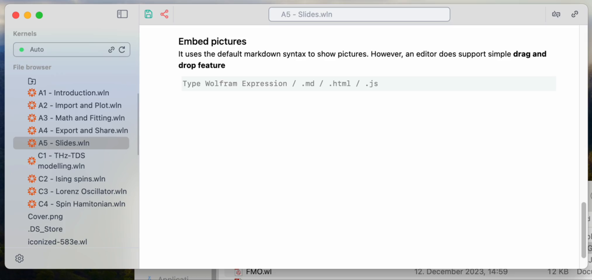
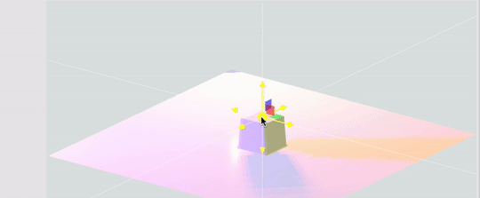
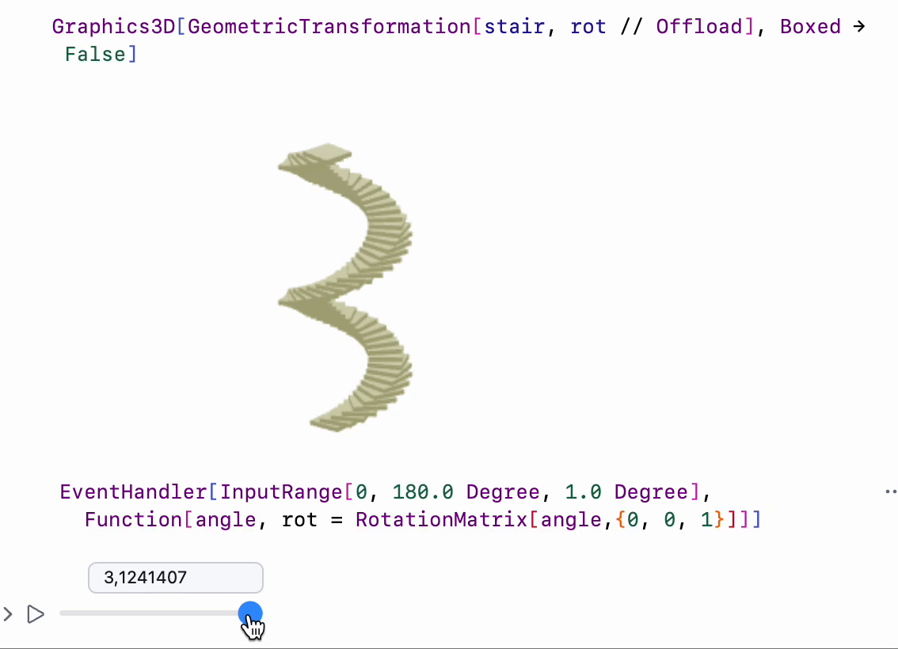

The whole notebook interface is made using plain Javascript, HTML powered by a [Wolfram WebServer](https://github.com/KirillBelovTest/HTTPHandler)  and [WLX](https://jerryi.github.io/wlx-docs/) running locally on a Wolfram Kernel. It means you can work remotely by running a server anywhere you want (see how at [instruction](frontend/instruction.md)).

Some calculations are performed partially by your browser, you can have a control over it, [if you want](frontend/Dynamics.md) . All UI elements, cells operations are written in Javascript and Wolfram Language and performed by WLJS Interpreter

:::info
Compared to Mathematica the cell design has mostly flat structure similar to Jupyter Notebook. Only `input` and `output` cells are joined into groups.
:::

:::info
Output cells are editable
:::

### Cell control buttons
All cells are grouped by parent input cell, apart from that the structure of the notebook is flat. The controls are applied to the whole group

From left to right
- add new cell below
- hide an input cell
- evaluate (also `Shift+Enter` combo)
- more

The last options expands into

Project to a window is the most interesting feature here, that allows to evaluate a cell in a new window. It comes handy while demonstrating [presentations](frontend/Advanced/Slides/Slides.md).

### Shortcuts
*working in both: browser and desktop application*
#### UI
- `Ctrl+S`, `Cmd+S` save notebook
- `Alt+.`, `Cmd+.` abort evaluation
- `Ctrl+P`, `Cmd+P` open command palette
- `Shift+Enter` evaluate current cell
#### Cells
- `Ctrl+W`, `Cmd+2` hide/show input cell
- `Ctrl+/` make fraction on selected
- `Ctrl+6` make superscript on selected
- `Ctrl+2` make square root on selected
- `Ctrl+-` make subscript on selected
- `Ctrl/Cmd+/` comment a line

## Wolfram Language
When you start typing the language you are using assumed to be WL. By pressing `Shift+Enter` you can start evaluation

Output cells are joined to the input and the last one can be hidden by clicking on the $\rightarrow$ sign on the left side from the cell.

:::note
Once you change something inside the output cell, it loses its parent and becomes new input cell, like in Mathematica.
:::

Syntax sugar, fractions and other 2D input are supported 

The most useful commands are listed below

- `Ctrl`+`/` fraction
- `Ctrl`+`^` power
- `Ctrl`+`-` subscript
- `Ctrl`+`2` square root

Or using a special toolbar (snippet)

Now let us move to some other gems

## Snippets
To help in writing matrixes, colors, and some other useful stuff are accessible by the shortcut `Super/Cmd`+`P`

All snippets are just special kind of notebooks including all UI elements.

## AI Copilot
See it in action on Youtube Shorts

<iframe width="315" height="560"
src="https://youtube.com/embed/wenBdDRpD4g?si=bB5h28zAHb7r6Nmh"
title="YouTube video player"
frameborder="0"
allow="accelerometer; autoplay; clipboard-write; encrypted-media; gyroscope; picture-in-picture; web-share"
allowfullscreen></iframe>

<iframe width="315" height="560"
src="https://youtube.com/embed/pXe1mSir47Q?si=UTclXIdPiB3HydPI"
title="YouTube video player"
frameborder="0"
allow="accelerometer; autoplay; clipboard-write; encrypted-media; gyroscope; picture-in-picture; web-share"
allowfullscreen></iframe>

## Editor of Power
A single input cell can produce Wolfram Language output, HTML page, Javascript window or a slide of a presentation

Or just draw something inside the code editor

## Graphics 2D & 3D
Most Mathematica's plotting functions produces lower-level primitives. The major part of them are supported

<Wl >{`ExampleData[{"Geometry3D","KleinBottle"}]`}</Wl>

:::info
Try to drag and pan using your mouse!
:::

:::note
Graphics elements are not exported SVG. All primitives are recreated using d3.js and THREE.js from scratch
:::

## Realtime calculations

__Dynamics? We have a lot of it__

### Short videos

<iframe width="315" height="560"
src="https://youtube.com/embed/ItXbjNtGlew?si=enz0K6jAu2xv5hAK"
title="YouTube video player"
frameborder="0"
allow="accelerometer; autoplay; clipboard-write; encrypted-media; gyroscope; picture-in-picture; web-share"
allowfullscreen></iframe>

Or even with polygons in 3D

<iframe width="560" height="315" src="https://www.youtube.com/embed/LNP1S4-rX3k?si=CcmzvBy2rNlHpajR" title="YouTube video player" frameborder="0" allow="accelerometer; autoplay; clipboard-write; encrypted-media; gyroscope; picture-in-picture; web-share" referrerpolicy="strict-origin-when-cross-origin" allowfullscreen></iframe>

## Other languages
Of course the notebook interface is impossible to use without text annotation, here you do not need to switch to a different cell type. To use you favorite (or not) Markdown type in the first line of a cell `.md` and magic happens

By clicking on an arrow on the right, you can hide the source cell and only the output will be displayed. An editor is very flexible you can quite easily add your custom output cell support. 

Or combine WL together with Javascript to visualize your data in incredible way

