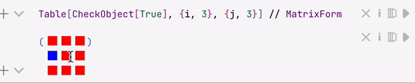

Used __to replace wrapped__ Wolfram Expression with custom HTML/JS elements

```mathematica
(*VB[*)(expr)(*,*)(*view*)(*]VB*)
```

Most decorations generated by `TemplateBox`, graphics functions `Graphics`, `Graphics3D`, `InputButton` and etc are ViewBox-es.

- the expression is __not editable by a user__ and is fully replaced in the editor by the provided view (behaves like a 1 symbol)
- the inner `expr` __is revealed__ after first evaluation 

`RGBColor`, `DateObject` and [InterpretationBox](frontend/Reference/Decorations/InterpretationBox.md) (together with [EditorView](frontend/Reference/GUI/EditorView.md)) uses this structure to display a human-readable form of the content inside

There is a helper function to prevent an editor from rendering, if you want to write using this low-level representation

```mathematica
ViewBox[expr_, displayView_, opts___]
```

it will keep `expr` in a code replacing visually by DOM element. The last one will be attached to the expression `displayView` executed after.


## Options
### `"Event"`
Manually enables events generation. Using the provided event object identifier (`_String`), it fires various events based on its state. You can attach a normal [`EventHandler`](frontend/Reference/Misc/Events.md#`EventHandler`) to the given id

```mathematica
uid = CreateUUID[];
EventHandler[uid, {pattern_String :> handler_, ..}]

ViewBox[.., "Event"->uid]
```

There are following patterns available to be attached to
- `"Mounted"` fires once a widget is visible. A unique identifier is provided as a payload
- `"Destroy"` fires once it was removed

#### Meta markers
Once it has been mounted it provides a unique ID as a string in `"Mounted"` event, which can be used in [MetaMarker](frontend/Reference/Frontend%20IO/MetaMarker.md). You can also apply [``ViewBox`InnerExpression``](#``ViewBox`InnerExpression``) and [``ViewBox`OuterExpression``](#``ViewBox`OuterExpression``) as well.

*If there is no containers found inside ViewBox, it will copy just `env` variable, which is still fine for MetaMarkers to work*


## Examples

:::tip
This method __is much faster__ than [InterpretationBox](frontend/Reference/Decorations/InterpretationBox.md) or [Interpretation](frontend/Reference/Decorations/Interpretation.md), since it does not spawn [EditorView](frontend/Reference/GUI/EditorView.md) inside for displaying regular boxes.
:::

### Simple straight example
Let us make a special symbol with a single property

```mathematica
boxObject /: MakeBoxes[boxObject[s_], StandardForm] := With[{
  g = Graphics[{Blue, Disk[{0,0},1], Opacity[0.5], Red,Disk[{0,0},s]}, ImageSize->80, Controls->False, ImagePadding->None]
},
  ViewBox[boxObject[s], g ]
]
```

As you can see **no JS required**

```mathematica
Table[boxObject[i], {i,3}]
```


And you can still work with them as it was symbols

#### Event listeners
We can make frontend beep, once widget has been destroyed

```mathematica
boxObject /: MakeBoxes[boxObject[s_], StandardForm] := With[{
  g = Graphics[{Blue, Disk[{0,0},1], Opacity[0.5], Red,Disk[{0,0},s]}, ImageSize->80, Controls->False, ImagePadding->None],
  uid = CreateUUID[]
},
  EventHandler[uid, {"Destroy"->Beep}];
  
  ViewBox[boxObject[s], g, "Event"->uid]
]
```

### Replacing expression with custom JS
One can define its own style of cells boxes

```js
.js
core.Replacer = async (args, env) => {
  env.element.style.background = "red";
  env.element.style.width = "2em";
  env.element.style.height = "1em";
}
```

```mathematica
wrapper /: MakeBoxes[wrapper[expr_], StandardForm] := ViewBox[wrapper[expr], Replacer]
```

and then try

```mathematica
wrapper[1/2]
```

:::note
This is basically how `RGBColor`, `DateObject` are implemented
:::


## Mutability
In general it is possible to update the expression underneath indirectly. For this reason, there are multiple way of accessing this feature

### From Wolfram Kernel

Please see methods below

#### ``ViewBox`InnerExpression``
Is used to replace a covered expression by `ViewBox` with a given string. 

:::warning
It must be evaluated in the context of an instance of `ViewBox`, use [MetaMarker](frontend/Reference/Frontend%20IO/MetaMarker.md) and [FrontSubmit](frontend/Reference/Frontend%20IO/FrontSubmit.md) in order to apply this to a specific box
:::

__It returns the current content if no string is specified as an argument__. Use it with [MetaMarker](frontend/Reference/Frontend%20IO/MetaMarker.md) and [FrontFetch](frontend/Reference/Frontend%20IO/FrontFetch.md)

#### ``ViewBox`OuterExpression``
Is used to replace or update the content string within the box (including the box as well)

:::warning
It will destroy an instance of the ViewBox once applied.
:::

__Example__

```mathematica
Plot[x, {x,0,1}, Epilog->{MetaMarker["pp"]}]
```

and then we can destroy it and replace with our text

```mathematica
FrontSubmit[ViewBox`OuterExpression["Hello World"], MetaMarker["pp"]] 
```

### From Javascript function
An expression `displayView` is evaluated on WLJS Interpreter in the browser with special property provided (see tutorial [WLJS Functions](frontend/Advanced/Frontend%20interpretation/WLJS%20Functions.md))

```js
core.displayView = async (args, env) => {
	env.global.EditorWidget
}
```

this object contains property to update the content

```js
EditorWidget.applyChanges('"new content"')
```

##### Example
Let us create a special object, that will act like a checkbox

```mathematica
CheckObject /: MakeBoxes[CheckObject[state_:(True | False)], StandardForm] := With[{},
  ViewBox[CheckObject[state], CheckBoxDecorator[]]
]
```

now JS part

```js
.js

core.CheckBoxDecorator = async (args, env) => {
  let state = false;

  //check the raw data from the viewbox to determine the state
  if (env.global.EditorWidget.getDoc() == 'CheckObject[True]') state = true;

  //make a rectangle
  env.element.style.width = "1em";
  env.element.style.height = "1em";

  const update = (s) => env.element.style.background = s ? 'red' : 'blue';

  //color it depending on state
  update(state);

  //logic for updates when a user click on it
  env.element.addEventListener("click", () => {
    state = !state;
    update(state);
    
    const stringState = state ? 'True' : 'False';
    env.global.EditorWidget.applyChanges('CheckObject['+stringState+']');
  });
}
```

Let's test it!

```mathematica
CheckObject[True]
```
*then try to click on it, copy and paste it*


whatever you do, it will keep its state synced. No communication with WL Kernel happens, everything is running within the code-editor in the browser.

Or even cooler

```mathematica
Table[CheckObject[True], {i, 3}, {j, 3}] // MatrixForm 
```




## Supported output forms
- [StandardForm](frontend/Reference/Decorations/StandardForm.md)
