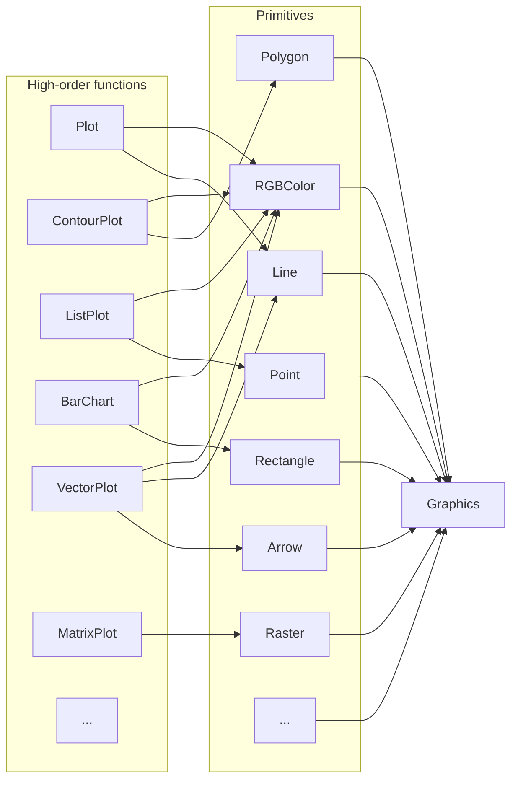

---
env:
  - WLJS
package: wljs-graphics-d3
update: false
source: https://github.com/JerryI/wljs-graphics-d3/blob/dev/src/kernel.js
---
```mathematica
Graphics[objects_, opts___]
```
represents a two-dimensional graphical image. This is a fundamental expression, which is produced by all 2D plotting functions

```mathematica
Graphics[
 Table[{Hue[t/20.0,1., 0.5], Circle[{Cos[2 Pi t/20], Sin[2 Pi t/20]}]}, {t, 20}]]
```

<Wl data={`WyJHcmFwaGljcyIsWyJMaXN0IixbIkxpc3QiLFsiSHVlIiw1LjBlLTIsMS4wLDAuNV0sWyJDaXJj
bGUiLFsiTGlzdCIsWyJQb3dlciIsWyJQbHVzIixbIlJhdGlvbmFsIiw1LDhdLFsiVGltZXMiLFsi
UmF0aW9uYWwiLDEsOF0sWyJQb3dlciIsNSxbIlJhdGlvbmFsIiwxLDJdXV1dLFsiUmF0aW9uYWwi
LDEsMl1dLFsiVGltZXMiLFsiUmF0aW9uYWwiLDEsNF0sWyJQbHVzIiwtMSxbIlBvd2VyIiw1LFsi
UmF0aW9uYWwiLDEsMl1dXV1dXV0sWyJMaXN0IixbIkh1ZSIsMC4xLDEuMCwwLjVdLFsiQ2lyY2xl
IixbIkxpc3QiLFsiVGltZXMiLFsiUmF0aW9uYWwiLDEsNF0sWyJQbHVzIiwxLFsiUG93ZXIiLDUs
WyJSYXRpb25hbCIsMSwyXV1dXSxbIlBvd2VyIixbIlBsdXMiLFsiUmF0aW9uYWwiLDUsOF0sWyJU
aW1lcyIsWyJSYXRpb25hbCIsLTEsOF0sWyJQb3dlciIsNSxbIlJhdGlvbmFsIiwxLDJdXV1dLFsi
UmF0aW9uYWwiLDEsMl1dXV1dLFsiTGlzdCIsWyJIdWUiLDAuMTUwMDAwMDAwMDAwMDAwMDIsMS4w
LDAuNV0sWyJDaXJjbGUiLFsiTGlzdCIsWyJQb3dlciIsWyJQbHVzIixbIlJhdGlvbmFsIiw1LDhd
LFsiVGltZXMiLFsiUmF0aW9uYWwiLC0xLDhdLFsiUG93ZXIiLDUsWyJSYXRpb25hbCIsMSwyXV1d
XSxbIlJhdGlvbmFsIiwxLDJdXSxbIlRpbWVzIixbIlJhdGlvbmFsIiwxLDRdLFsiUGx1cyIsMSxb
IlBvd2VyIiw1LFsiUmF0aW9uYWwiLDEsMl1dXV1dXV0sWyJMaXN0IixbIkh1ZSIsMC4yLDEuMCww
LjVdLFsiQ2lyY2xlIixbIkxpc3QiLFsiVGltZXMiLFsiUmF0aW9uYWwiLDEsNF0sWyJQbHVzIiwt
MSxbIlBvd2VyIiw1LFsiUmF0aW9uYWwiLDEsMl1dXV0sWyJQb3dlciIsWyJQbHVzIixbIlJhdGlv
bmFsIiw1LDhdLFsiVGltZXMiLFsiUmF0aW9uYWwiLDEsOF0sWyJQb3dlciIsNSxbIlJhdGlvbmFs
IiwxLDJdXV1dLFsiUmF0aW9uYWwiLDEsMl1dXV1dLFsiTGlzdCIsWyJIdWUiLDAuMjUsMS4wLDAu
NV0sWyJDaXJjbGUiLFsiTGlzdCIsMCwxXV1dLFsiTGlzdCIsWyJIdWUiLDAuMzAwMDAwMDAwMDAw
MDAwMDQsMS4wLDAuNV0sWyJDaXJjbGUiLFsiTGlzdCIsWyJUaW1lcyIsWyJSYXRpb25hbCIsMSw0
XSxbIlBsdXMiLDEsWyJUaW1lcyIsLTEsWyJQb3dlciIsNSxbIlJhdGlvbmFsIiwxLDJdXV1dXSxb
IlBvd2VyIixbIlBsdXMiLFsiUmF0aW9uYWwiLDUsOF0sWyJUaW1lcyIsWyJSYXRpb25hbCIsMSw4
XSxbIlBvd2VyIiw1LFsiUmF0aW9uYWwiLDEsMl1dXV0sWyJSYXRpb25hbCIsMSwyXV1dXV0sWyJM
aXN0IixbIkh1ZSIsMC4zNTAwMDAwMDAwMDAwMDAwMywxLjAsMC41XSxbIkNpcmNsZSIsWyJMaXN0
IixbIlRpbWVzIiwtMSxbIlBvd2VyIixbIlBsdXMiLFsiUmF0aW9uYWwiLDUsOF0sWyJUaW1lcyIs
WyJSYXRpb25hbCIsLTEsOF0sWyJQb3dlciIsNSxbIlJhdGlvbmFsIiwxLDJdXV1dLFsiUmF0aW9u
YWwiLDEsMl1dXSxbIlRpbWVzIixbIlJhdGlvbmFsIiwxLDRdLFsiUGx1cyIsMSxbIlBvd2VyIiw1
LFsiUmF0aW9uYWwiLDEsMl1dXV1dXV0sWyJMaXN0IixbIkh1ZSIsMC40LDEuMCwwLjVdLFsiQ2ly
Y2xlIixbIkxpc3QiLFsiVGltZXMiLFsiUmF0aW9uYWwiLDEsNF0sWyJQbHVzIiwtMSxbIlRpbWVz
IiwtMSxbIlBvd2VyIiw1LFsiUmF0aW9uYWwiLDEsMl1dXV1dLFsiUG93ZXIiLFsiUGx1cyIsWyJS
YXRpb25hbCIsNSw4XSxbIlRpbWVzIixbIlJhdGlvbmFsIiwtMSw4XSxbIlBvd2VyIiw1LFsiUmF0
aW9uYWwiLDEsMl1dXV0sWyJSYXRpb25hbCIsMSwyXV1dXV0sWyJMaXN0IixbIkh1ZSIsMC40NSwx
LjAsMC41XSxbIkNpcmNsZSIsWyJMaXN0IixbIlRpbWVzIiwtMSxbIlBvd2VyIixbIlBsdXMiLFsi
UmF0aW9uYWwiLDUsOF0sWyJUaW1lcyIsWyJSYXRpb25hbCIsMSw4XSxbIlBvd2VyIiw1LFsiUmF0
aW9uYWwiLDEsMl1dXV0sWyJSYXRpb25hbCIsMSwyXV1dLFsiVGltZXMiLFsiUmF0aW9uYWwiLDEs
NF0sWyJQbHVzIiwtMSxbIlBvd2VyIiw1LFsiUmF0aW9uYWwiLDEsMl1dXV1dXV0sWyJMaXN0Iixb
Ikh1ZSIsMC41LDEuMCwwLjVdLFsiQ2lyY2xlIixbIkxpc3QiLC0xLDBdXV0sWyJMaXN0IixbIkh1
ZSIsMC41NSwxLjAsMC41XSxbIkNpcmNsZSIsWyJMaXN0IixbIlRpbWVzIiwtMSxbIlBvd2VyIixb
IlBsdXMiLFsiUmF0aW9uYWwiLDUsOF0sWyJUaW1lcyIsWyJSYXRpb25hbCIsMSw4XSxbIlBvd2Vy
Iiw1LFsiUmF0aW9uYWwiLDEsMl1dXV0sWyJSYXRpb25hbCIsMSwyXV1dLFsiVGltZXMiLFsiUmF0
aW9uYWwiLDEsNF0sWyJQbHVzIiwxLFsiVGltZXMiLC0xLFsiUG93ZXIiLDUsWyJSYXRpb25hbCIs
MSwyXV1dXV1dXV0sWyJMaXN0IixbIkh1ZSIsMC42MDAwMDAwMDAwMDAwMDAxLDEuMCwwLjVdLFsi
Q2lyY2xlIixbIkxpc3QiLFsiVGltZXMiLFsiUmF0aW9uYWwiLDEsNF0sWyJQbHVzIiwtMSxbIlRp
bWVzIiwtMSxbIlBvd2VyIiw1LFsiUmF0aW9uYWwiLDEsMl1dXV1dLFsiVGltZXMiLC0xLFsiUG93
ZXIiLFsiUGx1cyIsWyJSYXRpb25hbCIsNSw4XSxbIlRpbWVzIixbIlJhdGlvbmFsIiwtMSw4XSxb
IlBvd2VyIiw1LFsiUmF0aW9uYWwiLDEsMl1dXV0sWyJSYXRpb25hbCIsMSwyXV1dXV1dLFsiTGlz
dCIsWyJIdWUiLDAuNjUsMS4wLDAuNV0sWyJDaXJjbGUiLFsiTGlzdCIsWyJUaW1lcyIsLTEsWyJQ
b3dlciIsWyJQbHVzIixbIlJhdGlvbmFsIiw1LDhdLFsiVGltZXMiLFsiUmF0aW9uYWwiLC0xLDhd
LFsiUG93ZXIiLDUsWyJSYXRpb25hbCIsMSwyXV1dXSxbIlJhdGlvbmFsIiwxLDJdXV0sWyJUaW1l
cyIsWyJSYXRpb25hbCIsMSw0XSxbIlBsdXMiLC0xLFsiVGltZXMiLC0xLFsiUG93ZXIiLDUsWyJS
YXRpb25hbCIsMSwyXV1dXV1dXV0sWyJMaXN0IixbIkh1ZSIsMC43MDAwMDAwMDAwMDAwMDAxLDEu
MCwwLjVdLFsiQ2lyY2xlIixbIkxpc3QiLFsiVGltZXMiLFsiUmF0aW9uYWwiLDEsNF0sWyJQbHVz
IiwxLFsiVGltZXMiLC0xLFsiUG93ZXIiLDUsWyJSYXRpb25hbCIsMSwyXV1dXV0sWyJUaW1lcyIs
LTEsWyJQb3dlciIsWyJQbHVzIixbIlJhdGlvbmFsIiw1LDhdLFsiVGltZXMiLFsiUmF0aW9uYWwi
LDEsOF0sWyJQb3dlciIsNSxbIlJhdGlvbmFsIiwxLDJdXV1dLFsiUmF0aW9uYWwiLDEsMl1dXV1d
XSxbIkxpc3QiLFsiSHVlIiwwLjc1LDEuMCwwLjVdLFsiQ2lyY2xlIixbIkxpc3QiLDAsLTFdXV0s
WyJMaXN0IixbIkh1ZSIsMC44LDEuMCwwLjVdLFsiQ2lyY2xlIixbIkxpc3QiLFsiVGltZXMiLFsi
UmF0aW9uYWwiLDEsNF0sWyJQbHVzIiwtMSxbIlBvd2VyIiw1LFsiUmF0aW9uYWwiLDEsMl1dXV0s
WyJUaW1lcyIsLTEsWyJQb3dlciIsWyJQbHVzIixbIlJhdGlvbmFsIiw1LDhdLFsiVGltZXMiLFsi
UmF0aW9uYWwiLDEsOF0sWyJQb3dlciIsNSxbIlJhdGlvbmFsIiwxLDJdXV1dLFsiUmF0aW9uYWwi
LDEsMl1dXV1dXSxbIkxpc3QiLFsiSHVlIiwwLjg1MDAwMDAwMDAwMDAwMDEsMS4wLDAuNV0sWyJD
aXJjbGUiLFsiTGlzdCIsWyJQb3dlciIsWyJQbHVzIixbIlJhdGlvbmFsIiw1LDhdLFsiVGltZXMi
LFsiUmF0aW9uYWwiLC0xLDhdLFsiUG93ZXIiLDUsWyJSYXRpb25hbCIsMSwyXV1dXSxbIlJhdGlv
bmFsIiwxLDJdXSxbIlRpbWVzIixbIlJhdGlvbmFsIiwxLDRdLFsiUGx1cyIsLTEsWyJUaW1lcyIs
LTEsWyJQb3dlciIsNSxbIlJhdGlvbmFsIiwxLDJdXV1dXV1dXSxbIkxpc3QiLFsiSHVlIiwwLjks
MS4wLDAuNV0sWyJDaXJjbGUiLFsiTGlzdCIsWyJUaW1lcyIsWyJSYXRpb25hbCIsMSw0XSxbIlBs
dXMiLDEsWyJQb3dlciIsNSxbIlJhdGlvbmFsIiwxLDJdXV1dLFsiVGltZXMiLC0xLFsiUG93ZXIi
LFsiUGx1cyIsWyJSYXRpb25hbCIsNSw4XSxbIlRpbWVzIixbIlJhdGlvbmFsIiwtMSw4XSxbIlBv
d2VyIiw1LFsiUmF0aW9uYWwiLDEsMl1dXV0sWyJSYXRpb25hbCIsMSwyXV1dXV1dLFsiTGlzdCIs
WyJIdWUiLDAuOTUwMDAwMDAwMDAwMDAwMSwxLjAsMC41XSxbIkNpcmNsZSIsWyJMaXN0IixbIlBv
d2VyIixbIlBsdXMiLFsiUmF0aW9uYWwiLDUsOF0sWyJUaW1lcyIsWyJSYXRpb25hbCIsMSw4XSxb
IlBvd2VyIiw1LFsiUmF0aW9uYWwiLDEsMl1dXV0sWyJSYXRpb25hbCIsMSwyXV0sWyJUaW1lcyIs
WyJSYXRpb25hbCIsMSw0XSxbIlBsdXMiLDEsWyJUaW1lcyIsLTEsWyJQb3dlciIsNSxbIlJhdGlv
bmFsIiwxLDJdXV1dXV1dXSxbIkxpc3QiLFsiSHVlIiwxLjAsMS4wLDAuNV0sWyJDaXJjbGUiLFsi
TGlzdCIsMSwwXV1dXSxbIlJ1bGUiLCJJbWFnZVNpemUiLDM1MF0sWyJSdWxlIiwiSW1hZ2VQYWRk
aW5nIiwiTm9uZSJdXQ==
`}>{`Graphics[
 Table[{Hue[t/20.0,1., 0.5], Circle[{Cos[2 Pi t/20], Sin[2 Pi t/20]}]}, {t, 20}], ImageSize->350, ImagePadding->None]`}</Wl>

```mathematica
Graphics[{EdgeForm[Black], Green, Rectangle[{0, -1}, {2, 1}], Red, Disk[], Blue,
   Circle[{2, 0}], Yellow, Polygon[{{2, 0}, {4, 1}, {4, -1}}], Purple, Arrow[{{4, 3/2}, {0, 3/2}, {0, 0}}], Black, 
  SVGAttribute[Line[{{-1, 0}, {4, 0}}], "stroke-dasharray"->"3"]}]
```

<Wl data={`WyJHcmFwaGljcyIsWyJMaXN0IixbIkVkZ2VGb3JtIixbIkdyYXlMZXZlbCIsMF1dLFsiUkdCQ29s
b3IiLDAsMSwwXSxbIlJlY3RhbmdsZSIsWyJMaXN0IiwwLC0xXSxbIkxpc3QiLDIsMV1dLFsiUkdC
Q29sb3IiLDEsMCwwXSxbIkRpc2siLFsiTGlzdCIsMCwwXV0sWyJSR0JDb2xvciIsMCwwLDFdLFsi
Q2lyY2xlIixbIkxpc3QiLDIsMF1dLFsiUkdCQ29sb3IiLDEsMSwwXSxbIlBvbHlnb24iLFsiTGlz
dCIsWyJMaXN0IiwyLDBdLFsiTGlzdCIsNCwxXSxbIkxpc3QiLDQsLTFdXV0sWyJSR0JDb2xvciIs
MC41LDAsMC41XSxbIkFycm93IixbIkxpc3QiLFsiTGlzdCIsNCxbIlJhdGlvbmFsIiwzLDJdXSxb
Ikxpc3QiLDAsWyJSYXRpb25hbCIsMywyXV0sWyJMaXN0IiwwLDBdXV0sWyJHcmF5TGV2ZWwiLDBd
LFsiU1ZHQXR0cmlidXRlIixbIkxpbmUiLFsiTGlzdCIsWyJMaXN0IiwtMSwwXSxbIkxpc3QiLDQs
MF1dXSxbIlJ1bGUiLCInc3Ryb2tlLWRhc2hhcnJheSciLCInMyciXV1dLFsiUnVsZSIsIkltYWdl
U2l6ZSIsMzUwXSxbIlJ1bGUiLCJJbWFnZVBhZGRpbmciLCJOb25lIl1d
`}>{`Graphics[{EdgeForm[Black], Green, Rectangle[{0, -1}, {2, 1}], Red, Disk[], Blue,
   Circle[{2, 0}], Yellow, Polygon[{{2, 0}, {4, 1}, {4, -1}}], Purple, Arrow[{{4, 3/2}, {0, 3/2}, {0, 0}}], Black, 
  SVGAttribute[Line[{{-1, 0}, {4, 0}}], "stroke-dasharray"->"3"]}, ImageSize->350, ImagePadding->None]`}</Wl>

The engine that interprets graphical data is a [separate Javascript library](https://github.com/JerryI/wljs-graphics-d3).

## Graphics objects
Please see the corresponding section in __Reference__ section for expression to be used with `Graphics`.

Mostly all primitives are generated by a high-order functions like [Plot](frontend/Reference/Plotting%20Functions/Plot.md), [ListLinePlot](frontend/Reference/Plotting%20Functions/ListLinePlot.md), [ListVectorPlot](frontend/Reference/Plotting%20Functions/ListVectorPlot.md), [BubbleChart](frontend/Reference/Plotting%20Functions/BubbleChart.md) and etc




## Options
### `PlotRange`
manually specifies, where the borders of the visible area (viewport) are

```mathematica
PlotRange->{{-1,1}, {-1,1}}
```

:::note
If `PlotRange` is missing, WLJS Graphics will try to guess the dimensions in order to fit all objects to the screen
:::

### `ImageSize`
specifies the actual size in pixels of a canvas

```mathematica
ImageSize->300 or ImageSize->{300,200}
```

### `ImagePadding`
removes or adds the spacing between the plotted range and the canvas border

```mathematica title="remove any padding"
ImagePadding->None
```

<Wl data={`WyJHcmFwaGljcyIsWyJDaXJjbGUiLFsiTGlzdCIsMCwwXV0sWyJSdWxlIiwiSW1hZ2VQYWRkaW5n
IiwiTm9uZSJdLFsiUnVsZSIsIkltYWdlU2l6ZSIsMzUwXV0=
`}>{`Graphics[Circle[], ImagePadding->None, ImageSize->350]`}</Wl>

```mathematica title="add to all sides"
ImagePadding->10
```

<Wl data={`WyJHcmFwaGljcyIsWyJDaXJjbGUiLFsiTGlzdCIsMCwwXV0sWyJSdWxlIiwiSW1hZ2VQYWRkaW5n
IiwxMF0sWyJSdWxlIiwiSW1hZ2VTaXplIiwzNTBdXQ==
`}>{`Graphics[Circle[], ImagePadding->10, ImageSize->350]`}</Wl>

### `Axes`
Show or hide axes 

```mathematica
Axes->True
```

#### Example
```mathematica
Graphics[{EdgeForm[Black], Green, Rectangle[{0, -1}, {2, 1}], Red, Disk[], Blue,
   Circle[{2, 0}], Yellow, Polygon[{{2, 0}, {4, 1}, {4, -1}}], Purple, Arrow[{{4, 3/2}, {0, 3/2}, {0, 0}}], Black, 
  SVGAttribute[Line[{{-1, 0}, {4, 0}}], "stroke-dasharray"->"3"]}, Axes->True ]
```

<Wl data={`WyJHcmFwaGljcyIsWyJMaXN0IixbIkVkZ2VGb3JtIixbIkdyYXlMZXZlbCIsMF1dLFsiUkdCQ29s
b3IiLDAsMSwwXSxbIlJlY3RhbmdsZSIsWyJMaXN0IiwwLC0xXSxbIkxpc3QiLDIsMV1dLFsiUkdC
Q29sb3IiLDEsMCwwXSxbIkRpc2siLFsiTGlzdCIsMCwwXV0sWyJSR0JDb2xvciIsMCwwLDFdLFsi
Q2lyY2xlIixbIkxpc3QiLDIsMF1dLFsiUkdCQ29sb3IiLDEsMSwwXSxbIlBvbHlnb24iLFsiTGlz
dCIsWyJMaXN0IiwyLDBdLFsiTGlzdCIsNCwxXSxbIkxpc3QiLDQsLTFdXV0sWyJSR0JDb2xvciIs
MC41LDAsMC41XSxbIkFycm93IixbIkxpc3QiLFsiTGlzdCIsNCxbIlJhdGlvbmFsIiwzLDJdXSxb
Ikxpc3QiLDAsWyJSYXRpb25hbCIsMywyXV0sWyJMaXN0IiwwLDBdXV0sWyJHcmF5TGV2ZWwiLDBd
LFsiU1ZHQXR0cmlidXRlIixbIkxpbmUiLFsiTGlzdCIsWyJMaXN0IiwtMSwwXSxbIkxpc3QiLDQs
MF1dXSxbIlJ1bGUiLCInc3Ryb2tlLWRhc2hhcnJheSciLCInMyciXV1dLFsiUnVsZSIsIkltYWdl
U2l6ZSIsMzUwXSxbIlJ1bGUiLCJBeGVzIix0cnVlXV0=
`}>{`Graphics[{EdgeForm[Black], Green, Rectangle[{0, -1}, {2, 1}], Red, Disk[], Blue,
   Circle[{2, 0}], Yellow, Polygon[{{2, 0}, {4, 1}, {4, -1}}], Purple, Arrow[{{4, 3/2}, {0, 3/2}, {0, 0}}], Black, 
  SVGAttribute[Line[{{-1, 0}, {4, 0}}], "stroke-dasharray"->"3"]}, ImageSize->350, Axes->True ]`}</Wl>

### `AxesLabel`
Place labels on your axes
```mathematica
AxesLabel -> {"xxx", "yyy"}
```

:::note
Activate `Axes` option first
:::

for example

<Wl data={`WyJHcmFwaGljcyIsWyJDaXJjbGUiLFsiTGlzdCIsMCwwXV0sWyJSdWxlIiwiSW1hZ2VTaXplIiwz
NTBdLFsiUnVsZSIsIkF4ZXMiLHRydWVdLFsiUnVsZSIsIkF4ZXNMYWJlbCIsWyJMaXN0IiwiJ3h4
eCciLCIneXknIl1dXQ==
`}>{`Graphics[Circle[], ImageSize->350, Axes->True, AxesLabel->{"xxx","yy"}]`}</Wl>

Labels __accepts only strings__ or numbers unlike Mathematica, where you can put everything. 

Since it is translated into [`Text`](frontend/Reference/Graphics/Text.md), one can use sort of TeX math input

```mathematica
Graphics[Circle[], Axes->True, AxesLabel -> {"x-axis (cm^{-1})", "y-axis \\alpha"}]
```

<Wl data={`WyJHcmFwaGljcyIsWyJDaXJjbGUiLFsiTGlzdCIsMCwwXV0sWyJSdWxlIiwiSW1hZ2VTaXplIiwz
NTBdLFsiUnVsZSIsIkF4ZXMiLHRydWVdLFsiUnVsZSIsIkF4ZXNMYWJlbCIsWyJMaXN0IiwiJ3gt
YXhpcyAoY21eey0xfSknIiwiJ3ktYXhpcyBcXGFscGhhJyJdXV0=
`}>{`Graphics[Circle[], ImageSize->350, Axes->True, AxesLabel -> {"x-axis (cm^{-1})", "y-axis \\alpha"}]`}</Wl>


It also supports [Offset](frontend/Reference/Graphics/Offset.md) attribute

```mathematica
Graphics[Circle[], Axes->True, AxesLabel -> {Offset["x-axis (cm^{-1})", {0,0.5}], "y-axis \\alpha"}]
```

<Wl data={`WyJHcmFwaGljcyIsWyJDaXJjbGUiLFsiTGlzdCIsMCwwXV0sWyJSdWxlIiwiSW1hZ2VTaXplIiwz
NTBdLFsiUnVsZSIsIkF4ZXMiLHRydWVdLFsiUnVsZSIsIkF4ZXNMYWJlbCIsWyJMaXN0IixbIk9m
ZnNldCIsIid4LWF4aXMgKGNtXnstMX0pJyIsWyJMaXN0IiwwLDAuNV1dLCIneS1heGlzIFxcYWxw
aGEnIl1dXQ==
`}>{`Graphics[Circle[], ImageSize->350, Axes->True, AxesLabel -> {Offset["x-axis (cm^{-1})", {0,0.5}], "y-axis \\alpha"}]`}</Wl>


### `Ticks`
Customize ticks by providing an array of numbers for both axes
```mathematica
Graphics[Circle[], Axes->True, Ticks->{{0, 0.5, 1}, {}}]
```

<Wl data={`WyJHcmFwaGljcyIsWyJDaXJjbGUiLFsiTGlzdCIsMCwwXV0sWyJSdWxlIiwiSW1hZ2VTaXplIiwz
NTBdLFsiUnVsZSIsIkF4ZXMiLHRydWVdLFsiUnVsZSIsIlRpY2tzIixbIkxpc3QiLFsiTGlzdCIs
MCwwLjUsMV0sWyJMaXN0Il1dXV0=
`}>{`Graphics[Circle[], ImageSize->350, Axes->True, Ticks->{{0, 0.5, 1}, {}}]`}</Wl>

Or by providing as pairs `{Number, String}` one can specify the displayed text
```mathematica
Graphics[Circle[], Axes->True, Ticks->{{{0, "Zero"}, {0.5, "Half"}, {1,"One"}}, {}}]
```

<Wl data={`WyJHcmFwaGljcyIsWyJDaXJjbGUiLFsiTGlzdCIsMCwwXV0sWyJSdWxlIiwiSW1hZ2VTaXplIiwz
NTBdLFsiUnVsZSIsIkF4ZXMiLHRydWVdLFsiUnVsZSIsIlRpY2tzIixbIkxpc3QiLFsiTGlzdCIs
WyJMaXN0IiwwLCInWmVybyciXSxbIkxpc3QiLDAuNSwiJ0hhbGYnIl0sWyJMaXN0IiwxLCInT25l
JyJdXSxbIkxpc3QiXV1dXQ==
`}>{`Graphics[Circle[], ImageSize->350, Axes->True, Ticks->{{{0, "Zero"}, {0.5, "Half"}, {1,"One"}}, {}}]`}</Wl>


### `Controls`
The features __allows to pan and zoom your plots__, that was never possible in Mathematica

```mathematica
Controls->True
```

<Wl data={`WyJHcmFwaGljcyIsWyJBbm5vdGF0aW9uIixbIkxpc3QiLFsiTGlzdCIsWyJMaXN0IixbIkxpc3Qi
XSxbIkxpc3QiXSxbIkFubm90YXRpb24iLFsiTGlzdCIsWyJEaXJlY3RpdmUiLFsiT3BhY2l0eSIs
MS4wXSxbIlJHQkNvbG9yIiwwLjM2ODQxNywwLjUwNjc3OSwwLjcwOTc5OF0sWyJBYnNvbHV0ZVRo
aWNrbmVzcyIsMl1dLFsiTGluZSIsWyJMaXN0IixbIkxpc3QiLDEuMDAwMDAyMDIwNDA4MTYzM2Ut
MywwLjgyNTc0MTYyMDY1MDAxODhdLFsiTGlzdCIsMS45NzE2MTk3Mzk2Nzk4MzY1ZS0zLC0wLjk4
NTU4MTQ5MjY3NjIxNTNdLFsiTGlzdCIsMi45NDMyMzc0NTg5NTE1MDk2ZS0zLDAuNDUyODA2MDM0
NTAxNTEwMV0sWyJMaXN0IiwzLjk5NjU4MjQwNTIwNTk1OGUtMywtMC44OTczMDY4ODMyOTQyMTQy
XSxbIkxpc3QiLDUuMDQ5OTI3MzUxNDYwNDA2ZS0zLC0wLjEwMjEzNTExNzQ5MTQ3NzUyXSxbIkxp
c3QiLDYuMDMzNDY4OTEyNDUyNzMyZS0zLDAuNjkwNTcxNDA0MjUxNDM4OV0sWyJMaXN0Iiw3LjAx
NzAxMDQ3MzQ0NTA1N2UtMywtMC45MDgyODM0MzU5NzkxNjExXSxbIkxpc3QiLDcuOTgxMjU4ODUz
MjU2ODk0ZS0zLC0wLjM2MTc5MDgxMjgyMzg5NzhdLFsiTGlzdCIsOC45NDU1MDcyMzMwNjg3M2Ut
MywtMC45NjYwMjM4ODA2NjM2MjA3XSxbIkxpc3QiLDkuOTkxNDgyODM5ODYzMzRlLTMsLTAuNDMx
MTA4Mjg4NjY4NTI3MTNdLFsiTGlzdCIsMS4xMDM3NDU4NDQ2NjU3OTVlLTIsMC40ODQzNDk0MDA1
OTI5MzY4XSxbIkxpc3QiLDEuMjAxMzYzMDY2ODE5MDQzOGUtMiwwLjk5OTkwOTkyNjIyMzU4Njhd
LFsiTGlzdCIsMS4yOTg5ODAyODg5NzIyOTI1ZS0yLDAuOTk5ODk1NzEzMTQ3MzY1XSxbIkxpc3Qi
LDEuNDA0NzcwMjMzODIzODE5ZS0yLDAuODc3NDk0MzgxMzE0Mjk2N10sWyJMaXN0IiwxLjUxMDU2
MDE3ODY3NTM0NTJlLTIsLTAuMjI1MjEyMTYwOTQ2NTEzNjddLFsiTGlzdCIsMS42MTQ0MjA4MDU0
MDg4MjI3ZS0yLC0wLjc3NzE1NjA3ODc1ODQxODFdLFsiTGlzdCIsMS43MTgyODE0MzIxNDIzZS0y
LDAuOTk2OTQyMzczNzkyNjU1N10sWyJMaXN0IiwxLjgxNTE2MTcyMDM0OTU2NTNlLTIsLTAuOTkz
NTUwMDg4Mzc2NDU1Nl0sWyJMaXN0IiwxLjkxMjA0MjAwODU1NjgzZS0yLDAuODk0MzQ2Nzg5NDAy
MDE0Nl0sWyJMaXN0IiwyLjAxNzA5NTAxOTQ2MjM3MjdlLTIsLTAuNjM1OTQ3NjkyOTgxMzE2Nl0s
WyJMaXN0IiwyLjEyMjE0ODAzMDM2NzkxNTJlLTIsMS44MjM1OTAyMDU4MTk4OTk3ZS0zXSxbIkxp
c3QiLDIuMjIwMjIwNzAyNzQ3MjQ1NmUtMiwwLjg3MTUwODUwNTgyODEwMzRdLFsiTGlzdCIsMi4z
MTgyOTMzNzUxMjY1NzU3ZS0yLC0wLjc0OTM3NTIzMzE0NDE0ODFdLFsiTGlzdCIsMi40MTQ0MzY3
MjkzODc4NTdlLTIsLTAuNTQ1MzYzODYyNzQzMjY5NF0sWyJMaXN0IiwyLjUxMDU4MDA4MzY0OTEz
ODRlLTIsMC44NDY0NDQ2NjUxNzA0MDE3XSxbIkxpc3QiLDIuNjE0ODk2MTYwNjA4Njk3ZS0yLDAu
NTE2OTg0NjA4OTA1NDYzNV0sWyJMaXN0IiwyLjcxOTIxMjIzNzU2ODI1NmUtMiwtMC43OTc4NzA5
NDIxMDc2MDI4XSxbIkxpc3QiLDIuODE2NTQ3OTc2MDAxNjAyNmUtMiwtMC44MTE2MjkxMjEzOTI3
NjU5XSxbIkxpc3QiLDIuOTEzODgzNzE0NDM0OTQ5ZS0yLDAuMjM2Nzg5MjQyNzAzODEyNDZdLFsi
TGlzdCIsMy4wMTkzOTIxNzU1NjY1NzMzZS0yLDAuOTkxMjMxMzEzMTY4MTY2Ml0sWyJMaXN0Iiwz
LjEyNDkwMDYzNjY5ODE5NzVlLTIsMC41NTIyNzUyMjgzOTA1NzI5XSxbIkxpc3QiLDMuMjI4NDc5
Nzc5NzExNzcyZS0yLC0wLjQyNzM4Mjg1NjY5Mzk2ODJdLFsiTGlzdCIsMy4zMzIwNTg5MjI3MjUz
NDhlLTIsLTAuOTg2MTk2NzMwMzc3NzYzN10sWyJMaXN0IiwzLjQyODY1NzcyNzIxMjcxMWUtMiwt
MC43NzgwNzY5NzMxMzk0Nzk0XSxbIkxpc3QiLDMuNTI1MjU2NTMxNzAwMDc0ZS0yLC05LjIyNjQ2
NDgwMDMxODU0NGUtMl0sWyJMaXN0IiwzLjYzMDAyODA1ODg4NTcxNGUtMiwwLjY2NDEzNTkzMjk4
MTUyOTJdLFsiTGlzdCIsMy43MzQ3OTk1ODYwNzEzNTQ0ZS0yLDAuOTk3NDMzNDU4Mzk3ODcyNl0s
WyJMaXN0IiwzLjgzMjU5MDc3NDczMDc4MjZlLTIsMC44MTg3NzI0NTEzNzg1ODE1XSxbIkxpc3Qi
LDMuOTMwMzgxOTYzMzkwMjExZS0yLDAuMzA1MTMzNDUxOTUwMDE4NF0sWyJMaXN0Iiw0LjAzNjM0
NTg3NDc0NzkxN2UtMiwtMC4zNTAyNjgyMDYwMjYxOTc4XSxbIkxpc3QiLDQuMTQyMzA5Nzg2MTA1
NjIyZS0yLC0wLjgzNjkxNDExNzI2NjA3MThdLFsiTGlzdCIsNC4yNDYzNDQzNzkzNDUyNzg2ZS0y
LC0wLjk5OTkyNDYzODc4MjE5NzhdLFsiTGlzdCIsNC4zNTAzNzg5NzI1ODQ5MzU0ZS0yLC0wLjgz
ODk1MTk4NTg1ODUxMzldLFsiTGlzdCIsNC40NDc0MzMyMjcyOTgzNzk0ZS0yLC0wLjQ3MzkxNDQ4
MzAxNjgwMjMzXSxbIkxpc3QiLDQuNTQ0NDg3NDgyMDExODI0ZS0yLC0xLjM1MzI1OTQ4ODU2MTk0
OTNlLTJdLFsiTGlzdCIsNC42NDk3MTQ0NTk0MjM1NDZlLTIsMC40NjU3MjMxMTQ1MzY3Mzk4N10s
WyJMaXN0Iiw0Ljc1NDk0MTQzNjgzNTI2OGUtMiwwLjgxOTQxODI0MDM0MDYwMzhdLFsiTGlzdCIs
NC44NTMxODgwNzU3MjA3Nzc1ZS0yLDAuOTgyOTk4NzI1OTM5Nzc3MV0sWyJMaXN0Iiw0Ljk1MTQz
NDcxNDYwNjI4N2UtMiwwLjk3NDk3NTQ1MjY2Njc2MDNdLFsiTGlzdCIsNS4wNDc3NTIwMzUzNzM3
NDhlLTIsMC44MTk5MDM3NTQ5OTQwODE3XSxbIkxpc3QiLDUuMTQ0MDY5MzU2MTQxMjA4NmUtMiww
LjU1NjYxNTU4ODAwMDE4MzFdLFsiTGlzdCIsNS4yNDg1NTkzOTk2MDY5NDdlLTIsMC4yMDE4OTM4
NzIyNzMzMzk1NV0sWyJMaXN0Iiw1LjM1MzA0OTQ0MzA3MjY4NWUtMiwtMC4xNjc4MTcyMjUyODUy
NjIzM10sWyJMaXN0Iiw1LjQ1MDU1OTE0ODAxMjIxMWUtMiwtMC40ODE4OTM0Nzg2ODQ3MzUzN10s
WyJMaXN0Iiw1LjU0ODA2ODg1Mjk1MTczN2UtMiwtMC43MzQ3Mjg0MzcwNjk4NDczXSxbIkxpc3Qi
LDUuNjUzNzUxMjgwNTg5NTQwNGUtMiwtMC45MTc2NzMxOTUxNzgyMzAyXSxbIkxpc3QiLDUuNzU5
NDMzNzA4MjI3MzQzNGUtMiwtMC45OTY0NjkxNjEyMDA2Njc4XSxbIkxpc3QiLDUuODYzMTg2ODE3
NzQ3MDk4ZS0yLC0wLjk3NTE5NjY3OTI2NzE0NzFdLFsiTGlzdCIsNS45NjY5Mzk5MjcyNjY4NTI1
ZS0yLC0wLjg2Nzk0MzA4MTkwNDczMTFdLFsiTGlzdCIsNi4wNjM3MTI2OTgyNjAzOTRlLTIsLTAu
NzA1ODIyMjc1Njc3NDY0OF0sWyJMaXN0Iiw2LjE2MDQ4NTQ2OTI1MzkzN2UtMiwtMC41MDA4MDA3
ODA1NjgzMDcyXSxbIkxpc3QiLDYuMjY1NDMwOTYyOTQ1NzU2ZS0yLC0wLjI0OTk1MjA3NDcyNjY0
NTgyXSxbIkxpc3QiLDYuMzcwMzc2NDU2NjM3NTc2ZS0yLDEuMDMwMzY2NDYwMTYyNjI2OGUtMl0s
WyJMaXN0Iiw2LjQ2ODM0MTYxMTgwMzE4M2UtMiwwLjI0NTUxNDE1NjcwMzcyMzM3XSxbIkxpc3Qi
LDYuNTY2MzA2NzY2OTY4NzkxZS0yLDAuNDYwNjI3NjQ1ODM2MjExMV0sWyJMaXN0Iiw2LjY2MjM0
MjYwNDAxNjM1ZS0yLDAuNjQyODYxMjMyNTM2MDM0Nl0sWyJMaXN0Iiw2Ljc1ODM3ODQ0MTA2Mzkw
N2UtMiwwLjc5MDQzMjM4NDIzODQxNDhdLFsiTGlzdCIsNi44NjI1ODcwMDA4MDk3NDNlLTIsMC45
MDcwMzk2NjIxNTQzMDU0XSxbIkxpc3QiLDYuOTY2Nzk1NTYwNTU1NTc5ZS0yLDAuOTc2NjI2Mzc3
ODA0NTU4OV0sWyJMaXN0Iiw3LjA2NDAyMzc4MTc3NTIwM2UtMiwwLjk5OTgxODE1Nzk3Nzc1MDZd
LFsiTGlzdCIsNy4xNjEyNTIwMDI5OTQ4MjdlLTIsMC45ODUwNTA2OTk1MjM3Nzc3XSxbIkxpc3Qi
LDcuMjY2NjUyOTQ2OTEyNzI3ZS0yLDAuOTMwMjYwODg0NDc1NDA1N10sWyJMaXN0Iiw3LjM3MjA1
Mzg5MDgzMDYzZS0yLDAuODQwNTg5MjYwOTgxNTQ4N10sWyJMaXN0Iiw3LjQ3MDQ3NDQ5NjIyMjMx
OGUtMiwwLjczMDkxMzgwMzkyMDE5NTZdLFsiTGlzdCIsNy41Njg4OTUxMDE2MTQwMDhlLTIsMC42
MDE2NzU3MTQ4MjQ0MjJdLFsiTGlzdCIsNy42NjUzODYzODg4ODc2NDllLTIsMC40NjExNDU5MDAy
NzExMDQxXSxbIkxpc3QiLDcuNzYxODc3Njc2MTYxMjg4ZS0yLDAuMzExODIxODkwNDMwODE2OF0s
WyJMaXN0Iiw3Ljk3MTIwNTY5NjEwNTEyM2UtMiwtMi4xMjE1NDAxODMxNDI3NjMzZS0yXSxbIkxp
c3QiLDguMTY2NTczMDM4OTk2NTMzZS0yLC0wLjMxNTgzMDkxOTQ2OTAwNTNdLFsiTGlzdCIsOC4y
NzI0Mjk0MzMxNDA1MTZlLTIsLTAuNDYwMDI0OTY0Njc3NjU4ODVdLFsiTGlzdCIsOC4zNzgyODU4
MjcyODQ0OThlLTIsLTAuNTg5NzU0NTY4MDA4MDgzXSxbIkxpc3QiLDguNDgyMjEyOTAzMzEwNDMy
ZS0yLC0wLjcwMTEzOTQ0NDAzMTQ1MTFdLFsiTGlzdCIsOC41ODYxMzk5NzkzMzYzNjZlLTIsLTAu
Nzk1NDE1ODk4NjUxMjgyOF0sWyJMaXN0Iiw4LjY4MzA4NjcxNjgzNjA4N2UtMiwtMC44NjcyODgy
MjcyNDk4NjU3XSxbIkxpc3QiLDguNzgwMDMzNDU0MzM1ODA5ZS0yLC0wLjkyMzQxNzc3Njg0MDU0
OTldLFsiTGlzdCIsOC44ODUxNTI5MTQ1MzM4MDllLTIsLTAuOTY2NjA2NTk4ODQ2NDIxNV0sWyJM
aXN0Iiw4Ljk5MDI3MjM3NDczMTgwN2UtMiwtMC45OTE4NzUzNDY3NDg5NjM0XSxbIkxpc3QiLDku
MDg4NDExNDk2NDAzNTk1ZS0yLC0wLjk5OTk3MjI1OTA2Njc2MTddLFsiTGlzdCIsOS4xODY1NTA2
MTgwNzUzODFlLTIsLTAuOTkzOTQ1NTg3MDYzOTg4OF0sWyJMaXN0Iiw5LjI4Mjc2MDQyMTYyOTEx
OWUtMiwtMC45NzUyNTY4MDEwMDIyMjddLFsiTGlzdCIsOS4zNzg5NzAyMjUxODI4NTdlLTIsLTAu
OTQ0OTI3NjIyODE1NjQyMl0sWyJMaXN0Iiw5LjQ4MzM1Mjc1MTQzNDg3M2UtMiwtMC45MDAxMDcz
NzUyNTUzNTMzXSxbIkxpc3QiLDkuNTg3NzM1Mjc3Njg2ODg3ZS0yLC0wLjg0NDI3NjU2NTgzNjQz
MTFdLFsiTGlzdCIsOS42ODUxMzc0NjU0MTI2OTFlLTIsLTAuNzgzNTI2MjI3Nzc0NjIyOF0sWyJM
aXN0Iiw5Ljc4MjUzOTY1MzEzODQ5M2UtMiwtMC43MTU2MjM1NDQ0NTE2MDQ3XSxbIkxpc3QiLDku
ODkxMjY5NzI1NTQ4ODM5ZS0yLC0wLjYzMjc4NzI1OTgwODE3ODRdLFsiTGlzdCIsOS45OTk5OTk3
OTc5NTkxODVlLTIsLTAuNTQ0MDIxMjgwNDE2MDU4MV1dXV0sIidDaGFydGluZ2BQcml2YXRlYFRh
ZyMxJyJdXV0sWyJMaXN0Il1dLFsiQXNzb2NpYXRpb24iLFsiUnVsZSIsIidIaWdobGlnaHRFbGVt
ZW50cyciLFsiQXNzb2NpYXRpb24iLFsiUnVsZSIsIidMYWJlbCciLFsiTGlzdCIsIidYWUxhYmVs
JyJdXSxbIlJ1bGUiLCInQmFsbCciLFsiTGlzdCIsIidJbnRlcnBvbGF0ZWRCYWxsJyJdXV1dLFsi
UnVsZSIsIidMYXlvdXRPcHRpb25zJyIsWyJBc3NvY2lhdGlvbiIsWyJSdWxlIiwiJ1BhbmVsUGxv
dExheW91dCciLFsiQXNzb2NpYXRpb24iXV0sWyJSdWxlIiwiJ1Bsb3RSYW5nZSciLFsiTGlzdCIs
WyJMaXN0IiwxLjBlLTMsMC4xXSxbIkxpc3QiLC0wLjk5OTk3MjI1OTA2Njc2MTcsMC45OTk5MDk5
MjYyMjM1ODY4XV1dLFsiUnVsZSIsIidGcmFtZSciLFsiTGlzdCIsWyJMaXN0IixmYWxzZSxmYWxz
ZV0sWyJMaXN0IixmYWxzZSxmYWxzZV1dXSxbIlJ1bGUiLCInQXhlc09yaWdpbiciLFsiTGlzdCIs
MCwwXV0sWyJSdWxlIiwiJ0ltYWdlU2l6ZSciLFsiTGlzdCIsMzUwLFsiVGltZXMiLDM1MCxbIlBv
d2VyIiwiR29sZGVuUmF0aW8iLC0xXV1dXSxbIlJ1bGUiLCInQXhlcyciLFsiTGlzdCIsdHJ1ZSx0
cnVlXV0sWyJSdWxlIiwiJ0xhYmVsU3R5bGUnIixbIkxpc3QiXV0sWyJSdWxlIiwiJ0FzcGVjdFJh
dGlvJyIsWyJQb3dlciIsIkdvbGRlblJhdGlvIiwtMV1dLFsiUnVsZSIsIidEZWZhdWx0U3R5bGUn
IixbIkxpc3QiLFsiRGlyZWN0aXZlIixbIk9wYWNpdHkiLDEuMF0sWyJSR0JDb2xvciIsMC4zNjg0
MTcsMC41MDY3NzksMC43MDk3OThdLFsiQWJzb2x1dGVUaGlja25lc3MiLDJdXV1dLFsiUnVsZSIs
IidIaWdobGlnaHRMYWJlbGluZ0Z1bmN0aW9ucyciLFsiQXNzb2NpYXRpb24iLFsiUnVsZSIsIidD
b29yZGluYXRlc1Rvb2xPcHRpb25zJyIsWyJGdW5jdGlvbiIsWyJMaXN0IixbIklkZW50aXR5Iixb
IlBhcnQiLFsiU2xvdCIsMV0sMV1dLFsiSWRlbnRpdHkiLFsiUGFydCIsWyJTbG90IiwxXSwyXV1d
XV0sWyJSdWxlIiwiJ1NjYWxpbmdGdW5jdGlvbnMnIixbIkxpc3QiLFsiTGlzdCIsIklkZW50aXR5
IiwiSWRlbnRpdHkiXSxbIkxpc3QiLCJJZGVudGl0eSIsIklkZW50aXR5Il1dXV1dLFsiUnVsZSIs
IidQcmltaXRpdmVzJyIsWyJMaXN0Il1dLFsiUnVsZSIsIidHQ0ZsYWcnIixmYWxzZV1dXSxbIlJ1
bGUiLCInTWV0YSciLFsiQXNzb2NpYXRpb24iLFsiUnVsZSIsIidEZWZhdWx0SGlnaGxpZ2h0JyIs
WyJMaXN0IiwiJ0R5bmFtaWMnIiwiTm9uZSJdXSxbIlJ1bGUiLCInSW5kZXgnIixbIkxpc3QiXV0s
WyJSdWxlIiwiJ0Z1bmN0aW9uJyIsIlBsb3QiXSxbIlJ1bGUiLCInR3JvdXBIaWdobGlnaHQnIixm
YWxzZV1dXV0sIidEeW5hbWljSGlnaGxpZ2h0JyJdLFsiTGlzdCIsWyJSdWxlIiwiRGlzcGxheUZ1
bmN0aW9uIiwiSWRlbnRpdHkiXSxbIlJ1bGUiLCJEaXNwbGF5RnVuY3Rpb24iLCJJZGVudGl0eSJd
LFsiUnVsZSIsIlRpY2tzIixbIkxpc3QiLCJBdXRvbWF0aWMiLCJBdXRvbWF0aWMiXV0sWyJSdWxl
IiwiQXhlc09yaWdpbiIsWyJMaXN0IiwwLDBdXSxbIlJ1bGUiLCJGcmFtZVRpY2tzIixbIkxpc3Qi
LFsiTGlzdCIsIkF1dG9tYXRpYyIsIkF1dG9tYXRpYyJdLFsiTGlzdCIsIkF1dG9tYXRpYyIsIkF1
dG9tYXRpYyJdXV0sWyJSdWxlIiwiR3JpZExpbmVzIixbIkxpc3QiLCJOb25lIiwiTm9uZSJdXSxb
IlJ1bGUiLCJEaXNwbGF5RnVuY3Rpb24iLCJJZGVudGl0eSJdLFsiUnVsZSIsIlBsb3RSYW5nZVBh
ZGRpbmciLFsiTGlzdCIsWyJMaXN0IixbIlNjYWxlZCIsMi4wZS0yXSxbIlNjYWxlZCIsMi4wZS0y
XV0sWyJMaXN0IixbIlNjYWxlZCIsNS4wZS0yXSxbIlNjYWxlZCIsNS4wZS0yXV1dXSxbIlJ1bGUi
LCJQbG90UmFuZ2VDbGlwcGluZyIsdHJ1ZV0sWyJSdWxlIiwiSW1hZ2VQYWRkaW5nIiwiQWxsIl0s
WyJSdWxlIiwiRGlzcGxheUZ1bmN0aW9uIiwiSWRlbnRpdHkiXSxbIlJ1bGUiLCJBc3BlY3RSYXRp
byIsWyJQb3dlciIsIkdvbGRlblJhdGlvIiwtMV1dLFsiUnVsZSIsIkF4ZXMiLFsiTGlzdCIsdHJ1
ZSx0cnVlXV0sWyJSdWxlIiwiQXhlc0xhYmVsIixbIkxpc3QiLCJOb25lIiwiTm9uZSJdXSxbIlJ1
bGUiLCJBeGVzT3JpZ2luIixbIkxpc3QiLDAsMF1dLFsiUnVsZURlbGF5ZWQiLCJEaXNwbGF5RnVu
Y3Rpb24iLCJJZGVudGl0eSJdLFsiUnVsZSIsIkZyYW1lIixbIkxpc3QiLFsiTGlzdCIsZmFsc2Us
ZmFsc2VdLFsiTGlzdCIsZmFsc2UsZmFsc2VdXV0sWyJSdWxlIiwiRnJhbWVMYWJlbCIsWyJMaXN0
IixbIkxpc3QiLCJOb25lIiwiTm9uZSJdLFsiTGlzdCIsIk5vbmUiLCJOb25lIl1dXSxbIlJ1bGUi
LCJGcmFtZVRpY2tzIixbIkxpc3QiLFsiTGlzdCIsIkF1dG9tYXRpYyIsIkF1dG9tYXRpYyJdLFsi
TGlzdCIsIkF1dG9tYXRpYyIsIkF1dG9tYXRpYyJdXV0sWyJSdWxlIiwiR3JpZExpbmVzIixbIkxp
c3QiLCJOb25lIiwiTm9uZSJdXSxbIlJ1bGUiLCJHcmlkTGluZXNTdHlsZSIsWyJEaXJlY3RpdmUi
LFsiR3JheUxldmVsIiwwLjUsMC40XV1dLFsiUnVsZSIsIkltYWdlU2l6ZSIsMzUwXSxbIlJ1bGUi
LCJNZXRob2QiLFsiTGlzdCIsWyJSdWxlIiwiJ0RlZmF1bHRCb3VuZGFyeVN0eWxlJyIsIkF1dG9t
YXRpYyJdLFsiUnVsZSIsIidEZWZhdWx0R3JhcGhpY3NJbnRlcmFjdGlvbiciLFsiTGlzdCIsWyJS
dWxlIiwiJ1ZlcnNpb24nIiwxLjJdLFsiUnVsZSIsIidUcmFja01vdXNlUG9zaXRpb24nIixbIkxp
c3QiLHRydWUsZmFsc2VdXSxbIlJ1bGUiLCInRWZmZWN0cyciLFsiTGlzdCIsWyJSdWxlIiwiJ0hp
Z2hsaWdodCciLFsiTGlzdCIsWyJSdWxlIiwiJ3JhdGlvJyIsMl1dXSxbIlJ1bGUiLCInSGlnaGxp
Z2h0UG9pbnQnIixbIkxpc3QiLFsiUnVsZSIsIidyYXRpbyciLDJdXV0sWyJSdWxlIiwiJ0Ryb3Bs
aW5lcyciLFsiTGlzdCIsWyJSdWxlIiwiJ2ZyZWVmb3JtQ3Vyc29yTW9kZSciLHRydWVdLFsiUnVs
ZSIsIidwbGFjZW1lbnQnIixbIkxpc3QiLFsiUnVsZSIsIid4JyIsIidBbGwnIl0sWyJSdWxlIiwi
J3knIiwiJ05vbmUnIl1dXV1dXV1dXSxbIlJ1bGUiLCInRGVmYXVsdE1lc2hTdHlsZSciLFsiQWJz
b2x1dGVQb2ludFNpemUiLDZdXSxbIlJ1bGUiLCInU2NhbGluZ0Z1bmN0aW9ucyciLCJOb25lIl0s
WyJSdWxlIiwiJ0Nvb3JkaW5hdGVzVG9vbE9wdGlvbnMnIixbIkxpc3QiLFsiUnVsZSIsIidEaXNw
bGF5RnVuY3Rpb24nIixbIkZ1bmN0aW9uIixbIkxpc3QiLFtbIkZ1bmN0aW9uIixbIklkZW50aXR5
IixbIlNsb3QiLDFdXV0sWyJQYXJ0IixbIlNsb3QiLDFdLDFdXSxbWyJGdW5jdGlvbiIsWyJJZGVu
dGl0eSIsWyJTbG90IiwxXV1dLFsiUGFydCIsWyJTbG90IiwxXSwyXV1dXV0sWyJSdWxlIiwiJ0Nv
cGllZFZhbHVlRnVuY3Rpb24nIixbIkZ1bmN0aW9uIixbIkxpc3QiLFtbIkZ1bmN0aW9uIixbIklk
ZW50aXR5IixbIlNsb3QiLDFdXV0sWyJQYXJ0IixbIlNsb3QiLDFdLDFdXSxbWyJGdW5jdGlvbiIs
WyJJZGVudGl0eSIsWyJTbG90IiwxXV1dLFsiUGFydCIsWyJTbG90IiwxXSwyXV1dXV1dXV1dLFsi
UnVsZSIsIlBsb3RSYW5nZSIsWyJMaXN0IixbIkxpc3QiLDEuMGUtMywwLjFdLFsiTGlzdCIsLTAu
OTk5OTcyMjU5MDY2NzYxNywwLjk5OTkwOTkyNjIyMzU4NjhdXV0sWyJSdWxlIiwiUGxvdFJhbmdl
Q2xpcHBpbmciLHRydWVdLFsiUnVsZSIsIlBsb3RSYW5nZVBhZGRpbmciLFsiTGlzdCIsWyJMaXN0
IixbIlNjYWxlZCIsMi4wZS0yXSxbIlNjYWxlZCIsMi4wZS0yXV0sWyJMaXN0IixbIlNjYWxlZCIs
Mi4wZS0yXSxbIlNjYWxlZCIsMi4wZS0yXV1dXSxbIlJ1bGUiLCJUaWNrcyIsWyJMaXN0IiwiQXV0
b21hdGljIiwiQXV0b21hdGljIl1dLFsiUnVsZSIsIkNvbnRyb2xzIix0cnVlXV1d
`}>{`Insert[Plot[Sin[1/x], {x, 0.001, 0.1}, MaxRecursion->1, ImageSize->350], Controls->True, {2,-1}]`}</Wl>

*Try to use your mouse here*

:::note
from the latest update, this is `True` by the default
:::

### `Frame`
Turns plot into the journals-like styled graph. In general it has much more options to customize the look

```mathematica
Graphics[Circle[], Axes->True, Frame->True]
```

<Wl data={`WyJHcmFwaGljcyIsWyJDaXJjbGUiLFsiTGlzdCIsMCwwXV0sWyJSdWxlIiwiSW1hZ2VTaXplIiwz
NTBdLFsiUnVsZSIsIkF4ZXMiLHRydWVdLFsiUnVsZSIsIkZyYW1lIix0cnVlXV0=
`}>{`Graphics[Circle[], ImageSize->350, Axes->True, Frame->True]`}</Wl>

#### `FrameTicks`
The same as [`Ticks`](#`Ticks`), but for this regime.

#### `FrameLabels` 
The same as [`AxesLabel`](#`AxesLabel`)

```mathematica
FrameLabel->{{"yy", None}, {"xx", None}}
```

<Wl data={`WyJHcmFwaGljcyIsWyJDaXJjbGUiLFsiTGlzdCIsMCwwXV0sWyJSdWxlIiwiSW1hZ2VTaXplIiwz
NTBdLFsiUnVsZSIsIkF4ZXMiLHRydWVdLFsiUnVsZSIsIkZyYW1lIix0cnVlXSxbIlJ1bGUiLCJG
cmFtZUxhYmVsIixbIkxpc3QiLFsiTGlzdCIsIid5eSciLCJOb25lIl0sWyJMaXN0IiwiJ3h4JyIs
Ik5vbmUiXV1dXQ==
`}>{`Graphics[Circle[], ImageSize->350, Axes->True, Frame->True, FrameLabel->{{"yy", None}, {"xx", None}}]`}</Wl>


#### `FrameStyle`
Affects the style of [`FrameLabels`](#`FrameLabels`). Use `Directive` for changing the style

```mathematica
FrameStyle->Directive[FontSize->16]
```

<Wl data={`WyJHcmFwaGljcyIsWyJDaXJjbGUiLFsiTGlzdCIsMCwwXV0sWyJSdWxlIiwiSW1hZ2VTaXplIiwz
NTBdLFsiUnVsZSIsIkF4ZXMiLHRydWVdLFsiUnVsZSIsIkZyYW1lIix0cnVlXSxbIlJ1bGUiLCJG
cmFtZUxhYmVsIixbIkxpc3QiLFsiTGlzdCIsIid5eSciLCJOb25lIl0sWyJMaXN0IiwiJ3h4JyIs
Ik5vbmUiXV1dLFsiUnVsZSIsIkZyYW1lU3R5bGUiLFsiRGlyZWN0aXZlIixbIlJ1bGUiLCJGb250
U2l6ZSIsMTZdXV1d
`}>{`Graphics[Circle[], ImageSize->350, Axes->True, Frame->True, FrameLabel->{{"yy", None}, {"xx", None}}, FrameStyle->Directive[FontSize->16]]`}</Wl>

#### `FrameTicksStyle`
Affects the style of [`FrameTicks`](#`FrameTicks`)

```mathematica
FrameTicksStyle->Directive[FontSize->16]
```

<Wl data={`WyJHcmFwaGljcyIsWyJDaXJjbGUiLFsiTGlzdCIsMCwwXV0sWyJSdWxlIiwiSW1hZ2VTaXplIiwz
NTBdLFsiUnVsZSIsIkF4ZXMiLHRydWVdLFsiUnVsZSIsIkZyYW1lIix0cnVlXSxbIlJ1bGUiLCJG
cmFtZUxhYmVsIixbIkxpc3QiLFsiTGlzdCIsIid5eSciLCJOb25lIl0sWyJMaXN0IiwiJ3h4JyIs
Ik5vbmUiXV1dLFsiUnVsZSIsIkZyYW1lVGlja3NTdHlsZSIsWyJEaXJlY3RpdmUiLFsiUnVsZSIs
IkZvbnRTaXplIiwxNl1dXV0=
`}>{`Graphics[Circle[], ImageSize->350, Axes->True, Frame->True, FrameLabel->{{"yy", None}, {"xx", None}}, FrameTicksStyle->Directive[FontSize->16]]`}</Wl>


#### `TickLabels`
To remove unnecessary ticks, use

```mathematica
TickLabels->{{True, False}, {True, False}}
```

<Wl data={`WyJHcmFwaGljcyIsWyJDaXJjbGUiLFsiTGlzdCIsMCwwXV0sWyJSdWxlIiwiSW1hZ2VTaXplIiwz
NTBdLFsiUnVsZSIsIkF4ZXMiLHRydWVdLFsiUnVsZSIsIkZyYW1lIix0cnVlXSxbIlJ1bGUiLCJU
aWNrTGFiZWxzIixbIkxpc3QiLFsiTGlzdCIsdHJ1ZSxmYWxzZV0sWyJMaXN0Iix0cnVlLGZhbHNl
XV1dXQ==
`}>{`Graphics[Circle[], ImageSize->350, Axes->True, Frame->True, TickLabels->{{True, False}, {True, False}}]`}</Wl>

### `Epilog`
Puts any graphics object on top 

```mathematica
Epilog->{Red, Line[{{-1,-1}, {1,1}}]}
```

<Wl data={`WyJHcmFwaGljcyIsWyJDaXJjbGUiLFsiTGlzdCIsMCwwXV0sWyJSdWxlIiwiSW1hZ2VTaXplIiwz
NTBdLFsiUnVsZSIsIkVwaWxvZyIsWyJMaXN0IixbIlJHQkNvbG9yIiwxLDAsMF0sWyJMaW5lIixb
Ikxpc3QiLFsiTGlzdCIsLTEsLTFdLFsiTGlzdCIsMSwxXV1dXV1d
`}>{`Graphics[Circle[], ImageSize->350, Epilog->{Red, Line[{{-1,-1}, {1,1}}]}]`}</Wl>

It opens up many possibilities, since it provides low-level access to the `Graphics` canvas.

#### Example
One can use it on a high-level function like `Plot` to add low-level primitives

```mathematica
Plot[Sin[x], {x,0,Pi}, Epilog->{Red, Line[{{-1,-1}, {1,1}}]}]
```

<Wl data={`WyJHcmFwaGljcyIsWyJBbm5vdGF0aW9uIixbIkxpc3QiLFsiTGlzdCIsWyJMaXN0IixbIkxpc3Qi
XSxbIkxpc3QiXSxbIkFubm90YXRpb24iLFsiTGlzdCIsWyJEaXJlY3RpdmUiLFsiT3BhY2l0eSIs
MS4wXSxbIlJHQkNvbG9yIiwwLjM2ODQxNywwLjUwNjc3OSwwLjcwOTc5OF0sWyJBYnNvbHV0ZVRo
aWNrbmVzcyIsMl1dLFsiTGluZSIsWyJMaXN0IixbIkxpc3QiLDYuNDExNDEzNTc4NzU0Njc5ZS04
LDYuNDExNDEzNTc4NzU0Njc1ZS04XSxbIkxpc3QiLDkuNjM1ODI3NjU5NTQ0NjExZS00LDkuNjM1
ODI2MTY4NDEzNjA1ZS00XSxbIkxpc3QiLDEuOTI3MTAxNDE3NzczMTM0N2UtMywxLjkyNzEwMDIy
NDk4NzU1MDVlLTNdLFsiTGlzdCIsMy44NTQxMzg3MjE0MTA0ODJlLTMsMy44NTQxMjkxNzk2MDcz
MThlLTNdLFsiTGlzdCIsNy43MDgyMTMzMjg2ODUxNzY1ZS0zLDcuNzA4MTM2OTk2MzM0Njc2ZS0z
XSxbIkxpc3QiLDEuNTQxNjM2MjU0MzIzNDU2NmUtMiwxLjU0MTU3NTE4OTc0OTE3MjdlLTJdLFsi
TGlzdCIsMy4wODMyNjYwOTcyMzMzMzQ0ZS0yLDMuMDgyNzc3NjAxMTAxNDk1N2UtMl0sWyJMaXN0
Iiw2LjE2NjUyNTc4MzA1MzA5ZS0yLDYuMTYyNjE4MzgzNDE2MzUzZS0yXSxbIkxpc3QiLDAuMTI4
NTE3Mzk0MDkwMTA0ODUsMC4xMjgxNjM5MDUxNTg5Mjc3OF0sWyJMaXN0IiwwLjE5MDkzOTM1MjUy
NDcyNTYsMC4xODk3ODEyNTk2NzU0NDE3N10sWyJMaXN0IiwwLjI1MjEzNjgzOTkyMzc3MDUsMC4y
NDk0NzM4MDM1OTA3Mzg1XSxbIkxpc3QiLDAuMzE4NTIxMjY5ODY1OTk0MjcsMC4zMTMxNjI1NTQx
ODgzOTQwNl0sWyJMaXN0IiwwLjM4MDQ3NTUyMTk4MzI2NDg0LDAuMzcxMzYyMDI3OTA5MTU1NF0s
WyJMaXN0IiwwLjQ0NzYxNjcxNjY0MzcxNDIsMC40MzI4MTgyODAyNDA0MjIwN10sWyJMaXN0Iiww
LjUxMzUzMzQ0MDI2ODU4NzgsMC40OTEyNTc5ODM1NjEzMTU5NV0sWyJMaXN0IiwwLjU3NTAxOTk4
NjA2ODUwODEsMC41NDM4NTE1NjI3Mjk4NzM3XSxbIkxpc3QiLDAuNjQxNjkzNDc0NDExNjA3Myww
LjU5ODU1MjkxMzAxOTg0MzldLFsiTGlzdCIsMC43MDM5MzY3ODQ5Mjk3NTMzLDAuNjQ3MjIzNzA2
NTMxNDU4N10sWyJMaXN0IiwwLjc2NDk1NTYyNDQxMjMyMzUsMC42OTI1MDQ5ODYxMTU0OTE2XSxb
Ikxpc3QiLDAuODMxMTYxNDA2NDM4MDcyNSwwLjczODcxNDY3ODMwMTU4ODhdLFsiTGlzdCIsMC44
OTI5MzcwMTA2Mzg4NjgzLDAuNzc4OTE2OTgzMTY3MTY0XSxbIkxpc3QiLDAuOTU5ODk5NTU3Mzgy
ODQyOSwwLjgxOTEzMzk1ODMyMDQwNTNdLFsiTGlzdCIsMS4wMjU2Mzc2MzMwOTEyNDE4LDAuODU1
MDQ1MDEwMzI2NDIxM10sWyJMaXN0IiwxLjA4Njk0NTUzMDk3NDY4NzQsMC44ODUyMTAxMzM0MDQw
NTM3XSxbIkxpc3QiLDEuMTUzNDQwMzcxNDAxMzEyLDAuOTE0MTYzODg0MTk1MDMyNl0sWyJMaXN0
IiwxLjE1NDQxMDEzMTc1NDQ2MzMsMC45MTQ1NTY1NDE1NzcxMTc2XSxbIkxpc3QiLDEuMTU1Mzc5
ODkyMTA3NjE0NCwwLjkxNDk0ODMzODg3ODE1ODRdLFsiTGlzdCIsMS4xNTczMTk0MTI4MTM5MTY2
LDAuOTE1NzI5MzUxNzY0MDc3Ml0sWyJMaXN0IiwxLjE2MTE5ODQ1NDIyNjUyMSwwLjkxNzI4MTA0
MDQwNTM4MzldLFsiTGlzdCIsMS4xNjg5NTY1MzcwNTE3Mjk5LDAuOTIwMzQyOTg3NzE5NzgxN10s
WyJMaXN0IiwxLjE4NDQ3MjcwMjcwMjE0NzYsMC45MjYzMDA1MjE4MzAzMDIxXSxbIkxpc3QiLDEu
MjE1NTA1MDM0MDAyOTgzMiwwLjkzNzU0NTE5ODQ3MjQ5ODVdLFsiTGlzdCIsMS4yMTY1NTU4NDAz
MzMzNzE0LDAuOTM3OTEwMjE3OTM2NDYxNV0sWyJMaXN0IiwxLjIxNzYwNjY0NjY2Mzc1OTgsMC45
MzgyNzQyMDE3NjU3MzcyXSxbIkxpc3QiLDEuMjE5NzA4MjU5MzI0NTM2MywwLjkzODk5OTA2MDkx
MzczNTRdLFsiTGlzdCIsMS4yMjM5MTE0ODQ2NDYwODkyLDAuOTQwNDM2MzMzOTg2MTcyN10sWyJM
aXN0IiwxLjIzMjMxNzkzNTI4OTE5NTUsMC45NDMyNjEwMTA3NDg1MjU5XSxbIkxpc3QiLDEuMjQ5
MTMwODM2NTc1NDA4MSwwLjk0ODcxMDE5NDI3Mjg5NTNdLFsiTGlzdCIsMS4yODI3NTY2MzkxNDc4
MzMzLDAuOTU4ODAyNTg5NjUxOTU5MV0sWyJMaXN0IiwxLjI4Mzc4ODMxMzExODI5MDgsMC45NTkw
OTUxNTAyOTUwMTU2XSxbIkxpc3QiLDEuMjg0ODE5OTg3MDg4NzQ4MiwwLjk1OTM4NjY5MDEyNDEw
NjRdLFsiTGlzdCIsMS4yODY4ODMzMzUwMjk2NjMsMC45NTk5NjY3MDYxMDAyNzQ5XSxbIkxpc3Qi
LDEuMjkxMDEwMDMwOTExNDkyNSwwLjk2MTExNDQ3NDcwNDYyNzddLFsiTGlzdCIsMS4yOTkyNjM0
MjI2NzUxNTE4LDAuOTYzMzYwODkwNDc2MDM4Nl0sWyJMaXN0IiwxLjMxNTc3MDIwNjIwMjQ3MDMs
MC45Njc2NTY3MDY1NTg5NTQ3XSxbIkxpc3QiLDEuMzE2ODAxODgwMTcyOTI3OCwwLjk2NzkxNjQ1
MjY0ODI0NzRdLFsiTGlzdCIsMS4zMTc4MzM1NTQxNDMzODUyLDAuOTY4MTc1MTY4NTM0NjExN10s
WyJMaXN0IiwxLjMxOTg5NjkwMjA4NDMsMC45Njg2ODk1MDg1OTgxOTM3XSxbIkxpc3QiLDEuMzI0
MDIzNTk3OTY2MTI5NywwLjk2OTcwNTgxNDI0NzY3ODJdLFsiTGlzdCIsMS4zMzIyNzY5ODk3Mjk3
ODksMC45NzE2ODg4Njc0Mjk1MTI4XSxbIkxpc3QiLDEuMzQ4NzgzNzczMjU3MTA3NSwwLjk3NTQ1
NjI3NDQ1NDA1MDldLFsiTGlzdCIsMS4zNDk3NDYyMjU2OTkwNTAyLDAuOTc1NjY3NzQ4MTM5MzYy
M10sWyJMaXN0IiwxLjM1MDcwODY3ODE0MDk5MjcsMC45NzU4NzgzMTgwNDkzNjMxXSxbIkxpc3Qi
LDEuMzUyNjMzNTgzMDI0ODc3NywwLjk3NjI5Njc0NTc2NDA1NDJdLFsiTGlzdCIsMS4zNTY0ODMz
OTI3OTI2NDc2LDAuOTc3MTIyNzQ3MzYzNDQ3M10sWyJMaXN0IiwxLjM2NDE4MzAxMjMyODE4OCww
Ljk3ODczMTI5MjY3NjMwNTRdLFsiTGlzdCIsMS4zNzk1ODIyNTEzOTkyNjgyLDAuOTgxNzc0MjIy
NTA5MjA3OF0sWyJMaXN0IiwxLjM4MDU0NDcwMzg0MTIxMDYsMC45ODE5NTY2ODI3OTc0MjU3XSxb
Ikxpc3QiLDEuMzgxNTA3MTU2MjgzMTUzMSwwLjk4MjEzODIzMzQ4NDgwMDddLFsiTGlzdCIsMS4z
ODM0MzIwNjExNjcwMzgsMC45ODI0OTg2MDUzODUxNzMxXSxbIkxpc3QiLDEuMzg3MjgxODcwOTM0
ODA4MywwLjk4MzIwODQyNjYzMjY2MThdLFsiTGlzdCIsMS4zOTQ5ODE0OTA0NzAzNDg0LDAuOTg0
NTg0MzQyMzc3MDkyNF0sWyJMaXN0IiwxLjQxMDM4MDcyOTU0MTQyODYsMC45ODcxNjA5ODU5MTA5
NThdLFsiTGlzdCIsMS40MTE0MjQyMjc5NjA2MDg0LDAuOTg3MzI3MTI0ODQ0NjZdLFsiTGlzdCIs
MS40MTI0Njc3MjYzNzk3ODgsMC45ODc0OTIxODg2ODg4NjI1XSxbIkxpc3QiLDEuNDE0NTU0NzIz
MjE4MTQ3NSwwLjk4NzgxOTA5MDM5MDk5NDldLFsiTGlzdCIsMS40MTg3Mjg3MTY4OTQ4NjYxLDAu
OTg4NDU5OTg0ODkxMzMwOV0sWyJMaXN0IiwxLjQyNzA3NjcwNDI0ODMwMzcsMC45ODk2OTAwOTk1
ODk3Njc2XSxbIkxpc3QiLDEuNDI4MTIwMjAyNjY3NDgzMywwLjk4OTgzOTAxNjE3OTE1ODldLFsi
TGlzdCIsMS40MjkxNjM3MDEwODY2NjMsMC45ODk5ODY4NTQ5NDM4ODAyXSxbIkxpc3QiLDEuNDMx
MjUwNjk3OTI1MDIyNCwwLjk5MDI3OTI5ODM1NjU2NjZdLFsiTGlzdCIsMS40MzU0MjQ2OTE2MDE3
NDEsMC45OTA4NTEyNDQyODE0MzQ2XSxbIkxpc3QiLDEuNDQzNzcyNjc4OTU1MTc4NiwwLjk5MTk0
MzMzODA0NzkxMzZdLFsiTGlzdCIsMS40NDQ4MTYxNzczNzQzNTgyLDAuOTkyMDc0OTkwNzgyNjI5
NV0sWyJMaXN0IiwxLjQ0NTg1OTY3NTc5MzUzOCwwLjk5MjIwNTU2MzI1Nzk0NzVdLFsiTGlzdCIs
MS40NDc5NDY2NzI2MzE4OTcyLDAuOTkyNDYzNDY2ODYyODUwOV0sWyJMaXN0IiwxLjQ1MjEyMDY2
NjMwODYxNjEsMC45OTI5NjYzMDQ3ODI4NDEzXSxbIkxpc3QiLDEuNDYwNDY4NjUzNjYyMDUzNSww
Ljk5MzkyMDA3MzE5NzIxMjRdLFsiTGlzdCIsMS40NzcxNjQ2MjgzNjg5Mjg2LDAuOTk1NjE5NzU0
MDI0NTI4MV0sWyJMaXN0IiwxLjQ3ODEzODkwNTI1OTU5MzUsMC45OTU3MTAzNzE0NDkwNDY4XSxb
Ikxpc3QiLDEuNDc5MTEzMTgyMTUwMjU4LDAuOTk1ODAwMDQzNzI5OTYyNF0sWyJMaXN0IiwxLjQ4
MTA2MTczNTkzMTU4NzYsMC45OTU5NzY1NTI1MjE0MDc5XSxbIkxpc3QiLDEuNDg0OTU4ODQzNDk0
MjQ3LDAuOTk2MzE4MjI0Njk1OTczOV0sWyJMaXN0IiwxLjQ5Mjc1MzA1ODYxOTU2NTIsMC45OTY5
NTYxNjk1NTE0ODYxXSxbIkxpc3QiLDEuNDkzNzI3MzM1NTEwMjMsMC45OTcwMzE2NTQ5NjY3NDUx
XSxbIkxpc3QiLDEuNDk0NzAxNjEyNDAwODk0NywwLjk5NzEwNjE5Mzk4NDIxODJdLFsiTGlzdCIs
MS40OTY2NTAxNjYxODIyMjQyLDAuOTk3MjUyNDMyNTQzNjkwOV0sWyJMaXN0IiwxLjUwMDU0NzI3
Mzc0NDg4MzUsMC45OTc1MzM1NDk4MzYyNDU1XSxbIkxpc3QiLDEuNTA4MzQxNDg4ODcwMjAxOCww
Ljk5ODA1MDMzMDQ3NDY5ODddLFsiTGlzdCIsMS41MDkzMTU3NjU3NjA4NjY3LDAuOTk4MTEwNjY1
NTM4MTc3XSxbIkxpc3QiLDEuNTEwMjkwMDQyNjUxNTMxMywwLjk5ODE3MDA1MzE3OTY1NThdLFsi
TGlzdCIsMS41MTIyMzg1OTY0MzI4NjA4LDAuOTk4Mjg1OTg1OTcyMDI4Nl0sWyJMaXN0IiwxLjUx
NjEzNTcwMzk5NTUyMDEsMC45OTg1MDY0ODAwNzI2ODk4XSxbIkxpc3QiLDEuNTE3MTA5OTgwODg2
MTg0OCwwLjk5ODU1OTIzNDIzMjEzNTJdLFsiTGlzdCIsMS41MTgwODQyNTc3NzY4NDk2LDAuOTk4
NjExMDQwNTQzNzkzXSxbIkxpc3QiLDEuNTIwMDMyODExNTU4MTc5NCwwLjk5ODcxMTgwOTQyNzk0
NDJdLFsiTGlzdCIsMS41MjM5Mjk5MTkxMjA4Mzg0LDAuOTk4OTAxOTcwOTE5MzY3XSxbIkxpc3Qi
LDEuNTI0OTA0MTk2MDExNTAzMywwLjk5ODk0NzE0MDk2OTk5MThdLFsiTGlzdCIsMS41MjU4Nzg0
NzI5MDIxNjgyLDAuOTk4OTkxMzYyODA0NjIxOV0sWyJMaXN0IiwxLjUyNzgyNzAyNjY4MzQ5Nzcs
MC45OTkwNzY5NjE2NTg4OTQzXSxbIkxpc3QiLDEuNTMxNzI0MTM0MjQ2MTU3LDAuOTk5MjM2Nzc4
OTg4ODY2NF0sWyJMaXN0IiwxLjUzMjY5ODQxMTEzNjgyMTgsMC45OTkyNzQzNjIxODY2MTM0XSxb
Ikxpc3QiLDEuNTMzNjcyNjg4MDI3NDg2NSwwLjk5OTMxMDk5Njg1Nzc2MjFdLFsiTGlzdCIsMS41
MzU2MjEyNDE4MDg4MTYsMC45OTkzODE0MjA0ODIwNjk1XSxbIkxpc3QiLDEuNTM5NTE4MzQ5Mzcx
NDc1MiwwLjk5OTUxMDg4Mzk0MTc3MTFdLFsiTGlzdCIsMS41NDA0NzM0OTM5MDIyMDkzLDAuOTk5
NTQwMjk4MTI3OTY3OV0sWyJMaXN0IiwxLjU0MTQyODYzODQzMjk0MzIsMC45OTk1Njg4MDA0MzI1
NDU5XSxbIkxpc3QiLDEuNTQzMzM4OTI3NDk0NDExLDAuOTk5NjIzMDY5MjkzNjY2OF0sWyJMaXN0
IiwxLjU0NDI5NDA3MjAyNTE0NDgsMC45OTk2NDg4MzU4MDA3MDAzXSxbIkxpc3QiLDEuNTQ1MjQ5
MjE2NTU1ODc4NywwLjk5OTY3MzY5MDMyNzA5NTldLFsiTGlzdCIsMS41NDcxNTk1MDU2MTczNDY2
LDAuOTk5NzIwNjYzMzQ4MTA2Nl0sWyJMaXN0IiwxLjU0ODExNDY1MDE0ODA4MDcsMC45OTk3NDI3
ODE3OTk4NjgxXSxbIkxpc3QiLDEuNTQ5MDY5Nzk0Njc4ODE0NiwwLjk5OTc2Mzk4ODE4NTI4NDld
LFsiTGlzdCIsMS41NTA5ODAwODM3NDAyODIzLDAuOTk5ODAzNjY0NjgwNTI5NV0sWyJMaXN0Iiwx
LjU1MTkzNTIyODI3MTAxNjIsMC45OTk4MjIxMzQ3NTQxNjA2XSxbIkxpc3QiLDEuNTUyODkwMzcy
ODAxNzUsMC45OTk4Mzk2OTI2ODkwNTNdLFsiTGlzdCIsMS41NTQ4MDA2NjE4NjMyMTgsMC45OTk4
NzIwNzIwNzkzODE5XSxbIkxpc3QiLDEuNTU1NzU1ODA2MzkzOTUyLDAuOTk5ODg2ODkzNTA1Mjc4
Nl0sWyJMaXN0IiwxLjU1NjcxMDk1MDkyNDY4NiwwLjk5OTkwMDgwMjczMzM1NzFdLFsiTGlzdCIs
MS41NTc2NjYwOTU0NTU0MTk4LDAuOTk5OTEzNzk5NzUwOTI4Ml0sWyJMaXN0IiwxLjU1ODYyMTIz
OTk4NjE1MzcsMC45OTk5MjU4ODQ1NDYxMzQ2XSxbIkxpc3QiLDEuNTU5NTc2Mzg0NTE2ODg3NSww
Ljk5OTkzNzA1NzEwNzk1MTRdLFsiTGlzdCIsMS41NjA1MzE1MjkwNDc2MjE0LDAuOTk5OTQ3MzE3
NDI2MTg1OF0sWyJMaXN0IiwxLjU2MTQ4NjY3MzU3ODM1NTIsMC45OTk5NTY2NjU0OTE0Nzc0XSxb
Ikxpc3QiLDEuNTYyNDQxODE4MTA5MDg5MywwLjk5OTk2NTEwMTI5NTI5NzldLFsiTGlzdCIsMS41
NjMzOTY5NjI2Mzk4MjM0LDAuOTk5OTcyNjI0ODI5OTUxMl0sWyJMaXN0IiwxLjU2NDM1MjEwNzE3
MDU1NzMsMC45OTk5NzkyMzYwODg1NzM4XSxbIkxpc3QiLDEuNTY1MzA3MjUxNzAxMjkxMSwwLjk5
OTk4NDkzNTA2NTEzMzldLFsiTGlzdCIsMS41NjYyNjIzOTYyMzIwMjUsMC45OTk5ODk3MjE3NTQ0
MzI3XSxbIkxpc3QiLDEuNTY3MjE3NTQwNzYyNzU4OSwwLjk5OTk5MzU5NjE1MjEwMjldLFsiTGlz
dCIsMS41NjgxNzI2ODUyOTM0OTI3LDAuOTk5OTk2NTU4MjU0NjEwM10sWyJMaXN0IiwxLjU2OTEy
NzgyOTgyNDIyNjYsMC45OTk5OTg2MDgwNTkyNTIzXSxbIkxpc3QiLDEuNTcwMDgyOTc0MzU0OTYw
NywwLjk5OTk5OTc0NTU2NDE1OV0sWyJMaXN0IiwxLjU3MTAzODExODg4NTY5NDgsMC45OTk5OTk5
NzA3NjgyOTI1XSxbIkxpc3QiLDEuNTcxOTkzMjYzNDE2NDI4NiwwLjk5OTk5OTI4MzY3MTQ0NzVd
LFsiTGlzdCIsMS41NzI5NDg0MDc5NDcxNjI1LDAuOTk5OTk3Njg0Mjc0MjUwOF0sWyJMaXN0Iiwx
LjU3MzkwMzU1MjQ3Nzg5NjQsMC45OTk5OTUxNzI1NzgxNjE1XSxbIkxpc3QiLDEuNTc0ODU4Njk3
MDA4NjMwMiwwLjk5OTk5MTc0ODU4NTQ3MDldLFsiTGlzdCIsMS41NzU4MTM4NDE1MzkzNjQsMC45
OTk5ODc0MTIyOTkzMDNdLFsiTGlzdCIsMS41NzY3Njg5ODYwNzAwOTgsMC45OTk5ODIxNjM3MjM2
MTM2XSxbIkxpc3QiLDEuNTc3NzI0MTMwNjAwODMyLDAuOTk5OTc2MDAyODYzMTkxXSxbIkxpc3Qi
LDEuNTc4Njc5Mjc1MTMxNTY2MSwwLjk5OTk2ODkyOTcyMzY1NTddLFsiTGlzdCIsMS41Nzk2MzQ0
MTk2NjIzLDAuOTk5OTYwOTQ0MzExNDYwN10sWyJMaXN0IiwxLjU4MDU4OTU2NDE5MzAzMzksMC45
OTk5NTIwNDY2MzM4OTFdLFsiTGlzdCIsMS41ODE1NDQ3MDg3MjM3Njc3LDAuOTk5OTQyMjM2Njk5
MDYzOV0sWyJMaXN0IiwxLjU4MjQ5OTg1MzI1NDUwMTYsMC45OTk5MzE1MTQ1MTU5MjkyXSxbIkxp
c3QiLDEuNTgzNDU0OTk3Nzg1MjM1NSwwLjk5OTkxOTg4MDA5NDI2ODZdLFsiTGlzdCIsMS41ODUz
NjUyODY4NDY3MDM0LDAuOTk5ODkzODc0NTc4NjU4NF0sWyJMaXN0IiwxLjU4NjMyMDQzMTM3NzQz
NzUsMC45OTk4Nzk1MDM1MDg0MzM3XSxbIkxpc3QiLDEuNTg3Mjc1NTc1OTA4MTcxNCwwLjk5OTg2
NDIyMDI0NzEzMjhdLFsiTGlzdCIsMS41ODkxODU4NjQ5Njk2MzksMC45OTk4MzA5MTcyMDc5MDY1
XSxbIkxpc3QiLDEuNTkwMTQxMDA5NTAwMzczLDAuOTk5ODEyODk3NDYwMzYzNF0sWyJMaXN0Iiwx
LjU5MTA5NjE1NDAzMTEwNjgsMC45OTk3OTM5NjU1ODI1MDldLFsiTGlzdCIsMS41OTMwMDY0NDMw
OTI1NzQ4LDAuOTk5NzUzMzY1NTA1Nzg0M10sWyJMaXN0IiwxLjU5Mzk2MTU4NzYyMzMwODksMC45
OTk3MzE2OTczNDM5NTM1XSxbIkxpc3QiLDEuNTk0OTE2NzMyMTU0MDQyNywwLjk5OTcwOTExNzEy
NTg5MDNdLFsiTGlzdCIsMS41OTY4MjcwMjEyMTU1MTA1LDAuOTk5NjYxMjIwNjA0Mjk4NF0sWyJM
aXN0IiwxLjYwMDY0NzU5OTMzODQ0NjEsMC45OTk1NTQ0ODM4NDg0Njk2XSxbIkxpc3QiLDEuNjAx
NjgzNzg5ODQ2NDE3MSwwLjk5OTUyMzAyMDIzNjIyNjddLFsiTGlzdCIsMS42MDI3MTk5ODAzNTQz
ODgzLDAuOTk5NDkwNDgzNDQ1NDM5OF0sWyJMaXN0IiwxLjYwNDc5MjM2MTM3MDMzMDMsMC45OTk0
MjIxOTA0NjkxMjRdLFsiTGlzdCIsMS42MDg5MzcxMjM0MDIyMTQ3LDAuOTk5MjcyNzI3OTg4Mjc2
Nl0sWyJMaXN0IiwxLjYwOTk3MzMxMzkxMDE4NiwwLjk5OTIzMjY3OTk5MDM2NzldLFsiTGlzdCIs
MS42MTEwMDk1MDQ0MTgxNTcsMC45OTkxOTE1NTkxMjU2NTA4XSxbIkxpc3QiLDEuNjEzMDgxODg1
NDM0MDk5MSwwLjk5OTEwNjA5ODk3MzU0NzddLFsiTGlzdCIsMS42MTcyMjY2NDc0NjU5ODM1LDAu
OTk4OTIyMzA2Mjg3NDYxNl0sWyJMaXN0IiwxLjYxODI2MjgzNzk3Mzk1NDgsMC45OTg4NzM2NzY2
NTU4MTc5XSxbIkxpc3QiLDEuNjE5Mjk5MDI4NDgxOTI1OCwwLjk5ODgyMzk3NDU0MjgyNDVdLFsi
TGlzdCIsMS42MjEzNzE0MDk0OTc4NjgsMC45OTg3MjEzNTMwODczOThdLFsiTGlzdCIsMS42MjU1
MTYxNzE1Mjk3NTI0LDAuOTk4NTAzMjQyODI1NTM3NV0sWyJMaXN0IiwxLjYzMzgwNTY5NTU5MzUy
MSwwLjk5ODAxNTU2NjM5ODc5MjFdLFsiTGlzdCIsMS42MzQ4NDE4ODYxMDE0OTIsMC45OTc5NDk3
ODQxMTQwMTcyXSxbIkxpc3QiLDEuNjM1ODc4MDc2NjA5NDYzMiwwLjk5Nzg4MjkzMDMzOTg2NzNd
LFsiTGlzdCIsMS42Mzc5NTA0NTc2MjU0MDUxLDAuOTk3NzQ2MDA4NjExNzEzOV0sWyJMaXN0Iiwx
LjY0MjA5NTIxOTY1NzI4OTYsMC45OTc0NTkzMTA1MTgzMDg2XSxbIkxpc3QiLDEuNjUwMzg0NzQz
NzIxMDU4NCwwLjk5NjgzNDUxMzQwNzY2MzddLFsiTGlzdCIsMS42NTE0MjA5MzQyMjkwMjk2LDAu
OTk2NzUxNTk2NTUwNTgwNV0sWyJMaXN0IiwxLjY1MjQ1NzEyNDczNzAwMDYsMC45OTY2Njc2MDk0
OTA2MDUyXSxbIkxpc3QiLDEuNjU0NTI5NTA1NzUyOTQyOCwwLjk5NjQ5NjQyNTEyMzgzMTFdLFsi
TGlzdCIsMS42NTg2NzQyNjc3ODQ4MjcyLDAuOTk2MTQxMjE4MDAwMzAwNl0sWyJMaXN0IiwxLjY2
Njk2Mzc5MTg0ODU5NTgsMC45OTUzNzk0NzE5MzY1Nzg3XSxbIkxpc3QiLDEuNjY3OTMwNzYwODI4
MDUxOCwwLjk5NTI4NjE1ODkwNzgxMDddLFsiTGlzdCIsMS42Njg4OTc3Mjk4MDc1MDgsMC45OTUx
OTE5MTUyNTc2ODZdLFsiTGlzdCIsMS42NzA4MzE2Njc3NjY0MjA2LDAuOTk1MDAwNjM2NDQ2NzE5
M10sWyJMaXN0IiwxLjY3NDY5OTU0MzY4NDI0NTMsMC45OTQ2MDY5MTUzMDQxMDE0XSxbIkxpc3Qi
LDEuNjgyNDM1Mjk1NTE5ODk1LDAuOTkzNzc0ODM5ODQ0MTcyMV0sWyJMaXN0IiwxLjY5NzkwNjc5
OTE5MTE5NCwwLjk5MTkzMjMzNTE3MTQ0NTZdLFsiTGlzdCIsMS42OTg4NzM3NjgxNzA2NSwwLjk5
MTgwOTI5MDI3OTQ3NF0sWyJMaXN0IiwxLjY5OTg0MDczNzE1MDEwNjMsMC45OTE2ODUzMTgwMTcx
MTg1XSxbIkxpc3QiLDEuNzAxNzc0Njc1MTA5MDE4OCwwLjk5MTQzNDU5MTg0NTc5MzZdLFsiTGlz
dCIsMS43MDU2NDI1NTEwMjY4NDM2LDAuOTkwOTIyMDE2MjE2OTk4N10sWyJMaXN0IiwxLjcxMzM3
ODMwMjg2MjQ5MzIsMC45ODk4NTIzOTg5NDUyMDI1XSxbIkxpc3QiLDEuNzI4ODQ5ODA2NTMzNzky
MywwLjk4NzUzNTUyOTAyNDQ5MTldLFsiTGlzdCIsMS43Mjk4OTc4MjE0OTA0ODU3LDAuOTg3Mzcw
MDMzMTEwMDE2M10sWyJMaXN0IiwxLjczMDk0NTgzNjQ0NzE3ODgsMC45ODcyMDM0NTI3MzIyMjk2
XSxbIkxpc3QiLDEuNzMzMDQxODY2MzYwNTY1NiwwLjk4Njg2NzAzOTMxOTc1ODRdLFsiTGlzdCIs
MS43MzcyMzM5MjYxODczMzksMC45ODYxODEyMDcwNjUxNTAxXSxbIkxpc3QiLDEuNzQ1NjE4MDQ1
ODQwODg2LDAuOTg0NzU3NTYzNDIwMzE3Nl0sWyJMaXN0IiwxLjc2MjM4NjI4NTE0Nzk4MDEsMC45
ODE3MDI3MTYyMjg5OTc5XSxbIkxpc3QiLDEuNzYzNDM0MzAwMTA0NjczNSwwLjk4MTUwMjYxNDEz
NjYxNzJdLFsiTGlzdCIsMS43NjQ0ODIzMTUwNjEzNjY5LDAuOTgxMzAxNDM0MDI1MzE4Nl0sWyJM
aXN0IiwxLjc2NjU3ODM0NDk3NDc1MzYsMC45ODA4OTU4NDA2MzEwMDM4XSxbIkxpc3QiLDEuNzcw
NzcwNDA0ODAxNTI3MSwwLjk4MDA3MTcyNzQxNzAzODldLFsiTGlzdCIsMS43NzkxNTQ1MjQ0NTUw
NzQsMC45NzgzNzE4NDYzNzM1NTEzXSxbIkxpc3QiLDEuNzk1OTIyNzYzNzYyMTY3OCwwLjk3NDc2
NTg5MDM4NTUzMjldLFsiTGlzdCIsMS43OTY5NTE2NDYzNTg5MzAzLDAuOTc0NTM1Njk3NDIxNjI4
NV0sWyJMaXN0IiwxLjc5Nzk4MDUyODk1NTY5MjcsMC45NzQzMDQ0NzI4MTQ5MTI3XSxbIkxpc3Qi
LDEuODAwMDM4Mjk0MTQ5MjE3NywwLjk3MzgzODkyOTY1MzIzNTJdLFsiTGlzdCIsMS44MDQxNTM4
MjQ1MzYyNjc2LDAuOTcyODk1NDc0NDU5MzQ1MV0sWyJMaXN0IiwxLjgxMjM4NDg4NTMxMDM2Nzcs
MC45NzA5NTkxNDQ4ODUyMzM4XSxbIkxpc3QiLDEuODI4ODQ3MDA2ODU4NTY3NiwwLjk2Njg4OTI3
Mzk5NTE1MzFdLFsiTGlzdCIsMS44NjE3NzEyNDk5NTQ5NjcyLDAuOTU3OTY0NjM4NzE2NDYzXSxb
Ikxpc3QiLDEuODYyNzMwOTExMDIzMjE0NiwwLjk1NzY4ODg4NDAyNDA4ODldLFsiTGlzdCIsMS44
NjM2OTA1NzIwOTE0NjIzLDAuOTU3NDEyMjQ3MzQ4ODEyXSxbIkxpc3QiLDEuODY1NjA5ODk0MjI3
OTU3NSwwLjk1Njg1NjMyOTA2OTQzNTJdLFsiTGlzdCIsMS44Njk0NDg1Mzg1MDA5NDgsMC45NTU3
MzM5MTk5ODAwNDgxXSxbIkxpc3QiLDEuODc3MTI1ODI3MDQ2OTI4NywwLjk1MzQ0Njg2OTgzNzI3
MzNdLFsiTGlzdCIsMS44OTI0ODA0MDQxMzg4OTAzLDAuOTQ4NzA0MzE3ODQ0MTM4OF0sWyJMaXN0
IiwxLjkyMzE4OTU1ODMyMjgxMzYsMC45Mzg1NDkzODk2MzI5MzA3XSxbIkxpc3QiLDEuOTg5Nzk0
ODA5MjMzODM4NywwLjkxMzQ5Njg2MTU2NzMzMDldLFsiTGlzdCIsMi4wNTE5Njk4ODIzMTk5MTA2
LDAuODg2NDUyMzg4NjAxODA1XSxbIkxpc3QiLDIuMTEyOTIwNDg0MzcwNDA3LDAuODU2NjE0NjQx
MzE0MDUzNV0sWyJMaXN0IiwyLjE3OTA1ODAyODk2NDA4MiwwLjgyMDY0MjU5MzI1MDc3ODddLFsi
TGlzdCIsMi4yNDA3NjUzOTU3MzI4MDQ0LDAuNzgzODQwODczMjYyMDE2Nl0sWyJMaXN0IiwyLjMw
NzY1OTcwNTA0NDcwNTQsMC43NDA1Nzk5MDg3MjEwMDEzXSxbIkxpc3QiLDIuMzcwMTIzODM2NTMx
NjUzMywwLjY5NzE4ODk2Njc1Njc5ODNdLFsiTGlzdCIsMi40MzEzNjM0OTY5ODMwMjUsMC42NTIw
MDc1Mzc1Mzk0MjhdLFsiTGlzdCIsMi40OTc3OTAwOTk5Nzc1NzU3LDAuNjAwMjQxMTI4NTkwODAw
OF0sWyJMaXN0IiwyLjU1OTc4NjUyNTE0NzE3MywwLjU0OTUzMzgwMTA5OTUxNDddLFsiTGlzdCIs
Mi42MjY5Njk4OTI4NTk5NDk0LDAuNDkyMjA2NTA1NDA2MzI4MV0sWyJMaXN0IiwyLjY5MjkyODc4
OTUzNzE1LDAuNDMzNzYyMDI2NDYzOTk1NF0sWyJMaXN0IiwyLjc1NDQ1NzUwODM4OTM5NzYsMC4z
Nzc1MzcxMjg0MTE1ODcyXSxbIkxpc3QiLDIuODIxMTczMTY5Nzg0ODI0LDAuMzE0OTY0NzIxODEy
ODE1MTVdLFsiTGlzdCIsMi44ODM0NTg2NTMzNTUyOTcsMC4yNTUyNzY4MjE4OTQ3Ml0sWyJMaXN0
IiwyLjk0NDUxOTY2NTg5MDE5NCwwLjE5NTc5OTgxNjkyMzM3MTUzXSxbIkxpc3QiLDMuMDEwNzY3
NjIwOTY4MjcsMC4xMzA0NTIxNjkzMTU4NTYwMV0sWyJMaXN0IiwzLjA3MjU4NTM5ODIyMTM5Myw2
Ljg5NTI0OTk2MzQxNDk3M2UtMl0sWyJMaXN0IiwzLjA3MzY2MzYzNTU4NDc0MDYsNi43ODc2Nzg4
NjYyNTI3NzJlLTJdLFsiTGlzdCIsMy4wNzQ3NDE4NzI5NDgwODg0LDYuNjgwMDk5ODc3NzY0MzE0
ZS0yXSxbIkxpc3QiLDMuMDc2ODk4MzQ3Njc0Nzg0NCw2LjQ2NDkxODcyNzEwMTA5ZS0yXSxbIkxp
c3QiLDMuMDgxMjExMjk3MTI4MTc2LDYuMDM0NDY3MjMzNTc0NjU4ZS0yXSxbIkxpc3QiLDMuMDg5
ODM3MTk2MDM0OTU5LDUuMTczMjM1NTA1MTUzMTQ0ZS0yXSxbIkxpc3QiLDMuMTA3MDg4OTkzODQ4
NTI1MywzLjQ0OTY4MTQwMzMwMzc3ZS0yXSxbIkxpc3QiLDMuMTA4MTY3MjMxMjExODczLDMuMzQx
OTE5ODU4NDA1MzIzZS0yXSxbIkxpc3QiLDMuMTA5MjQ1NDY4NTc1MjIxLDMuMjM0MTU0NDI4MjA1
MjIxZS0yXSxbIkxpc3QiLDMuMTExNDAxOTQzMzAxOTE3LDMuMDE4NjEyNDEzMDU0ODg1OGUtMl0s
WyJMaXN0IiwzLjExNTcxNDg5Mjc1NTMwODQsMi41ODc0ODcyNzIwNzQ2NjVlLTJdLFsiTGlzdCIs
My4xMjQzNDA3OTE2NjIwOTE2LDEuNzI1MTAwNjE3MTE5OTI1MmUtMl0sWyJMaXN0IiwzLjEyNTQx
OTAyOTAyNTQzOTMsMS42MTcyOTE5NDQwOTI5MzQzZS0yXSxbIkxpc3QiLDMuMTI2NDk3MjY2Mzg4
Nzg3LDEuNTA5NDgxMzkwODA5Mjg1MWUtMl0sWyJMaXN0IiwzLjEyODY1Mzc0MTExNTQ4MywxLjI5
Mzg1NTE0NDgzNDM0OTdlLTJdLFsiTGlzdCIsMy4xMzI5NjY2OTA1Njg4NzQ3LDguNjI1ODU2MDQ4
OTY5MjQ1ZS0zXSxbIkxpc3QiLDMuMTM0MDQ0OTI3OTMyMjIyNCw3LjU0NzY1Mzk5NDQzMTE2MmUt
M10sWyJMaXN0IiwzLjEzNTEyMzE2NTI5NTU3MDIsNi40Njk0NDMxNjUwMjMwMDhlLTNdLFsiTGlz
dCIsMy4xMzcyNzk2NDAwMjIyNjYsNC4zMTMwMDAxOTU2OTgzMmUtM10sWyJMaXN0IiwzLjEzODM1
Nzg3NzM4NTYxMzYsMy4yMzQ3NzA1NjI4NTMxMDc1ZS0zXSxbIkxpc3QiLDMuMTM5NDM2MTE0NzQ4
OTYxMywyLjE1NjUzNzE2OTI3NzU1MDhlLTNdLFsiTGlzdCIsMy4xNDA1MTQzNTIxMTIzMDk2LDEu
MDc4MzAxMjY4NTIwNzEyMmUtM10sWyJMaXN0IiwzLjE0MTU5MjU4OTQ3NTY1NzMsNi40MTE0MTM1
OTAwNjkwNjNlLThdXV1dLCInQ2hhcnRpbmdgUHJpdmF0ZWBUYWcjMSciXV1dLFsiTGlzdCJdXSxb
IkFzc29jaWF0aW9uIixbIlJ1bGUiLCInSGlnaGxpZ2h0RWxlbWVudHMnIixbIkFzc29jaWF0aW9u
IixbIlJ1bGUiLCInTGFiZWwnIixbIkxpc3QiLCInWFlMYWJlbCciXV0sWyJSdWxlIiwiJ0JhbGwn
IixbIkxpc3QiLCInSW50ZXJwb2xhdGVkQmFsbCciXV1dXSxbIlJ1bGUiLCInTGF5b3V0T3B0aW9u
cyciLFsiQXNzb2NpYXRpb24iLFsiUnVsZSIsIidQYW5lbFBsb3RMYXlvdXQnIixbIkFzc29jaWF0
aW9uIl1dLFsiUnVsZSIsIidQbG90UmFuZ2UnIixbIkxpc3QiLFsiTGlzdCIsMCwiUGkiXSxbIkxp
c3QiLDAuMCwwLjk5OTk5OTk3MDc2ODI5MjVdXV0sWyJSdWxlIiwiJ0ZyYW1lJyIsWyJMaXN0Iixb
Ikxpc3QiLGZhbHNlLGZhbHNlXSxbIkxpc3QiLGZhbHNlLGZhbHNlXV1dLFsiUnVsZSIsIidBeGVz
T3JpZ2luJyIsWyJMaXN0IiwwLDBdXSxbIlJ1bGUiLCInSW1hZ2VTaXplJyIsWyJMaXN0IiwzNTAs
WyJUaW1lcyIsMzUwLFsiUG93ZXIiLCJHb2xkZW5SYXRpbyIsLTFdXV1dLFsiUnVsZSIsIidBeGVz
JyIsWyJMaXN0Iix0cnVlLHRydWVdXSxbIlJ1bGUiLCInTGFiZWxTdHlsZSciLFsiTGlzdCJdXSxb
IlJ1bGUiLCInQXNwZWN0UmF0aW8nIixbIlBvd2VyIiwiR29sZGVuUmF0aW8iLC0xXV0sWyJSdWxl
IiwiJ0RlZmF1bHRTdHlsZSciLFsiTGlzdCIsWyJEaXJlY3RpdmUiLFsiT3BhY2l0eSIsMS4wXSxb
IlJHQkNvbG9yIiwwLjM2ODQxNywwLjUwNjc3OSwwLjcwOTc5OF0sWyJBYnNvbHV0ZVRoaWNrbmVz
cyIsMl1dXV0sWyJSdWxlIiwiJ0hpZ2hsaWdodExhYmVsaW5nRnVuY3Rpb25zJyIsWyJBc3NvY2lh
dGlvbiIsWyJSdWxlIiwiJ0Nvb3JkaW5hdGVzVG9vbE9wdGlvbnMnIixbIkZ1bmN0aW9uIixbIkxp
c3QiLFsiSWRlbnRpdHkiLFsiUGFydCIsWyJTbG90IiwxXSwxXV0sWyJJZGVudGl0eSIsWyJQYXJ0
IixbIlNsb3QiLDFdLDJdXV1dXSxbIlJ1bGUiLCInU2NhbGluZ0Z1bmN0aW9ucyciLFsiTGlzdCIs
WyJMaXN0IiwiSWRlbnRpdHkiLCJJZGVudGl0eSJdLFsiTGlzdCIsIklkZW50aXR5IiwiSWRlbnRp
dHkiXV1dXV0sWyJSdWxlIiwiJ1ByaW1pdGl2ZXMnIixbIkxpc3QiXV0sWyJSdWxlIiwiJ0dDRmxh
ZyciLGZhbHNlXV1dLFsiUnVsZSIsIidNZXRhJyIsWyJBc3NvY2lhdGlvbiIsWyJSdWxlIiwiJ0Rl
ZmF1bHRIaWdobGlnaHQnIixbIkxpc3QiLCInRHluYW1pYyciLCJOb25lIl1dLFsiUnVsZSIsIidJ
bmRleCciLFsiTGlzdCJdXSxbIlJ1bGUiLCInRnVuY3Rpb24nIiwiUGxvdCJdLFsiUnVsZSIsIidH
cm91cEhpZ2hsaWdodCciLGZhbHNlXV1dXSwiJ0R5bmFtaWNIaWdobGlnaHQnIl0sWyJMaXN0Iixb
IlJ1bGUiLCJEaXNwbGF5RnVuY3Rpb24iLCJJZGVudGl0eSJdLFsiUnVsZSIsIkRpc3BsYXlGdW5j
dGlvbiIsIklkZW50aXR5Il0sWyJSdWxlIiwiVGlja3MiLFsiTGlzdCIsIkF1dG9tYXRpYyIsIkF1
dG9tYXRpYyJdXSxbIlJ1bGUiLCJBeGVzT3JpZ2luIixbIkxpc3QiLDAsMF1dLFsiUnVsZSIsIkZy
YW1lVGlja3MiLFsiTGlzdCIsWyJMaXN0IiwiQXV0b21hdGljIiwiQXV0b21hdGljIl0sWyJMaXN0
IiwiQXV0b21hdGljIiwiQXV0b21hdGljIl1dXSxbIlJ1bGUiLCJHcmlkTGluZXMiLFsiTGlzdCIs
Ik5vbmUiLCJOb25lIl1dLFsiUnVsZSIsIkRpc3BsYXlGdW5jdGlvbiIsIklkZW50aXR5Il0sWyJS
dWxlIiwiUGxvdFJhbmdlUGFkZGluZyIsWyJMaXN0IixbIkxpc3QiLFsiU2NhbGVkIiwyLjBlLTJd
LFsiU2NhbGVkIiwyLjBlLTJdXSxbIkxpc3QiLFsiU2NhbGVkIiw1LjBlLTJdLFsiU2NhbGVkIiw1
LjBlLTJdXV1dLFsiUnVsZSIsIlBsb3RSYW5nZUNsaXBwaW5nIix0cnVlXSxbIlJ1bGUiLCJJbWFn
ZVBhZGRpbmciLCJBbGwiXSxbIlJ1bGUiLCJEaXNwbGF5RnVuY3Rpb24iLCJJZGVudGl0eSJdLFsi
UnVsZSIsIkFzcGVjdFJhdGlvIixbIlBvd2VyIiwiR29sZGVuUmF0aW8iLC0xXV0sWyJSdWxlIiwi
QXhlcyIsWyJMaXN0Iix0cnVlLHRydWVdXSxbIlJ1bGUiLCJBeGVzTGFiZWwiLFsiTGlzdCIsIk5v
bmUiLCJOb25lIl1dLFsiUnVsZSIsIkF4ZXNPcmlnaW4iLFsiTGlzdCIsMCwwXV0sWyJSdWxlRGVs
YXllZCIsIkRpc3BsYXlGdW5jdGlvbiIsIklkZW50aXR5Il0sWyJSdWxlIiwiRXBpbG9nIixbIkxp
c3QiLFsiUkdCQ29sb3IiLDEsMCwwXSxbIkxpbmUiLFsiTGlzdCIsWyJMaXN0IiwtMSwtMV0sWyJM
aXN0IiwxLDFdXV1dXSxbIlJ1bGUiLCJGcmFtZSIsWyJMaXN0IixbIkxpc3QiLGZhbHNlLGZhbHNl
XSxbIkxpc3QiLGZhbHNlLGZhbHNlXV1dLFsiUnVsZSIsIkZyYW1lTGFiZWwiLFsiTGlzdCIsWyJM
aXN0IiwiTm9uZSIsIk5vbmUiXSxbIkxpc3QiLCJOb25lIiwiTm9uZSJdXV0sWyJSdWxlIiwiRnJh
bWVUaWNrcyIsWyJMaXN0IixbIkxpc3QiLCJBdXRvbWF0aWMiLCJBdXRvbWF0aWMiXSxbIkxpc3Qi
LCJBdXRvbWF0aWMiLCJBdXRvbWF0aWMiXV1dLFsiUnVsZSIsIkdyaWRMaW5lcyIsWyJMaXN0Iiwi
Tm9uZSIsIk5vbmUiXV0sWyJSdWxlIiwiR3JpZExpbmVzU3R5bGUiLFsiRGlyZWN0aXZlIixbIkdy
YXlMZXZlbCIsMC41LDAuNF1dXSxbIlJ1bGUiLCJJbWFnZVNpemUiLDM1MF0sWyJSdWxlIiwiTWV0
aG9kIixbIkxpc3QiLFsiUnVsZSIsIidEZWZhdWx0Qm91bmRhcnlTdHlsZSciLCJBdXRvbWF0aWMi
XSxbIlJ1bGUiLCInRGVmYXVsdEdyYXBoaWNzSW50ZXJhY3Rpb24nIixbIkxpc3QiLFsiUnVsZSIs
IidWZXJzaW9uJyIsMS4yXSxbIlJ1bGUiLCInVHJhY2tNb3VzZVBvc2l0aW9uJyIsWyJMaXN0Iix0
cnVlLGZhbHNlXV0sWyJSdWxlIiwiJ0VmZmVjdHMnIixbIkxpc3QiLFsiUnVsZSIsIidIaWdobGln
aHQnIixbIkxpc3QiLFsiUnVsZSIsIidyYXRpbyciLDJdXV0sWyJSdWxlIiwiJ0hpZ2hsaWdodFBv
aW50JyIsWyJMaXN0IixbIlJ1bGUiLCIncmF0aW8nIiwyXV1dLFsiUnVsZSIsIidEcm9wbGluZXMn
IixbIkxpc3QiLFsiUnVsZSIsIidmcmVlZm9ybUN1cnNvck1vZGUnIix0cnVlXSxbIlJ1bGUiLCIn
cGxhY2VtZW50JyIsWyJMaXN0IixbIlJ1bGUiLCIneCciLCInQWxsJyJdLFsiUnVsZSIsIid5JyIs
IidOb25lJyJdXV1dXV1dXV0sWyJSdWxlIiwiJ0RlZmF1bHRNZXNoU3R5bGUnIixbIkFic29sdXRl
UG9pbnRTaXplIiw2XV0sWyJSdWxlIiwiJ1NjYWxpbmdGdW5jdGlvbnMnIiwiTm9uZSJdLFsiUnVs
ZSIsIidDb29yZGluYXRlc1Rvb2xPcHRpb25zJyIsWyJMaXN0IixbIlJ1bGUiLCInRGlzcGxheUZ1
bmN0aW9uJyIsWyJGdW5jdGlvbiIsWyJMaXN0IixbWyJGdW5jdGlvbiIsWyJJZGVudGl0eSIsWyJT
bG90IiwxXV1dLFsiUGFydCIsWyJTbG90IiwxXSwxXV0sW1siRnVuY3Rpb24iLFsiSWRlbnRpdHki
LFsiU2xvdCIsMV1dXSxbIlBhcnQiLFsiU2xvdCIsMV0sMl1dXV1dLFsiUnVsZSIsIidDb3BpZWRW
YWx1ZUZ1bmN0aW9uJyIsWyJGdW5jdGlvbiIsWyJMaXN0IixbWyJGdW5jdGlvbiIsWyJJZGVudGl0
eSIsWyJTbG90IiwxXV1dLFsiUGFydCIsWyJTbG90IiwxXSwxXV0sW1siRnVuY3Rpb24iLFsiSWRl
bnRpdHkiLFsiU2xvdCIsMV1dXSxbIlBhcnQiLFsiU2xvdCIsMV0sMl1dXV1dXV1dXSxbIlJ1bGUi
LCJQbG90UmFuZ2UiLFsiTGlzdCIsWyJMaXN0IiwwLCJQaSJdLFsiTGlzdCIsMC4wLDAuOTk5OTk5
OTcwNzY4MjkyNV1dXSxbIlJ1bGUiLCJQbG90UmFuZ2VDbGlwcGluZyIsdHJ1ZV0sWyJSdWxlIiwi
UGxvdFJhbmdlUGFkZGluZyIsWyJMaXN0IixbIkxpc3QiLFsiU2NhbGVkIiwyLjBlLTJdLFsiU2Nh
bGVkIiwyLjBlLTJdXSxbIkxpc3QiLFsiU2NhbGVkIiwyLjBlLTJdLFsiU2NhbGVkIiwyLjBlLTJd
XV1dLFsiUnVsZSIsIlRpY2tzIixbIkxpc3QiLCJBdXRvbWF0aWMiLCJBdXRvbWF0aWMiXV1dXQ==
`}>{`Plot[Sin[x], {x,0,Pi}, Epilog->{Red, Line[{{-1,-1}, {1,1}}]}, ImageSize->350]`}</Wl>

or together with [MetaMarker](../Dynamics/MetaMarker.md).

### `Prolog`
The same as [`Epilog`](#`Epilog`), but acts before plotting the data.

### `TransitionType`
See [Dynamics](#Dynamics). The possible values

:::info
It can also be applied locally, see [TransitionType](frontend/Reference/Graphics/TransitionType.md)
:::

#### `"Linear"`

__THE DEFAULT ONE__

For example
```mathematica title="cell 1"
pt = {-1,0};
Graphics[{PointSize[0.3], Point[pt // Offload]}, ImageSize->350, PlotRange->{{-1,1}, {-1,1}}, "TransitionType"->"Linear"]
```

```mathematica title="cell 2"
pt = RandomReal[{-1,1}, 2];
```


#### `"CubicInOut"`
This one is used by the default

```mathematica title="cell 1"
pt = {-1,0};
Graphics[{PointSize[0.3], Point[pt // Offload]}, ImageSize->350, PlotRange->{{-1,1}, {-1,1}}, "TransitionType"->"CubicInOut"]
```


### `None`
No transition. Works great for fast animations

### `TransitionDuration`
Sets the duration of any transitions of graphics objects on canvas __in milliseconds__. The default value is `300`. 

:::info
It can also be applied locally, see [TransitionDuration](frontend/Reference/Graphics/TransitionDuration.md)
:::

## Combining two graphics plots
One can put `Graphics` into another `Graphics` canvas using [[frontend/Reference/Graphics/Inset]]

## Dynamics
The time-dependent symbols ([Dynamics](frontend/Dynamics.md)) are supported on the level of graphics primitives such as [Line](frontend/Reference/Graphics/Line.md), [Point](frontend/Reference/Graphics/Point.md), [Rectangle](frontend/Reference/Graphics/Rectangle.md), [Text](frontend/Reference/Graphics/Text.md) and etc... Not all primitives do support dynamic updates, please, check individually. 

The full reevaluation of `Graphics` does not happen, that allows to gain much more performance. However, since the dynamic binding is established between individual primitives and symbols, one can make nested constructions like this one

```mathematica
radius = 1.;
angle = 0.;
tpos = 0.

group = {
  LightBlue, Disk[{0,0}, radius // Offload],
  LightBlue, AbsoluteThickness[25], Line[{{-1,1}, {1,-1}}],
  Red, Directive[FontSize->24],
  Text["Hello World", {Offload[-0.23 + tpos],0}]
};

Graphics[Rotate[group, angle // Offload], TransitionType->"Linear", TransitionDuration->100]
```

Here
- an update of `angle` will not cause reevaluation of `group`
- and update of `radius` will only update the radius of `Disk`
- and update of `tpos` will reevaluate an expression `-0.23 + tpos` and change the text position

Let us animate this example

```mathematica title="evaluate in a separate cell"
Do[
  radius = 1+0.5 Sin[x];
  tpos = 0.5 Cos[4x];
  angle = x;
  Pause[0.1];
, {x, 0. , 2Pi, 0.1}];
```

The result will look like


