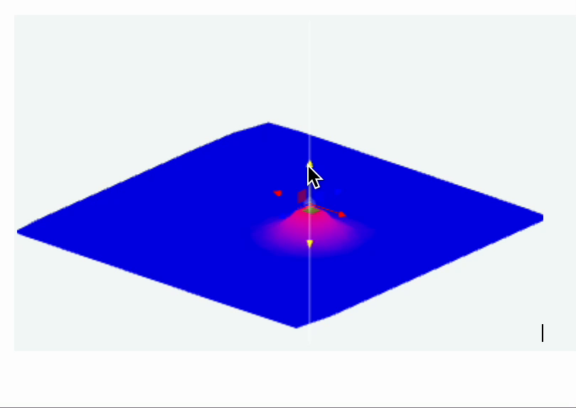
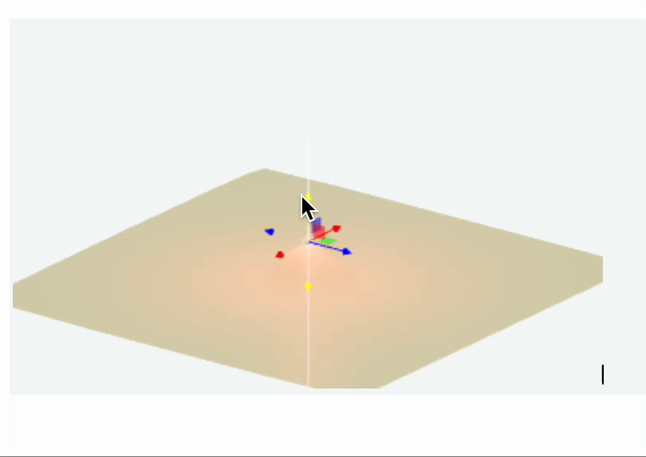

---
env:
  - WLJS
package: wljs-graphics3d-threejs
source: https://github.com/JerryI/Mathematica-ThreeJS-graphics-engine/blob/dev/src/kernel.js
update: true
---
```mathematica
GraphicsComplex[data_List, primitives_, opts___]
```

represents an efficient graphics structure for drawing complex 3D objects (or 2D - see [GraphicsComplex](../Graphics/GraphicsComplex.md)) storing vertices data in `data` variable. It replaces indexes found in `primitives` (can be nested) with a corresponding vertices and colors (if specified)

Most plotting functions such as [ListPlot3D](../Plotting%20Functions/ListPlot3D.md) and others use this way showing 3D graphics.

The implementation of [GraphicsComplex](GraphicsComplex.md) is based on a low-level THREE.js buffer position [attribute](https://threejs.org/docs/#api/en/core/BufferAttribute) directly written to a GPU memory.

## Supported primitives
### `Line`
No restrictions

```mathematica
v = PolyhedronData["Dodecahedron", "Vertices"] // N;
i = PolyhedronData["Dodecahedron", "FaceIndices"];
```

```mathematica
GraphicsComplex[v, {Black, Line[i]}] // Graphics3D 
```

<Wl data={`WyJHcmFwaGljczNEIixbIkdyYXBoaWNzQ29tcGxleCIsWyJMaXN0IixbIkxpc3QiLC0xLjM3NjM4
MTkyMDQ3MTE3MzYsMC4wLDAuMjYyODY1NTU2MDU5NTY2OF0sWyJMaXN0IiwxLjM3NjM4MTkyMDQ3
MTE3MzYsMC4wLC0wLjI2Mjg2NTU1NjA1OTU2NjhdLFsiTGlzdCIsLTAuNDI1MzI1NDA0MTc2MDIs
LTEuMzA5MDE2OTk0Mzc0OTQ3NSwwLjI2Mjg2NTU1NjA1OTU2NjhdLFsiTGlzdCIsLTAuNDI1MzI1
NDA0MTc2MDIsMS4zMDkwMTY5OTQzNzQ5NDc1LDAuMjYyODY1NTU2MDU5NTY2OF0sWyJMaXN0Iiwx
LjExMzUxNjM2NDQxMTYwNjYsLTAuODA5MDE2OTk0Mzc0OTQ3NSwwLjI2Mjg2NTU1NjA1OTU2Njhd
LFsiTGlzdCIsMS4xMTM1MTYzNjQ0MTE2MDY2LDAuODA5MDE2OTk0Mzc0OTQ3NSwwLjI2Mjg2NTU1
NjA1OTU2NjhdLFsiTGlzdCIsLTAuMjYyODY1NTU2MDU5NTY2OCwtMC44MDkwMTY5OTQzNzQ5NDc1
LDEuMTEzNTE2MzY0NDExNjA2Nl0sWyJMaXN0IiwtMC4yNjI4NjU1NTYwNTk1NjY4LDAuODA5MDE2
OTk0Mzc0OTQ3NSwxLjExMzUxNjM2NDQxMTYwNjZdLFsiTGlzdCIsLTAuNjg4MTkwOTYwMjM1NTg2
OCwtMC41LC0xLjExMzUxNjM2NDQxMTYwNjZdLFsiTGlzdCIsLTAuNjg4MTkwOTYwMjM1NTg2OCww
LjUsLTEuMTEzNTE2MzY0NDExNjA2Nl0sWyJMaXN0IiwwLjY4ODE5MDk2MDIzNTU4NjgsLTAuNSwx
LjExMzUxNjM2NDQxMTYwNjZdLFsiTGlzdCIsMC42ODgxOTA5NjAyMzU1ODY4LDAuNSwxLjExMzUx
NjM2NDQxMTYwNjZdLFsiTGlzdCIsMC44NTA2NTA4MDgzNTIwNCwwLjAsLTEuMTEzNTE2MzY0NDEx
NjA2Nl0sWyJMaXN0IiwtMS4xMTM1MTYzNjQ0MTE2MDY2LC0wLjgwOTAxNjk5NDM3NDk0NzUsLTAu
MjYyODY1NTU2MDU5NTY2OF0sWyJMaXN0IiwtMS4xMTM1MTYzNjQ0MTE2MDY2LDAuODA5MDE2OTk0
Mzc0OTQ3NSwtMC4yNjI4NjU1NTYwNTk1NjY4XSxbIkxpc3QiLC0wLjg1MDY1MDgwODM1MjA0LDAu
MCwxLjExMzUxNjM2NDQxMTYwNjZdLFsiTGlzdCIsMC4yNjI4NjU1NTYwNTk1NjY4LC0wLjgwOTAx
Njk5NDM3NDk0NzUsLTEuMTEzNTE2MzY0NDExNjA2Nl0sWyJMaXN0IiwwLjI2Mjg2NTU1NjA1OTU2
NjgsMC44MDkwMTY5OTQzNzQ5NDc1LC0xLjExMzUxNjM2NDQxMTYwNjZdLFsiTGlzdCIsMC40MjUz
MjU0MDQxNzYwMTk5NCwtMS4zMDkwMTY5OTQzNzQ5NDc1LC0wLjI2Mjg2NTU1NjA1OTU2NjhdLFsi
TGlzdCIsMC40MjUzMjU0MDQxNzYwMTk5NCwxLjMwOTAxNjk5NDM3NDk0NzUsLTAuMjYyODY1NTU2
MDU5NTY2OF1dLFsiTGlzdCIsWyJHcmF5TGV2ZWwiLDBdLFsiTGluZSIsWyJMaXN0IixbIkxpc3Qi
LDE1LDEwLDksMTQsMV0sWyJMaXN0IiwyLDYsMTIsMTEsNV0sWyJMaXN0Iiw1LDExLDcsMywxOV0s
WyJMaXN0IiwxMSwxMiw4LDE2LDddLFsiTGlzdCIsMTIsNiwyMCw0LDhdLFsiTGlzdCIsNiwyLDEz
LDE4LDIwXSxbIkxpc3QiLDIsNSwxOSwxNywxM10sWyJMaXN0Iiw0LDIwLDE4LDEwLDE1XSxbIkxp
c3QiLDE4LDEzLDE3LDksMTBdLFsiTGlzdCIsMTcsMTksMywxNCw5XSxbIkxpc3QiLDMsNywxNiwx
LDE0XSxbIkxpc3QiLDE2LDgsNCwxNSwxXV1dXV1d
`}>{`v = PolyhedronData["Dodecahedron", "Vertices"] // N; i = PolyhedronData["Dodecahedron", "FaceIndices"]; GraphicsComplex[v, {Black, Line[i]}] // Graphics3D `}</Wl>


### `Polygon`
Triangles works faster than quads or pentagons

```mathematica
GraphicsComplex[v, Polygon[i]] // Graphics3D 
```

<Wl data={`WyJHcmFwaGljczNEIixbIkdyYXBoaWNzQ29tcGxleCIsWyJMaXN0IixbIkxpc3QiLC0xLjM3NjM4
MTkyMDQ3MTE3MzYsMC4wLDAuMjYyODY1NTU2MDU5NTY2OF0sWyJMaXN0IiwxLjM3NjM4MTkyMDQ3
MTE3MzYsMC4wLC0wLjI2Mjg2NTU1NjA1OTU2NjhdLFsiTGlzdCIsLTAuNDI1MzI1NDA0MTc2MDIs
LTEuMzA5MDE2OTk0Mzc0OTQ3NSwwLjI2Mjg2NTU1NjA1OTU2NjhdLFsiTGlzdCIsLTAuNDI1MzI1
NDA0MTc2MDIsMS4zMDkwMTY5OTQzNzQ5NDc1LDAuMjYyODY1NTU2MDU5NTY2OF0sWyJMaXN0Iiwx
LjExMzUxNjM2NDQxMTYwNjYsLTAuODA5MDE2OTk0Mzc0OTQ3NSwwLjI2Mjg2NTU1NjA1OTU2Njhd
LFsiTGlzdCIsMS4xMTM1MTYzNjQ0MTE2MDY2LDAuODA5MDE2OTk0Mzc0OTQ3NSwwLjI2Mjg2NTU1
NjA1OTU2NjhdLFsiTGlzdCIsLTAuMjYyODY1NTU2MDU5NTY2OCwtMC44MDkwMTY5OTQzNzQ5NDc1
LDEuMTEzNTE2MzY0NDExNjA2Nl0sWyJMaXN0IiwtMC4yNjI4NjU1NTYwNTk1NjY4LDAuODA5MDE2
OTk0Mzc0OTQ3NSwxLjExMzUxNjM2NDQxMTYwNjZdLFsiTGlzdCIsLTAuNjg4MTkwOTYwMjM1NTg2
OCwtMC41LC0xLjExMzUxNjM2NDQxMTYwNjZdLFsiTGlzdCIsLTAuNjg4MTkwOTYwMjM1NTg2OCww
LjUsLTEuMTEzNTE2MzY0NDExNjA2Nl0sWyJMaXN0IiwwLjY4ODE5MDk2MDIzNTU4NjgsLTAuNSwx
LjExMzUxNjM2NDQxMTYwNjZdLFsiTGlzdCIsMC42ODgxOTA5NjAyMzU1ODY4LDAuNSwxLjExMzUx
NjM2NDQxMTYwNjZdLFsiTGlzdCIsMC44NTA2NTA4MDgzNTIwNCwwLjAsLTEuMTEzNTE2MzY0NDEx
NjA2Nl0sWyJMaXN0IiwtMS4xMTM1MTYzNjQ0MTE2MDY2LC0wLjgwOTAxNjk5NDM3NDk0NzUsLTAu
MjYyODY1NTU2MDU5NTY2OF0sWyJMaXN0IiwtMS4xMTM1MTYzNjQ0MTE2MDY2LDAuODA5MDE2OTk0
Mzc0OTQ3NSwtMC4yNjI4NjU1NTYwNTk1NjY4XSxbIkxpc3QiLC0wLjg1MDY1MDgwODM1MjA0LDAu
MCwxLjExMzUxNjM2NDQxMTYwNjZdLFsiTGlzdCIsMC4yNjI4NjU1NTYwNTk1NjY4LC0wLjgwOTAx
Njk5NDM3NDk0NzUsLTEuMTEzNTE2MzY0NDExNjA2Nl0sWyJMaXN0IiwwLjI2Mjg2NTU1NjA1OTU2
NjgsMC44MDkwMTY5OTQzNzQ5NDc1LC0xLjExMzUxNjM2NDQxMTYwNjZdLFsiTGlzdCIsMC40MjUz
MjU0MDQxNzYwMTk5NCwtMS4zMDkwMTY5OTQzNzQ5NDc1LC0wLjI2Mjg2NTU1NjA1OTU2NjhdLFsi
TGlzdCIsMC40MjUzMjU0MDQxNzYwMTk5NCwxLjMwOTAxNjk5NDM3NDk0NzUsLTAuMjYyODY1NTU2
MDU5NTY2OF1dLFsiTGlzdCIsWyJQb2x5Z29uIixbIkxpc3QiLFsiTGlzdCIsMTUsMTAsOSwxNCwx
XSxbIkxpc3QiLDIsNiwxMiwxMSw1XSxbIkxpc3QiLDUsMTEsNywzLDE5XSxbIkxpc3QiLDExLDEy
LDgsMTYsN10sWyJMaXN0IiwxMiw2LDIwLDQsOF0sWyJMaXN0Iiw2LDIsMTMsMTgsMjBdLFsiTGlz
dCIsMiw1LDE5LDE3LDEzXSxbIkxpc3QiLDQsMjAsMTgsMTAsMTVdLFsiTGlzdCIsMTgsMTMsMTcs
OSwxMF0sWyJMaXN0IiwxNywxOSwzLDE0LDldLFsiTGlzdCIsMyw3LDE2LDEsMTRdLFsiTGlzdCIs
MTYsOCw0LDE1LDFdXV1dXV0=
`}>{`v = PolyhedronData["Dodecahedron", "Vertices"] // N; i = PolyhedronData["Dodecahedron", "FaceIndices"]; GraphicsComplex[v, {Polygon[i]}] // Graphics3D `}</Wl>

## Options
### `"VertexColors"`
Defines sets of colors used for shading vertices

:::info
`"VertexColors"` is a plain list which must have the following form
```mathematica
"VertexColors" ->{{r1,g1,b1}, {r2,g2,b2}, ...}
```
:::

## Dynamic updates
It does support dynamic updates for vertices data and colors. Use [Offload](../Interpreter/Offload.md) wrapper.

:::warning
Number of points in a mesh cannot be changed
:::

```mathematica title="cell 1"
(* generate mesh *)
proc = HardcorePointProcess[50, 0.5, 2];
reg = Rectangle[{-10, -10}, {10, 10}];
samples = RandomPointConfiguration[proc, reg]["Points"];

(* triangulate *)
Needs["ComputationalGeometry`"];
triangles2[points_] := Module[{tr, triples},
  tr = DelaunayTriangulation[points];
  triples = Flatten[Function[{v, list},
      Switch[Length[list],
        (* account for nodes with connectivity 2 or less *)
        1, {},
        2, {Flatten[{v, list}]}, 
        _, {v, ##} & @@@ Partition[list, 2, 1, {1, 1}]
      ]
    ] @@@ tr, 1];
  Cases[GatherBy[triples, Sort], a_ /; Length[a] == 3 :> a[[1]]]]

triangles = triangles2[samples];

(* sample function *)
f[p_, {x_,y_,z_}] := z Exp[-(*FB[*)(((*SpB[*)Power[Norm[p - {x,y}](*|*),(*|*)2](*]SpB*))(*,*)/(*,*)(2.))(*]FB*)]

(* initial data *)
probe = {#[[1]], #[[2]], f[#, {10, 0, 0}]} &/@ samples // Chop;
colors = With[{mm = MinMax[probe[[All,3]]]},
      (Blend[{{mm[[1]], Blue}, {mm[[2]], Red}}, #[[3]]] )&/@ probe /. {RGBColor -> List} // Chop];
```

```mathematica title="cell 2"
Graphics3D[{
  GraphicsComplex[probe // Offload, {Polygon[triangles]}, "VertexColors"->Offload[colors]],

  EventHandler[Sphere[{0,0,0}, 0.1], {"transform"->Function[data, With[{pos = data["position"]},
    probe = {#[[1]], #[[2]], f[#, pos]} &/@ samples // Chop;
    colors = With[{mm = MinMax[probe[[All,3]]]},
      (Blend[{{mm[[1]], Blue}, {mm[[2]], Red}}, #[[3]]] )&/@ probe /. {RGBColor -> List} // Chop];
  ]]}]
}]
```

The result is interactive 3D plot



Or the variation of it, if we add a point light source

```mathematica
light = {0,0,0};
Graphics3D[{
  GraphicsComplex[probe // Offload, {Polygon[triangles]}],
  PointLight[Red, light // Offload],

  EventHandler[Sphere[{0,0,0}, 0.1], {"transform"->Function[data, With[{pos = data["position"]},
    probe = {#[[1]], #[[2]], f[#, pos]} &/@ samples // Chop;
    light = pos;
  ]]}]
}]
```


