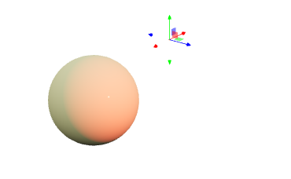

---
env:
  - WLJS
source: https://github.com/JerryI/Mathematica-ThreeJS-graphics-engine/blob/dev/src/kernel.js
update: true
package: wljs-graphics3d-threejs
---
```mathematica
PointLight[col_RGBColor, position_:{0,0,10}, intensity_:100, distance_:0, decay_:2]
```

represents an artificial point-light source at the given position and parameters.

```mathematica
Graphics3D[{Black,Polygon[ {{-5,5,-1}, {5,5,-1}, {5,-5,-1}, {-5,-5,-1}}], White, Cuboid[{-1,-1,-1}, {1,1,1}], PointLight[Red, {1.5075, 4.1557, 2.6129}, 100], PointLight[Cyan, {-2.4489, -1.9012, 2.8386}, 100]}, "Lighting"->None]
```

<Wl data={`WyJHcmFwaGljczNEIixbIkxpc3QiLFsiR3JheUxldmVsIiwwXSxbIlBvbHlnb24iLFsiTGlzdCIs
WyJMaXN0IiwtNSw1LC0xXSxbIkxpc3QiLDUsNSwtMV0sWyJMaXN0Iiw1LC01LC0xXSxbIkxpc3Qi
LC01LC01LC0xXV1dLFsiR3JheUxldmVsIiwxXSxbIkN1Ym9pZCIsWyJMaXN0IiwtMSwtMSwtMV0s
WyJMaXN0IiwxLDEsMV1dLFsiUG9pbnRMaWdodCIsWyJSR0JDb2xvciIsMSwwLDBdLFsiTGlzdCIs
MS41MDc1LDQuMTU1NywyLjYxMjldLDEwMF0sWyJQb2ludExpZ2h0IixbIlJHQkNvbG9yIiwwLDEs
MV0sWyJMaXN0IiwtMi40NDg5LC0xLjkwMTIsMi44Mzg2XSwxMDBdXSxbIlJ1bGUiLCInTGlnaHRp
bmcnIiwiTm9uZSJdXQ==
`}>{`
Graphics3D[{Black,Polygon[ {{-5,5,-1}, {5,5,-1}, {5,-5,-1}, {-5,-5,-1}}], White, Cuboid[{-1,-1,-1}, {1,1,1}], PointLight[Red, {1.5075, 4.1557, 2.6129}, 100], PointLight[Cyan, {-2.4489, -1.9012, 2.8386}, 100]}, "Lighting"->None]`}</Wl>

## Dynamics
Only `position` field supports dynamic updates. Use gizmo snippet to manipulate the light source position or [Offload](../Interpreter/Offload.md) keyword.
