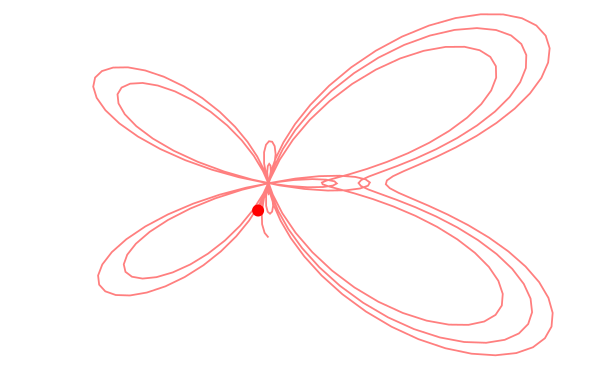

---
env:
  - Wolfram Kernel
source: https://github.com/JerryI/wl-misc/
update:
---
`Module` that always leaks memory on-purpose
```mathematica
LeakyModule[variables_List, expr_, opts__]
```

It might sound controversial, but it comes very useful to be used for dynamics with components approach.

## Example
If you need a module, that animates something

```mathematica
ParametricAnimator[equation_, variable_:t, range_:{0, Infinity, 0.1}] := LeakyModule[{time = range[[1]], task, scale = 1, array = {}, scaledArray={}},

    (* sample the equation each frame and rescale if needed *)
	animate := Block[{variable = time},
        With[{e = {Sin[t], Cos[t]} equation},
    		scale = If[Norm[e scale] > 1.4, scale 0.95, scale 1];
            array = Append[array, e];
    		scaledArray = scale array; 
            pointer = e scale;
        ];

		time += range[[3]];
		If[time >= range[[2]], TaskRemove[task]];
	];

    animate;

    (* async task to animate every 30 ms *)
	task = SetInterval[animate, 30];

    (* stop the task if cell was destroyed or reevaluated *)
	EventHandler[EvaluationCell[], {"destroy"->Function[Null, TaskRemove[task]; Print["removed"]]}];

	Graphics[{Red, PointSize[0.05], Point[pointer // Offload],
 Opacity[0.5], Line[scaledArray // Offload]
  }, TransitionDuration->10, TransitionType->"Linear", Controls->True]
]
```

Then, picking some fancy curve
```mathematica
ParametricAnimator[Exp[Sin[t]] - 2 Cos[4t] + Sin[(2t - Pi)/24], t, {0,16, 0.05}]
```

we will see this

### Why and how it works


## Options
You can take care about variables by yourself accessing `"Garbage"`  option

```mathematica
storage = {};
LeakyModule[{a,b,c}, a=3, "Garbage":>storage]
```