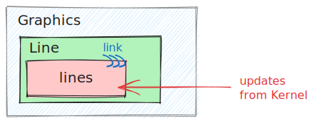
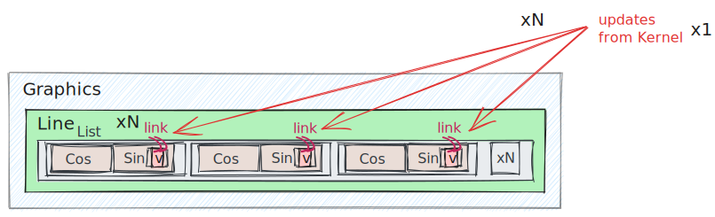
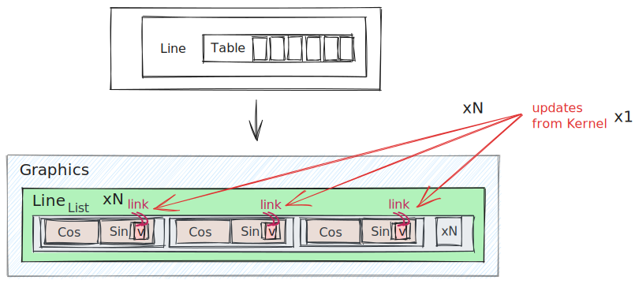
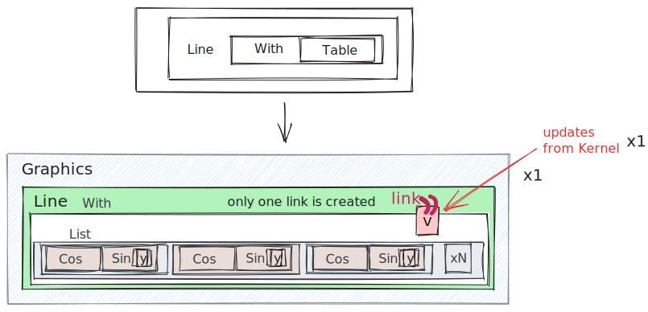
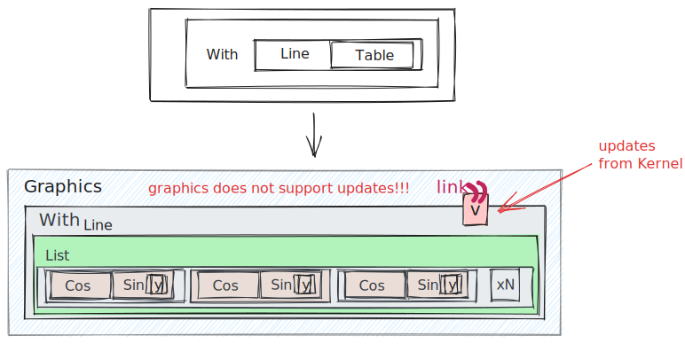

The way how dynamics work is quite different compared to Wolfram Mathematica. The key changes were made for the sake of performance and control (or imagination of  @JerryI - maintainer)

import Component from '@site/src/components/wljs-notebook-react/includes';
import Notebook from '@site/src/components/wljs-notebook-react';

<Component></Component>


## Architecture
All dynamics in terms of what you expect from Mathematica's experience happens on the frontend's side, i.e. in your browser (running [WLJS Interpeter](../../interpreter/intro.md)). Have a look at the diagram


Some expressions are meant for to be executed on frontend, i.e. not defined on the Kernel, then a user do not need to specify explicitly what and when should happen. In other cases, a user can use `Hold` attribute or `CreateFrontEndObject` to tell explicitly Wolfram Kernel pass an expression without evaluation to the frontend. Therefore one can play around with a way of splitting your code-base to archive the maximum flexibility and performance. 

:::tip
Always keep in mind, which part of code executes on Wolfram Kernel (server) and what is delegated to the frontend (browser). This is the only way to write predictable and good performing code 
:::
## All symbols are dynamic
It does not mean, that your `Set` statements will be reevaluated on change of a nested symbol, however, for most graphics primitives it works out of the box

<Notebook code="H4sIABA4hmQAA+1dbXPcthH+K6y+yJ0RaLy/OGlmGjVt2nGSTtK6M5U0CUiC0qWnO80dZdnJ+L/3AUjenWTZOUnWWFYg2TouAC4Wi90luc+BODg42DHOcGOVJlK1lsjGU+KsVIQyFWpaVY0MfmfvYOdvC392MqmX8fj7UHd+djwNkXg+WXY7e4TtsaMVxUAfRfL789ho5++n/jj8MPll4wRF6R6j9Ag/KGs4NVXQlGhrDZFtRUlV15TwileirbnS1G0lRanuJEdrXU0ZZ8SGwIh0dSCuFRCrpZ5y7ivF2+3kkHeSg1fBtb5tSMPRu6S1Jt4bRlppDGscZVVV3VIfpbqRJK7llDFWE88cjMTTGvahHOENZqySzgnBt5YEfd9FljpQzT2vSF0JHw1WkYoHQUQQATIFioOrsvR80MffvtyfT+eLnT1w7HXyzokr5YaYKIilvQTvl9SulOZVVVkYj2KVgtK4JRXsm7jGM97WVgpqPoig4o6CakO91Az2XlWw91rDzqSoSdNww2ijqbT0QWhUBd4EUzOivanhmPDOSkDQVutKGmm8a99yzLsLKm4uKPM11Fgb4qSARjHZxGkIWllqdBta7fU92Ci/uaBwa28Uw4QzARuFIxMnEPjrRvjguWfS2zsLGn3+roI2oZU1czVRVRTUGEs8rgdEcgfNKiu8vYepv4WgDuGHGu9JHSTEa3xLvKght2WKSmFFY9+6lN5K0M0oehtBqxBdqaoIXAfXfOslqSrtSOtsoyEyNc19aRQB/waCGhgpfg2po6HCmRRCaFsRXJw1p21ba/HWZfCDCMpvqE/VNtJJQivPCYJ7jfsHhmskheeHhrrWqA8t5sHOvyanAawgLwf19XzaQFS/A4luKr6zlY1q5TxerRiildNBkjaw0JrGVI7JByw+N7VXjktS4+YAF1vroH0YtwiMVqKyjrs7u93mTdSmsOm+rpfjYOevi/ms+2rW7C+C78J+mE7RaPfzJRhO5rOinvrl8k+HuIuZTskFhDkLi6KN54RZQ2bzJhzuFMWyez0NaDU/8/Wke/2sYJ8d7nzxeTN5uWLQzedrBvE8sgxdN5kdL4lPXS3XbGPbJfjWie5CM+l8lTpo/XSJHr84nBXDT+xkgxyLLveLgksnrVpW512HUXavzyL3nnpfxyu2VTe7OoqmubaP1M/k9Li4mDTdCU5lCnxOwuT4pBup5aLG4dPly+OnYFPiE9R18j7tRXzPUN4t4MkkTdbWY33XWCBd8XISLr6cv0JjWtCCS/wDK7+Y+NhNE2ZR84vzTY1N0NFQidJ2Mp1GszpfLNB5MmeUvjqdzmLbk647e/b06cXFRXkhyvni+CmnlEb9bDBsFv74RxT9+OMP0fyav6ODL/0ykODd+fRnQot1i8n5t9/P26jpwVLTZMBO7dmrz4bJGKk6CvOsWBxX/olSe4USe4U0ewUtxR+jWV+vlqSaM9+drLroFn62bOeL02fFsvbT8ISXNDIoGlR+o0vKjZCFLS0O5L4ucfMq7UgXupSG6UjH4khrzRkDrZjU6jmjJbdUFLK0XHC5D1pytJelNvgtQCsQ0uEhdCS4ZVzFlqoQpVVMpWaJvUCZKw0XWsTjfVcqao0bygXFk0o8tsY60ExxiC5KIx3lzzEUwbmAiE5r+5yXjhrOx+p9js8oxHg6L5WixibWvBSC0SgO5MJ5TJhUjmuukjqeM4g50KsxrOhhgKXmxkVtDKMvjZGSjdp5rkrhuIraTNrbV4MsUbvOiEKVxlq6qf1Ls/PfGM2extm9fvY/j6Z5Q3/9AyG/7bPRgj+Czz5i7xzlW49yNp/FMSevhGZOuHzJ5df0Bf3lN2b9eq6JDxyV2ZrCDhkpYfKEF3xJOI7xhxfxoy/EIf7wX05RbmvccrACCaShwbKvjL8Dl4EBwQnI79yovS7wQBKbryqXq9oVh0GcKBDa3Uye4kby3Eq3ObTm0Ho1tBJy6+j6Ie+IVnd3+tLdXaQuB14GFcbSy9FnFPLn5SsiLCbVGG4Rn7/ofSA2Jgs8WqBJeBkwDNxs4qTJ2dulfQCKphJnT5RUW70PWuAn0hqP9gXDNHNcAxj+wWhVNAT5NUzzBeNfDyX7aERhRAXjsb2gsRErrWTgiwcjTVO5tgw+Es1Em8QXFh0/YaipnmuZPgf6ReQe2/c0fI1HqwItKIuO4qiCnBzOU7got4KpCGcsGouSgxo/91c0h0dDGFNqJ3SUN55sSghs0igSa4QB+PlaFBim4RJdrWj1Yi2YxElI06QBxoFFd2AyDTANXJaCWZ0GnhQj4bm9XpPK1mpNWn2O/8UlxSbtQ5hhXvCR1DpMGz4EE2goSolBRMeFVtP0DdJBqwzSDDQkj0odKXwY1ddKHkfOJDdJf44plQKgYUl/MRUeAyAiJAygpE7EaiNFTyORH6stNwZzgTFrBDEEIwbhYr1y1hToSBXmRWqQCjCOoakrqYWWVqwQ3yAhiy1TVw4TqHky0yQJ4qEZyCgotMa55WlgcSAOMQt+sRp2tB7M4SYNAwb7kY5Tj9g0qjEaChiv1Dx4B2LQ6I7X3lesQ9TaG9/d9ubOCimci042OCt8VGsDMQdnhe2ZNJ8SUyvjT3RW3TvrULIv0yUiOkMM1Ujkrp0V0wIHSnRyVkyOEQjBo7NicgwylCtnXdO9s67owVmj9Tl0NTprvJQ4BxqSr70VF6fonP1HvFRFCg14FGV01fHU0VlH1qOzjl2Pzrqmo7OO1Ois48BGZx0HPjrrqJjBWUeVrdWatIqrbnTWtWJ77cfLbj8vg7OO0zY6K0KVjL48OitfSdc760j3zrqiBmcFreJ1c3RW3NJYiTGMzgqaalxPR2eFBWup185aGu1i68FXSy0ERF35ailxB4CgWLDCPIcnoUVfkq7wqe3KWXtWK18dehp9dRRk8NVRztFXx3GMvjqOc/TVDTr56ooefHXU4uirV5zjt+4XbnHD8PnTyzmkTXo8PpxdyioNtwhjQguOPImeHJCGZMG2RChdAQEVhuBGMhCgE1xXramDt+mafjmvdubxKBQTfesU2LootVjlTeJD0/GVnNTWXRNCJrOz865X4fuyZtO5b8KCTCezUGwck0kzjfdBVzV29Wisx1z0ecQvdmMK8s/L5bye+FiQ8ph9qnR30qB2Z3ebEewie7k+cTk5nqVTz2eQECrrCBW0dZdbxdu71CqN/XJd4zuf6srT5nD2PHS7y2LpXxcXoQCCgxE3hS+Wr0+r+fTyifXJZNqLPRxtVkISGEeqHQ83q2fhVV/ZH1w6cxFe9uelg8tV87Pl+9TY2whaxIf4S8no3WayPJv61728uAU+nSwW88UVZXbI//Z6wiSjLnF4R3r4JgY8P++gd+BL0+n7DLitvJIK8BNrNb5N0cgGiJkRpNIcX+gQmkvWwIB7bisLPowD/i3L2ob1nSyrF+odpvVo7CpN17sN69Qv/tfML9Dy1maVUYeMOnxY1OFxJzNzPiznwzLU8FC9M0MNGWrIofURhdYMNWSoIUMNGWrIUEOGGjLUkKGGjwk1aN1KxSwj+BY3vrdf1y2pmMKXzilntLWqrrS5KdTwvvTsNv09bHxhmxHcG77giz8V7NGkeh8qhqDqBksvJNYxcR0XBTAsvcBCUYJAH5eIKIXlmrfEELZhfX8YQjadjBNknCCvTsiQQc5rZcjg8XpnhgwyZJBD6yMKrRkyyJBBhgwyZJAhgwwZZMggQwYfEzLAHZMM2gRSu8bha9CNIJY5T5wPPGi8PKu9t9UJ23T9sNGDbUZwv6sT/r3EbWHxU3yPy09FeIUc7XIZk6D4TnntkSXETKxmqOjmRTXpP7uTCb58/ol91/zTXMMQtKei5g5vhMRLyaSsGmLx2h8iK6rwXiXZOilviT9sw/o+1zD8rqwvr3TICManhmA87sRozq3l3FqGLR6qd2bYIsMWObQ+otCaYYsMW2TYIsMWGbbIsEWGLTJs8TFhC9HUlFpkPiuuWuQ7G0M89k4hVtiqVkE2LKSs/4da6bBNfw8bq9hmBPeGVYxvrD/4df+1n+0Vq1fTH/waX0n/Zq/4NSaRD/zRXkHYm6M3R48mL/xQYQljdKUqH3ekcNg6o8ailwphirS89gGx2ikYx+1giW1Y3ycsgZix7Ioaq2uaeX1+Coso66TPr6YhUk8wQS938Rg7q8tJg2ZQa/fqcAcF09AVx9N55aco/vVNbJKYRe4o+ekAKugODw/Tzgnxcy8WHMSj/fnp2Rzyf7XCQVJ9qvshpJP24h+fjuI2DPFgnPAXk0V37qfrU+IWDWvqz13n65O/fPfNis0uRN6NBwOj0cXexWHcIOKa+n7HiIHPyjWvabix+8XbHaRtMPqxpZ0wLmtpHPh6V4zUGSZvVb/aHuOantf7ZAxn/gdxoG8YM2l92ftm4J/+HLa/qfm35+TKMBCZNsXu2Swms/Vpu+dnzTAHs/PpFMIdzo5+gtGgEcx4EaKPP/nHD999W8Kml+FJNKM/Itj1JvZsMLU30RQPZ2h+vsBT9GePJvb9DC4ZDcto2ANBw/J6npy9/d1mbzMw9lC8MwNjGRjLofURhdYMjGVgLANjGRjLwFgGxjIwloGxjwqMGYutC3RLsA1y3DCjptgRu3UkmkurAPgIW9/Tep5tun7gGNkWI7jf9Tzfzi/G1RPILSMdii0hXsYHZOj700kLf5oLdTQWzehaYVN+XLKwPX/cPbxl2Fu+tjXn1HvHov3eBhHbhvV9ImKPw6zyCpyMOXxqmMPjTmXmbFjOhmWg4aF6ZwYaMtCQQ+sjCq0ZaMhAQwYaMtCQgYYMNGSgIQMNHxNogIKY1qHGhskKbxzCm7CIryxud2WFaMdkoIx+yBU42/T3sNGFbUZwr3uNkLxjxL2/7KtBbK+MB2RUI9EPJ8Z+9dJik/HKs1Y6F0R125d9bcH6/jCE36ftHB39H9Yh6zpaoAAA" name="underpart-030f9">underpart-030f9</Notebook>

:::info
`Hold` just does a simple trick - provides to a frontend an unknown symbol, which forces frontend to fetch it from the Kernel. Once it fetched, a dynamic link was created. 
:::

The binding itself happens between `Rectangle` and `a`, but not `Graphics`, therefore only partial reevaluation occurs. To know more about details see [WLJS](../../interpreter/Advanced/symbols.md).

:::note
Automatic dynamic binding is possible for expressions, that executed inside the __[container](../../interpreter/Advanced/containers.md)__ on WLJS interpreter (on browser), i.e. `Graphics3D`, `Graphics` primitives and others.
:::

:::info
An expression wrapped inside `Hold` will be executed on frontend's side, i.e. on the browser.
:::

:::danger
Not all functions support dynamic binding or updates. For updates it should have `update` method defined, for dynamic binding - executed inside the container. See more about it there __[architecture](../../interpreter/Advanced/architecture.md), [containers](../../interpreter/Advanced/containers.md)__
:::

## Event-based approach
Working with GUI elements standing for input is done in more controllable way, where each button or slider is an event-generator. 
:::note
A library that provides UI elements used is [wljs-input](https://github.com/JerryI/wljs-inputs). See dedicated docs of it.
:::

Once event was fired, the assigned handler function will be called.

<Notebook code="H4sIAPQXh2QAA+1djW7cNhJ+Fd7igLTAUhYpipTSNMB10TYF3KJoghQ422j0Q3nVW6+MlfzXoO9+31DSru1LnLURXxyHTmxpyBE5M+Q34s5Q2r29vUmelGmSR5ZHYVlxVWnJk1jGXNvE5FoUVkdmMt2b/JYtD+3r2p4RsVu33WQaTvU0DOJpdED1Jws7mU6efH9ql90TOivDosiiLOcyNClXstA8M5nhQldRKnRahCZ5Mjk4oKtTaYtYFBVPVJ5zpSV4ExNzafM8rqQSuOIDUkxOh7ZMEoqqFAWvjFBcxdAtzbTiwibWFDatTBLR5T+usuN5XbSbptD+j9/NmkWzombFVFBzu/USiu1NXjSLko6/19388iUvLQ6TC/ySACh4leVkig3HrEEfk/MJVb6sl1T0qj6yVEiXocJd17ODRN9rDjmd/FrjyjAIBdj6nynG7YdVs+y+X5azlc06O7OLBdn8WWuLrm6WrFhkbfvt/qRABT+Dpsd2xSq6xi5LvmxKuz9hrO0uFhZczXFW1N3FUya+2Z88f1bWp+sGuqbZNEDX8dZ2Xb08bHnmumo3zRJvi3YLR3e2rDuyBVqpskWLHp/vL9nwQ51cIseiq/2i4MpFa878pOugZXdxTK331E0dr5vNu+V1LcrynX24fuqjQ3ZWl90cl4oY7cxtfTjvRqpdFTjdaU8Pd9BMgCOod8m704t4gyrvF3Beu8HaWtf36QLp2Cmg811zDuaQhUwq/EdT2arOqJvSLsnyq5PLFqvR0VCJ0qpeLGhanaxW6NxhBaXnR4sl8c677vjpzs7Z2VlwFgXN6nBHhmFI9rnUYLnKDv9A0R9/vKTpV/6EDr7LWsttlp4s/uQh23DUJ7/81lRk6WGmusHAPE2Oz78ZBmOkChLmKVsd5tlXcTxlcTRlykxZGERf07R+t1mcaY6zbr7uoltly7ZqVkdPWVtkC/uVDEJqgJWo/FkHoTSRYkmQ4ETNdCDhZpKRZjpQRmiiqZhoraUQoGOhdLwrwkAmYcRUkMhIqhloJcGvAm3wj4GOQahUh+lIyETImDhjFgVJLGLH5pqPUJYGRkY6ovNZGsRhYtKhPAqT2J0nJklBi1hC9CgwKg3lLlSJpIwgYqp1siuDNDRSjtUziSMJMV4ugziGy3ZNyyCKREjiQC5cJyLjygV4lKZrBjEHeq3Dmh4UDLQ0KVlj0D4wRikxWmc3DqJUxmRNZ71ZPMhC1k1NxOLAJEl42fpXRuff5M12aHTfPfrPaGreEq//4PzDmKUZ/Akw+4jROcq30XLZLElnh0pYZi7VqVQvwtfhXx8Y9Xe36toBUEVShJiHggeY8lwy2XKJc/yRjA59IU7xR/51hPKk4OBn4Zqh7Svp39DK0ADHBSHXt+LXTBWOfV3ZrmvXLQzikEDgu5087Fby3Mm23rV613rdtXJ+Z+/6MVdE69WdvrK6I+qq4xUwIZVe9T6jkH+25zxKMKjGyAT++XmPAWLmK3w0AovFJ6OGFpu4qD7+39LeAdFUodGLglAnegY6wg/ROk7gnTDMEvcAgf+YtDFNBPUCU/O1kC+GkhmYQkwiJiTxRyExiSBRAu2KAEK6cp0IYISmiTauXcxoOmKiunqplTsO9Gtqnfh7GliTNKtAR6EgoKRhDDklwMNSkjvGVIlSk4A5CiSo8Thb0xKIhjAm0GmkSV662AQQ2DgtXNNwA8D5RhRMTCMVulrT8euNYAoXxYmrdYoRHIRyCjrFVRCJRDvFnWEUkNvb1ZlsY1Zn1V38siuGddaHMMO44ODMOgwbDpGIwBgFCkoQcGFVN3yDdLCqgDQDDcnJqCOFg4n7WiVJc6GkcfZLRRw7B2iEs1+aonM4QHhITIAgTCOqNirqaRnBD2og3RiMBXTWcGJwRgLCUX2cJoaho5iZ147BFUCPgTUNwgRWWjcF/wYJBXG6rlIMoJZumjpJ4A/NQJKgsJqUiXSKkSIpfBZwsVabZg/G8DKNCYzmR5qGHr5pNCNNFDS8NvOADvigEY7vXFdsXNQGje/nvT1YIUWaEsgGsAKjWhuIOYAVc8+48VQYWkU/BFbdg3UomSl3iyAwkKtOFQ3QAFYMCwDkaAdWDI6J4IJHsGJwjMFtYwTrhu7BuqYHsNLsS9HVCFa6laQpaEi+QStuTgTO/kC3KqLAIEmUEarjpSNYx6ZHsI5dj2Dd0ATWkRrBOio2gnVUfATraJgBrKPJNmZ1VsVdl8C6MWxvfbrt9uMygHUcthGscFWKsDyCVa6l68E60j1Y19QAVtAx3TdHsGJJkyjoMIIVdKhxPx3Bihmsld6ANTA6Je4Bq4GOIoi6xmqgsAKAU2SCmV0gCRx9ibvDO941WPum1lgdehqxOgoyYHWUc8TqqMeI1VHPEauXaIfVNT1gdbTiiNVr4PjQeuEOC4ZnO1djSJfp8Xx/eSWqNCwRxoAWgFwTko2NMyWqnKdFFiJkmGQ8r+KEi7IyRtvMlHnu7ulX42rHGT4KURRxEwLbFDmOddyEPjQdXotJbd0157xeHp90vQlvipotmqy0K75AzJJdOud1uaB10HWLXT8b6zEWfRzxOSK5e5N/tW1T1BkVuCDpEOqtSxfn3UYDxHkvXdjWh8s+RNxgPcerKlcUCb7EQUs7x+H0vlpXZl3m6oKjsl1gKbhi37KfiM9Fh/coIAyXHh9AqVcNK21F1hg4T1rL3myY37D24ihvFuyrtj6C+89WrGsYlnbsojlh8+zUsnrJXrz6effrq0IU83rRqz+cXa7EJBiD4OPp5eqlPe8r+5MrV67saX+dO7la1Ry3Nw1HP9fAQcGAPqS8NlndHi+yi15eLKWP6tWqWV0blA5x5N7mmCxjYP49YebbAKE56WBuTow3AUEUigL3FY+rXHCVJwnHSiNGRqCqwkInOT44AQh9a2sk7JPCH5qh2zR95xnaC/SeKfqFzkA3sO+fgkfZ6j9lcwbOO09An+fweY6Pm+d43OFTH4HzETif3Hio6PTJDZ/c8K71EblWn9zwyQ2f3PDJDZ/c8MkNn9zwyY1Pmdwosb1bYey5qFSMvdU2w37oSvJYhnlUiciWmbxtcuOmQO42/T3sjMY2GtxLRuPmdMajif8+1BSEKXRW6DLlWYUUAdxszPMiE3iAAZ9BqrSQIZ5QuFsKYpum7ycFMZrv+3NbnLjPDnv7Wz1vsT858DPO5xx8zsE/W+HTDz5G5tMPjxadPv3g0w/etT4i1+rTDz794NMPPv3g0w8+/eDTDz798CnTDyLBbM5kzssYG7iVzPB4QKY1Ly0+DWA1JOI8vadnK7bp+mFnIrbR4L6erdhf/tKcuZ3oRbZksAFaZjgjR91hZ/oSeiPuebLso6LYtd7N7VDb5H9CSfamT2i8+XziyJ/psxNRpUq82YgnNs+4EqHmSYaYfp4g3aBEYrGwuuuzE1s0fV/PTnyB888/OeGzGJ9bFuNxB0d9fM3H13zq4qGi06cufOrCu9ZH5Fp96sKnLnzqwqcufOrCpy586sKnLj5l6sJaXcaRkrwMc2zaTkyGRX2p8TBAZMNUVlkR4tb/8Z6c2Ka/h52v2EaDe8lX/DCEgfeoZMpO8QwFnR2wnZ3hxTuPJgbs97L7KPADjAL7vew+avHFRi18QPihoNMHhH1A2LvWR+RafUDYB4R9QNgHhH1A2AeEfUDYB4Q/ZUAYX4+ax1mBTdhY+XBl8A7xvLIhtmOnlY4FrFneOiC85V72bbp+2LHhbTS4v73su7Z70rKs67Ji7t6wfrJip/ThGLZmbXNkuzn6wLvWO7uyLa0fP5+A8ee5aT2D+7Fpbji+MQJv5cdX9mJTeYI35CjcdTJkErJQ3HHT+jZN39em9cc80fzudJ+X+NzyEo873OkjZj5i5pMRDxWdPhnhkxHetT4i1+qTET4Z4ZMRPhnhkxE+GeGTET4Z8Ul3p+dYvOkk4lFl8A5vG4U8VUXCDfZeFwqzJJHJR92dvkV/DzsDsY0G95KBoO3oYn/5I9m4Ltq9t7OLbDllu1B47/e6m++9vQDH6d9T9sq9oP3trGn3zg+m7GW93Ltg5weoeXs+Dafyn7/W/yTfH4q/D9zm9hfNojz427+p/b6zFWms8T2+ecgt1gZ4Y35sea6QcjMmzOO8wqePIr5jtmKbpv+P3w1g6LuSS1HwCp9Y8X3ekcXjG1pxYRNrCiTrTBJ9od8NcHDwX7EcTawzkwAA" name="doing-ffb48">doing-ffb48</Notebook>

`slider` symbol is actually a special object, that stores the representation of a slider and an ID for the event, that will be fired when a user drags a knob. There is a shortcut for assigning a handler function `handler // slider` or one can also write

```mathematica
EventBind[slider, Function[data,
//...
]]
```

or (synonym)

```mathematica
EventHandler[slider, Function[data,
//...
]]
```

## Performance tips
You can explicitly choose what will be interpreted on the frontend or backend. We have a few possibilities for our function inside `Line` expression

### All load to backend
For this one need to change code to

```mathematica
Function[data, lines = With[{y = data}, Table[{Cos[x], Sin[y x]}, {x,0,2Pi, 0.01}]]] // slider

EmittedEvent[slider, 1];
```

The last line manually fires an event to initialize symbol `lines`. Then for the output we can write

```mathematica
Graphics[{Cyan, Line[lines // Hold]}]
```

One can illustrate this binding as on a picture below



The benefits of this approach
:::note
Suitable for heavy calculations, high-load on network transport - large latency
:::

### Gradually involving frontend
One can move an entire `Table` to the browser's side. Let's discard our changes we made to

```mathematica
Function[data, v = data] // slider
```

##### Naive approach 1
The obvious solution for output could be

```mathematica
Graphics[{Cyan, Line[Table[{Cos[x], Sin[Hold[v] x]}, {x,0,2$Pi$, 0.01}]]}]
```

That will be __a horrible solution__ 👎🏼  



Imagine, each time `Table` iterator `x` goes through the range of values, it creates a sublist of `Sin` and `Cos` functions, that contains dynamic variable `v`.  Then you end up with many instances of `v`. 

:::danger
```mathematica
Line[Table[Expression[Hold[symbol]], {i, 10}]]
```
Creates `10` instances of `symbol`. `Line` function will be called __10__ times on each update of `symbol`!
:::

:::danger
Do not put dynamic symbols inside large `Table`. Try to minimize the number of its copies made.
:::

##### Naive approach 2
Ok lets try to improve a bit

```mathematica
Graphics[{Cyan, Line[Table[{Cos[x], Sin[v x]}, {x,0,2$Pi$, 0.01}] // Hold]}]
```

This is also __horrible__ 👎🏼  Symbol `Table` does the same thing being executed on __browser's side as well__



##### Optimized version
One can minimize the number of instances to just 1 using `With`, as it was shown in the example above

```mathematica
Graphics[{Cyan, Line[With[{y = v}, Table[{Cos[x], Sin[y x]}, {x,0,2$Pi$, 0.01}]] // Hold]}]
```

This __will save up a lot of resources__ 👍🏼 



:::tip
```mathematica
Line[With[{y = symbol}, Table[Expression[y], {i, 10}]]]
```
Creates only 1 instance of `symbol`. A `Line` function will be called __1__ time per update of a `symbol`.
:::

:::tip
```mathematica
Line[symbol//Hold], ... Line[symbol//Hold]
```
This is ok, each `Line` is bounded to its own `symbol` instance. Therefore on update of `symbol`, each `Line` expression will be reevaluated once.
:::

### Possible pitfall with `With`
There might be temptation to wrap `Line` expression inside `With` as well, like that

```mathematica
Graphics[{Cyan, With[{y = v}, Line[Table[{Cos[x], Sin[y x]}, {x,0,2$Pi$, 0.01}]]] // Hold}]
```

__This will not work at all__ 👎🏼 because the binding will occur between `Graphics` and `v` objects



### Standalone frontend version 🎡
Since frontend has [WLJS](../../interpreter/intro.md) interpreter, sometimes you can omit the communication with Wolfram Kernel at all. Therefore it allows to build interactive embeddable notebooks, that can work without `wolframscript` installed. See more [Export notebook](Export%20notebook.md).

Firstly, underneath `InputRange` there is a frontend function `RangeView`, which provides a low-level access to a slider

```mathematica
RangeView[{0,6,0.5, V}]//Hold//CreateFrontEndObject
```

The keyword `CreateFrontEndObject` is used to manually execute inside the container the corresponding function. It detect a symbol `V`, which is undefined as assign to it a value from a slider. Now we can to the same trick with `Graphics`

```mathematica
Graphics[{Cyan, Line[With[{y = V}, Table[{Cos[x], Sin[y x]}, {x,0,2$Pi$, 0.01}]] // Hold]}]
```

There is no need in event-handling, since the entire code is executed in a browser
Now you can export a notebook into `.html` file and dynamics will still work.

You can download both notebook via following links below
- __[SliderExampleStandalone](files/SliderExampleStandalone.wl)__
- __[SliderExample](files/SliderExample.wl)__

## Grouping UI elements
Writing event handler function for each input element is a bit cumbersome, therefore you can use `InputGroup` wrapper, that preserves the original data structure you had

<Notebook code="H4sIADKCh2QAA+1ZbW/jxhH+K6y+XAp46X1f7uVioBGuvQBuP6SAP9Q+HCiSkhnIlEBSti/Ij+8zSy4l+Xx+uRYo0MSWxZ3d2dl5e4bk+PLyclav2s1uyxYu10qKihVc50znpWYLbSzjZmntUi2V5tXs5HL2c96sqou6uiPivO762Qk/EficmI+0vFuDbfbm/W3V9G9oJHJf8IWrWCWLjGnuC5b53DDjVebyBffLsnozO9x7ni+qddgbDksElj8Sw6iqsVr7YrlgylgFiUXFMs0h22SKG52bUutvUtUtDa+WXLOiVBXTZWmY5ypnTi0zmy1VtljkT6sqo6pKZEJUZc6WBffQLJdskQl8ec2FKa22ZU5qzTfr3U2zV/By9td20/Tvm/L9fVXs+nyxrj5s1iUd8YpIDVo+K+olngwWkU17efO2yvtqXq3XJOtdVxV9vWmSYp133Q9XswIL7K7Nt9uqTZa0p2pK1mzK6mqWJF3/eV2Ba7PNi7r//DYR31/Nzt6V9e0koN9s9gJoH+uqvq+bVcfycFS3F0u8HeQWge6rsg6GQsoyX3c48eyqScYfOuSAjFPH52LiaNPEudj1PazsP29J+kA9dfAkdtE3D60oy0fPCOfUN6vkri77a2wVBnKuq3p13UeqawsMT7vb1SnEpLiCekzf00HFJ0z5uoLXdQjWi239mi3QLrkFAn/c3IOZJzyRGh+Iyts6p2PKqiHPt7tDj2G4rNdryqVd2+JEwGTTYvb+Zt0Qw3Xfb9+ent7d3aV3Kt20q1PJOSenHEgp23z1CVOfPv2Tcq78Cer/mHeoRLnfrX9hPNlz1Lt//LxZknvH9AwRQHJm2/vvxwhEqiBl3ibtapF/Z8xJYtRJot1JwlP1Z8rlx30R/LHN++vpiL7Nm265aW/eJl2Rr6vvZMpJQFJi8e825dIpnWRphoGe21Q6obNIJzbVTliiaZpoa6UQoI3Q1pwLnsqMq0SnmVRSz0FrCX6dWoffBLQBob3lPhISJcoQp0lUmhlhAlsQrzDnUyeVVTSe+9TwzPlxXvHMhHHmMg9aGAnVVeq05/IcpigpFVT01mbnMvXcSRmX5xJXUiJul6kx3GVBtEyVEpzUgV7YJ5QL8wI82tKeUc2RnmyY6NHA1ErnyRuj9alzWovonXOTKi8NeTN4b25GXci73qnEpC7L+KH3j6LzLyphpxTdx6P/jlLzlSD9E2PPA5Uy+H8A1P9jdH5Zg5pNQzYHVMIz11LfSv2BX/Bfn4n641KDHABVZAVHHgqWIuWZTGTHJMb4kgldhkkM8SV/vcF8VjDwJ3xi6IZF+h2ljAIYNnBmX8VvE10E9mmxm1YnCaM6pBD4XqdP8ip9vsm3f5TWP0rrw9LK2DdX1//mY9D0SGePHumIOi68Ai6k2ePqE5X8pbtnKkNQnZMZ6vPZgAFiZi3eSsBS4YVmQ0+Y2FRvv5wdChClCkVPpdxmdg5a4YdoazJUJ4RZ4h4g8EHSGkoE/QGpeSHkh3FmDiaOJEqEJH68MoBJpJkWkCtSKBnmbSaAEUoT64JcZDRdkahhXVodriN9QdKJf6CBNUlZBVpxQUDx3EBPCfAknvQ2SBXlXQZmlUpQ8TqfaAlEQxmXWq8s6UubXQqFXbAiiEYZAM73qiAxndQ4aqLNxV4xjU14TQoGkmEEB6GDgcFwneId0AbDg2M0kDv4Nbhs79bg1XP8JUeODd6HMmNccAluHcOGixIKjCrFu18ALrwawjdqB68KaDPS0JycGilcnBlWtSTLhZYu+M8LY0IBdCL4z3scjgKICokESLlXtOy0GmipUActkO4cYgGbLYoYipGAcrRufOYSHGQSdxEYwgTsGFl9yjN4aRKF+gYNBXGGozwCaGVI06AJ6qEbSVIUXpMyk8EwMsSjZgEXk9mUPYjhIY0EhvhIU+hRm6IbKVEgeHLziA7UoAjHR58r9iVqj8av874erNDCewLZCFZg1FoHNUewIvdciKdGaDX9EFjtANZxZq7DLYLAQKXaawrQCFaEBQAKdAArguMUSnAEK4LjHG4bEax7egDrRI9gpezzOCqClW4l3oOG5nu04uZE4BwudKsiCgySVIlQjVsjWKPoCNZ4dATrniawRiqCNRoWwRoNj2CNjhnBGl22d2vwKu66BNa9Ywfv0213iMsI1hi2CFaUKk1YjmCVk3YDWCM9gHWiRrCCNnTfjGDFI02mYUMEK2hucT+NYEUGo820B2vqrCfuEaupVQqqTlhN0ZiCZ5BEiTsHksAxzIQ7fOCdwDqImrA6nhSxGhUZsRr1jFiNdkSsRjsjVg/ogNWJHrEavRix+gAczz0vfMMDw7vT48bRIR3HV81RK2l8RIhdLAC5JiQj7/MszwsGg9AWXErLFrkomBG2ypzyaDTycE8/bqZtc7wKQRIqS+x77aeoSGC8etB9evF5jLG62e76wW9P9cfWm7ysWraumyo5GLO6XNPDz0M3PRzFdQRg6BieoXN6OftL122KOqeJ0LUdW6t1GfqqL7HguCfb1asmbL2p8qapuo5Z5XJzzESPdIEpmH68VuY92rwYhCZp8kPyE/H8jYjLd7+RLXBFtYTD2FlYCr3fS36ClMXfCZZDX5jWr4YudCKucMSwtaVHv9fsldgLF/529vFYz+K6Xg9OGkeHi8iP2NaOw8PlprofFofB0c62uh32hcHx0mbbPRW0oU8AjpCFQyt8cmvdbdf550FhPGbf1G27aR/ErkdjeYgLcio207/Sd34NSDa7Hs5mxPgUXqrFMlNGLpkrF4ZpLxcMPX/JuMpUXipl/TIDXgZpE2CuyOLnEvklov+TRB50+komf/mfgMurF/2PAqn3e0y6jx//DVCVV40bGwAA" name="meanness-637a5">meanness-637a5</Notebook>

Now the events from first and second slider are grouped into the single event object. If you bind a handler function to it

```mathematica
Print // group
```

the corresponding output will be

```mathematica
...
<|"left"->5, "right"->6|>
```

You can do similar trick by replacing association with a list.

### Inline event handlers
It looks similar to Mathematica's implementation, where one can add an event handler to a random graphics primitive

<Notebook code="H4sIAICGh2QAA+1dbXObSBL+K3P+YntLYOYFBrLZVN26djd35du7Sury4WRXggDZ5GSkAmQ7SeW/39MDgyRvnMi+uOJ4x4kNPdP09PT000A3QuPxeCfOi4hrOfHSLIk8VQjpxWmgvGnOs4JLnXAld0bjnd/qdHFWZg3tH5VNS9sXv/18OJ/N650RHwWj4ARN/5qXVfuyfF/sjAKfU8svF0XV0hFFVYCzZ1kX020DP6TfkxM66MVyBgk7u3mdnu7SzpTLhGey8FQshKeyKPZSJSMv03EWxDycpJN8d8cce1RWOPYP4jv9ns9nOeQtwGp+RjDBr/W8an+p8sO6SNvisJjNaMSnTZG15bxi2Sxtmp+OdzJ0eJcww6Ko2ZSOKarcq+Z5cbzDWNO+mxXgmi/SrGzfPWH8x+OdZ0/z8mIQ0M7nKwF0nNcUbVtWpw2MT0M1K7HE20BuZui2yMs2nZgBpumswYjPjivW/9Aga6Rt2hwXDRsHDZyTZdtilu27BUnvqM8NPIidtNX1WeT5J8cw45Tnp+yyzNszHMpDyDkrytOz1lJNnWH3oLk4PYAYH1tQn9L3oFPxM1O5WcGz0izW1nO9aS7Qjl2UxeXP8yswByxgQuE/RKV1mdIweVGR5evlusVKDNR3onVazmbkVsu6xuAGSGi9Op9VxHvWtosnBweXl5f+pfTn9emBCIKA7LMmkODxGk2vX78k98v/hgF+TpvCK9JkOXvrBWzFUS5/fzGfkqV7TzWLAT+NF1c/9othqYyUecLq00m6F4YjFsoRU3rEAl/uk1t/2izGNIu0PRuGaOu0aqbz+vwJa7J0VuwJPyABLEfnPyI/EFoqFvsxdtRh5AvNVWxpFvlK84hoaiY6igTnoEOuovCIB76IA8mUHwsp1CFoJcCv/EjjHwMdglBJFCSWEDEXIXGGTPpxyEPDZsRLtCW+FjKStH+Y+GEQ66Rvl0Ecmv1YxwloHgqoLn2tkkAcYSpSCAkVkyiKj4SfBFoI230osCUl7OHCD8NAx0a08KXkAakDvXAcYq5p5+BRER3Tq9nTwxwGup+gHwmdkDX62ftaK8WtdY5CXyYiJGsa6x2GvS5k3URLFvo6joN162+szn8omh3Q6n569Z+Sa94Sr3/xvC9jljz4G2D2EaPT6reaZTWvaM4GlbDMmVAXQj0PXgXvv7Dqn5Zq5ACoHOdm+CH3fLi8J5hoPIF9/BGMNl0jdvFHvD9He5x54GfBwNB0nfSvl9IL8HBA4EW34o+Yygz70NkMvYOEXh1SCHy304fdSp872daFVhdar4dWz7tzdP2aV0TD1V20cXVH1Gbg5TAhtW5GH6vk2+bKkzEWVWsRIz4/6zBAzF6N+wKwFLinmNPFJg4qF39s7QIQuQqtnvSDKI4OQUv8EB2FMaITllngHMDxH04bkiOo53DNV1w871sOwRTAiRgXxC8DYuJ+rDjkch9KmvYo5sAIuUmkjVx4NG3hqKZfRMpse/oVSSf+jgbWBHkVaBlwAkoShNBTADwsIb1DuIpMdAxm6QtQdns40AKIhjLajxIZkb50sPahsDazMKIRBoDzlSpwTC0Uhhro8NVKMYWDwtj0mokRHLgyEzQTV77kcWQmbgyjgNzOrsZkK7Maqx7hl20Y1lgfyvTrgo0xa79s2EguwSh9hUkQcGFVs3y9drAqhzY9Dc3JqJbCRoddrxI0c66ENvZLeBiaAKi5sV+SYHAEQERIOIAfJJK6tZIdLSTiYASka421wJwjBDEEIw7lqD9MYs0wUMj0K8NgGjCPnjXxgxhWGkQhvkFDTpxmqAQLGAnjpkYTxEPdk6QorCZELMzEaCIJYhZwMUybvAdruE7DgSHe0rT0iE3WjOQoEDyYuUcHYpCF4yevK1YhaoXGm3lvD1ZokSQEsh6swGgUaajZgxW+p816Kiytoh8Ca9SBtW85VOYUQWCgUJ0gPzCAFcsCABnagBWLoyVCsAUrFkdrnDYsWFd0B9aB7sFK3pdgKAtWOpUkCWhovkIrTk4Ezm5DpyqiwCBIFQtVe6gFqxVtwWqHtmBd0QRWS1mw2olZsNqJW7Baw/RgtSZbmdVYFWddAuvKsJ316bTbrUsPVrtsFqwIVYqwbMEqBu06sFq6A+tA9WAFHdJ504IVlzSxwhwsWEEHEc6nFqzw4EhFK7D6OkqIu8eqH0kJVQes+gpXAAiKjDN9BCSBo2sxZ3jDO4C1EzVgtR/JYtUq0mPV6mmxaudhsWrnabG6RhusDnSPVWtFi9Vr4PjS9cIdLhieHmzmkNZpu39cbWSV+ksEm9ACkEtCMk/5VE5k4AWFDjwVFBMvVhPhBWGMO6Qsj0TGzTl9M6+2SHErRCnGVQps1WQ4hrwJ3TSdXstJbT2053lltVi2nQk/lzWbzdO8qL0Zsolsbd8r8xldB1232PU924+16PKIz5DHHO/8tWnmWZlSg8mg9nnOEslLbLaZAbKcawc25WllDs2R5cQV3bJszrwwLAK1yUcXeIbPzH6zL0/b1PT55/lxdVS0uw1r0nfssmBn6UXBUraglO2ItWdpy/JiCjM0aCVzbErKzspZN5N+b70T6wl/Mb12d727Kq66zm5n48i6uOiOMzubXfNF8znLdm4DDrqvv5ZcLpvFLH3X6Yur4vOyruf1Nfu2SAl3hsO6U4aZem/IGN/Gp+fLFgvhEePnfBonBAQcjmw3OQNuR7gX45bEkzLLdSbTSYxbZs/rpA1OfUwT/pKzbSP6/3S2Tq0bvO3xuppZwZt97Tyt/5vPL8F5Z09ztQlXm/i6tYnHnfJ0WTOXNXMFiYeKTleQcAUJF1ofUWh1BQlXkHAFCVeQcAUJV5BwBQlXkPiWBYk0E0mh89SbiDjHk8O42Ei5lF6RxVNcmGVRkmW3LUh8LmO7zXgPuwqxzQzusQqxYD+xD/Q0OGJ3+PHHR5P2/SolBpf4dYlf91C6ywG7RIXLAT8qdLocsMsBu9D6iEKrywG7HLDLAbscsMsBuxywywG7HPC3zAGH8N084RrJIIXnqmONi3opuFdIBVNOwjyPTTb1Hh5K32boh50O3mYG9/1Q+r8biGFvzLtEnqcVZlu/Yd0i57hVrufLClv2xrxb5A1b1OV52ZYXxYgaaW3eMIrtLcvSik0KupSsYAEc3M7Bki2bdn7Opsuqy67iceTu2ePvJ/n8fT7eHqY6ynAbA4/iePuM5oGXiiDywjSZFmKaT7NQ3fHx9m1E3+/j7c5p3YPyrl7i6iXfaUbWJfVcUs/VSx4qOl29xNVLXGh9RKHV1UtcvcTVS1y9xNVLXL3E1UtcveRb1kuiXPAUJsTrtTVeDRKlyJ2mceoVHGuaTMIEa3VP9ZJthn7Y9ZJtZnCf9ZK3DS0zUspFjdwsJUv3xrsv8aqVEdtd4M94l96Ijp3hjeu45aiaor4oah9VgrbFA/h7yzIfMRK6z356xj6QPW4WCaqX6fv+3t9f/vN3HwvfFHskwK8LZHSzYm/3A/GPd/dXLR+p5WR3f3//BP+gxkfSHUMs64rt7n5HD/9/n/WXNMgnCJLcw1XJ1FP5JPKSkEsv1EU2mWie5Wl8x/rLNqLvt/7iQPDA6jlvIcVVclwl54FUch53gtjlGF2O0ZVvHio6XfnGlW9caH1EodWVb1z5xpVvXPnGlW9c+caVb1z55luWb+QUz7grhZKDjCW+0xWf3UBUm3hIuk6CLEqzPO/O6V/plUfbjPewazbbzOAeazb2y3XHJsX8okDWefgi3bH5Hl0zOfrd+4GlbZtmZ91nA2Ca7pt12Q/71L3+YYOxkTH+YF6mRO9S+gg5H7CS/e2894z92n94YHw1YvTepasTBqa1scB62b9/nz51sOiHoe/YJcGj4OOI0XfqjhcnH0+QuT55NMnqh1qyiXFCSqMi9pIcr+hSaYRPuOBWx5sERRDwUOlpRB8ou0vJZhvR91mysUb85arIluamZ4z5bvEF1cc7f0q/Ozn5H6r+EwzCewAA" name="distinguish-55e04">distinguish-55e04</Notebook>

The following event are available
- `drag` - provides a list of two coordinates
- `zoom` - provides one relative scaling number
- `click` - provides coordinates, where the cursor clicked
- `mousemove` - provides coordinates of a mouse
- `mouseover` - provides coordinates once, when a mouse appears at a div

for 3D graphics the following events are provided
- `transform` - sends an association with a new position of a dragged object

:::note
Event handlers wrapped around graphics primitives are parts of [wljs-graphics-d3](https://github.com/JerryI/wljs-graphics-d3) library.
:::

:::info
Inline event handlers defined around `Graphics` primitives are executed on Wolfram Kernel
:::

Download notebook
__[InteractiveGraphics](files/InteractiveGraphics.wl)__


