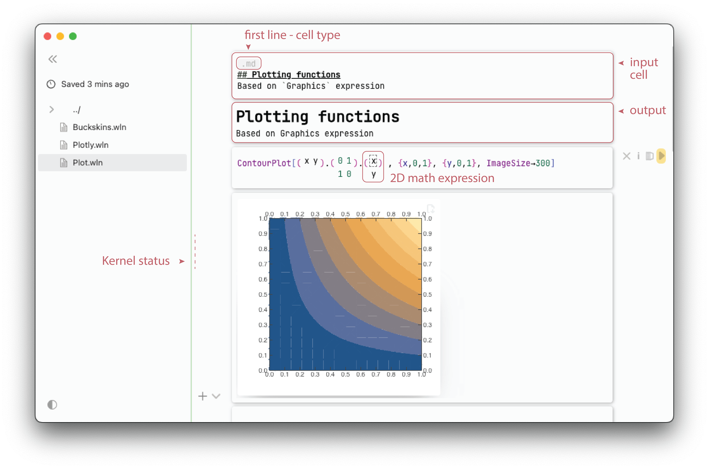

# Quick start
Frontend __does not require anything installed__ apart from `wolframscript` (see Freeware [Wolfram Engine](https://www.wolfram.com/engine/) or Wolfram Kernel). 

:::warning
Works only with Wolfram Engine $\geq$ __13.0.0__ 
:::

:::info
Make sure that Wolfram Engine is activated and no other instance of `wolfram` is running on your Mac/PC
:::





There is two ways you can choose from

## Desktop application
Frontend is also shipped as an Electron cross-platform application, that makes you feel like if you were using a real desktop app. However it also takes care about updates and other management, and provides context menu. __This is the easiest way__

__[Releases](https://github.com/JerryI/wolfram-js-frontend/releases)__

## Via console & web-browser
Clone the master branch and run `wolframscript`

```bash
git clone https://github.com/JerryI/wolfram-js-frontend
cd wolfram-js-frontend
wolframscript -f Scripts/run.wls
```

It will take some time to download all core plugins, after that you can start using it by opening your browser 

```bash
...
Open http://127.0.0.1:8090 in your browser
```

:::note
UI works well with most modern browsers, except Safari, where one might expect to see some glitches in an equation editor.
:::

## Updates & real-life applications
Please consider to check our [Blog](https://jerryi.github.io/wljs-docs/blog) section, that highlights some gems, introduces new plugins and many more!

## Video examples
This is a series of short videos highlighting some functions available in frontend and their application

<iframe width="560" height="315" src="https://www.youtube.com/embed/e6B1LKES_Og?si=gPH0UmjU7xxE1KF5" title="YouTube video player" frameborder="0" allow="accelerometer; autoplay; clipboard-write; encrypted-media; gyroscope; picture-in-picture; web-share" allowfullscreen></iframe>

<iframe width="560" height="315" src="https://www.youtube.com/embed/ka3FFy3X_W8?si=Uxvt8LCRWlYupiRo" title="YouTube video player" frameborder="0" allow="accelerometer; autoplay; clipboard-write; encrypted-media; gyroscope; picture-in-picture; web-share" allowfullscreen></iframe>

<iframe width="560" height="315" src="https://www.youtube.com/embed/zRv1qhMtCms?si=R_y-KMpX1AvGVrGs" title="YouTube video player" frameborder="0" allow="accelerometer; autoplay; clipboard-write; encrypted-media; gyroscope; picture-in-picture; web-share" allowfullscreen></iframe>

<iframe width="560" height="315" src="https://www.youtube.com/embed/7cEYJG7nk7U?si=Uusa_Cr9Jaa4KDis" title="YouTube video player" frameborder="0" allow="accelerometer; autoplay; clipboard-write; encrypted-media; gyroscope; picture-in-picture; web-share" allowfullscreen></iframe>


