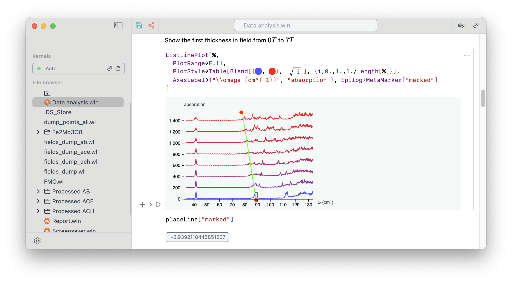

# Quick start
Wolfram Language Notebook __requires  `wolframscript` (see Freeware [Wolfram Engine](https://www.wolfram.com/engine/) or Wolfram Kernel)__ installed on your PC/Mac. This application will check all paths and ask to locate a Wolfram executable if nothing is found.

:::warning
Works only with Wolfram Engine $\geq$ __13.0.0__. The version __13.0.1__ is more preferable.
:::



There are two ways you can choose from

import Tabs from '@theme/Tabs';  
import TabItem from '@theme/TabItem';

## Desktop application
Notebook interface is shipped as an Electron application, which is cross-platform and has most benefits of a native desktop app. __This is the easiest way__

[Releases](https://github.com/JerryI/wolfram-js-frontend/releases)

<Tabs  
defaultValue="Windows"  
values={[  
{label: 'Windows', value: 'Windows'},  
{label: 'Linux', value: 'Linux'},  
{label: 'Mac', value: 'Mac'},  
]}>  
<TabItem value="Windows">
- [Windows](https://github.com/JerryI/wolfram-js-frontend/releases/download/2.0.0/WLJS.Notebook.Setup.2.1.9.exe)
</TabItem>  
<TabItem value="Linux">
- [Linux (Deb)](https://github.com/JerryI/wolfram-js-frontend/releases/download/2.0.0/wljs-notebook_2.1.9_amd64.deb)
- [Linux (AppImage)](https://github.com/JerryI/wolfram-js-frontend/releases/download/2.0.0/WLJS.Notebook-2.1.9.AppImage)
</TabItem> 
<TabItem value="Mac">

- [M1](https://github.com/JerryI/wolfram-js-frontend/releases/download/2.0.0/WLJS.Notebook-2.1.9-arm64.dmg)
- [Intel](https://github.com/JerryI/wolfram-js-frontend/releases/download/2.0.0/WLJS.Notebook-2.1.9.dmg)

</TabItem>  
</Tabs>

It comes with a launcher, that takes care about all updates, files extension association and etc.
## Server application
Since this is a web-based application, you can also run on a server. User interface is  reachable from any modern browser. Clone a master branch and run `wolframscript`

```bash
git clone https://github.com/JerryI/wolfram-js-frontend
cd wolfram-js-frontend
wolframscript -f Scripts/start.wls
```

It will take some time to download all core plugins, after that you can start using it by opening your browser 

```bash
...
Open http://127.0.0.1:20560 in your browser
```

