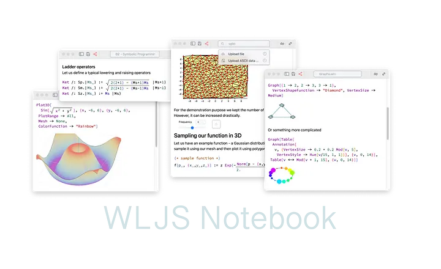

# Quick start
Wolfram Language Notebook __requires  `wolframscript` (see Freeware [Wolfram Engine](https://www.wolfram.com/engine/) or Wolfram Kernel)__ installed on your PC/Mac. 

:::note
Tested with Wolfram Engine 13.X - 14.X
:::



<h2 style={{'text-align':'center'}}> 

[Overview 🚀](frontend/Overview.md) 

</h2>


There are two ways you can choose from

import Tabs from '@theme/Tabs';  
import TabItem from '@theme/TabItem';

## Desktop application
Notebook interface is shipped as an Electron application, which is cross-platform and has most benefits of a native desktop app. __This is the easiest way__

[Releases](https://github.com/JerryI/wolfram-js-frontend/releases)

<Tabs  
defaultValue="Windows"  
values={[  
{label: 'Windows', value: 'Windows'},  
{label: 'Linux', value: 'Linux'},  
{label: 'Mac', value: 'Mac'},  
]}>  
<TabItem value="Windows">
- [Windows](https://github.com/JerryI/wolfram-js-frontend/releases/download/2.4.5/WLJS.Notebook.Setup.2.4.5.exe)
</TabItem>  
<TabItem value="Linux">
- [Linux (Deb)](https://github.com/JerryI/wolfram-js-frontend/releases/download/2.4.5/wljs-notebook_2.4.5_amd64.deb)
- [Linux (AppImage)](https://github.com/JerryI/wolfram-js-frontend/releases/download/2.4.5/WLJS.Notebook-2.4.5.AppImage)
</TabItem> 
<TabItem value="Mac">

- [M1](https://github.com/JerryI/wolfram-js-frontend/releases/download/2.4.5/WLJS.Notebook-2.4.5-arm64.dmg)
- [Intel](https://github.com/JerryI/wolfram-js-frontend/releases/download/2.4.5/WLJS.Notebook-2.4.5.dmg)

</TabItem>  
</Tabs>

It comes with a launcher, that takes care about all updates, files extension association and etc. Also see [releases](https://github.com/JerryI/wolfram-js-frontend/releases) page for more portable installation bundles (no docs).

For all options fully offline work is 100% possible.

## Server application
Since this is a web-based application, you can also run on a server. User interface is  reachable from any modern browser. Clone a master branch and run `wolframscript`

```bash
git clone https://github.com/JerryI/wolfram-js-frontend
cd wolfram-js-frontend
wolframscript -f Scripts/start.wls
```

It will take some time to download all core plugins, after that you can start using it by opening your browser 

```bash
...
Open http://127.0.0.1:20560 in your browser
```

To start server on a specific hostname

```shell
wolframscript -f Scripts/start.wls host 0.0.0.0 http 8080 ws 8081 ws2 8082 docs 8085
```

that will open __an HTTP server__ on `8080` port with `8081`, `8082` __used for realtime communication__ and __docs pages__ at `8085`

### Extra arguments

- set the home folder (overrides settings)
```
wolframscript -f Scripts/start.wls folder "Demos"
```

- disable autolaunch of the evaluation kernel
```
wolframscript -f Scripts/start.wls noautolaunch True
```

- disable autotest
```
wolframscript -f Scripts/start.wls bypasstest True
```


## Sponsorship
To help maintain this project ❤️
- [GitHub Sponsors](https://github.com/sponsors/JerryI)
- [__PayPal__](https://www.paypal.com/donate/?hosted_button_id=BN9LWUUUJGW54)

## Media
- YTS 📽️ [You don't need to program your figures manually](https://youtube.com/shorts/Z76dMHK8POM?feature=share)
- YTS 📽️ [How to do Dynamics in Computation Notebook](https://youtube.com/shorts/T-ryDA1Sb3g?feature=share)
- YTS 📽️ [We made AI Copilot in your Notebook 🤖](https://youtube.com/shorts/6s9m5ZGPkdE?feature=share)
- YTS 📽️ [AI Copilot in your Notebook. Part 2 🤖](https://youtube.com/shorts/B_ZVjN9cvQM?feature=share)

## Publications 📢
- *Medium* May 2024: [Reinventing dynamic and portable notebooks with Javascript and Wolfram Language](https://medium.com/@krikus.ms/reinventing-dynamic-and-portable-notebooks-with-javascript-and-wolfram-language-22701d38d651)
- *Yandex Open Source Jam* April 2024: [Dynamic notebook interface + Wolfram Language](https://www.youtube.com/watch?v=tmAY_5Wto-E) (Russian language only)
- *DPG2024 Berlin March 2024*: [Computational Notebook as a Modern Multitool for Scientists](https://www.dpg-verhandlungen.de/year/2024/conference/berlin/part/agi/session/4/contribution/4), [Slides](https://www.dpg-physik.de/vereinigungen/fachuebergreifend/ag/agi/veranstaltungen/tagungen-und-workshops/berlin_2024/agi-4_4-kirill-vasin.pdf)
- *Habrahabr* October 2023 [Open-source блокнот Wolfram Language или как воссоздать минимальное ядро Mathematica на Javascript и не только](https://habr.com/ru/articles/767490/) (Russian language only)
- *Habrahabr* October 2023 [Wolfram Language JavaScript Frontend](https://habr.com/ru/articles/766360/) (Russian language only)