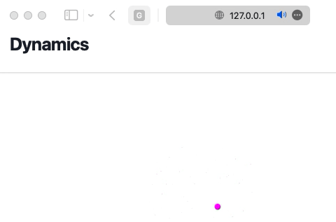
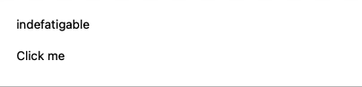

# Dynamics

import Theme from "./theme.js";
<Theme></Theme>

There is no need in crafting your own API to interact with a working Wolfram Kernel to bring input elements update the data in real-time. 

:::note
It is assumed you have read an [interpeter](interpeter.md) page first
:::
## Preparations
The general idea is to use WebSockets protocol for the communication, for that one need to set up a corresponding server [WebSocketHandler](https://github.com/KirillBelovTest/WebSocketHandler) written by Kirill Belov. Please see his repo for more details regarding this server. One need only to set an hostname and port for it and assign it __to a separate TCP server__.

After that, to handle the connection between WLJS Interpreter and Wolfram Kernel another package [WLJSTransport](https://github.com/JerryI/wl-misc/blob/main/Kernel/WLJSIO.wl) is needed, that hooks up to a WebSocket handler.

If you think it is not enough, then, to handle events that comes from WLJS we also need [Events](https://github.com/JerryI/wl-misc/blob/main/Kernel/Events.wl) library, __which is not available @ Wolfram Paclet Repository__, and can be installed only using [LPM package manager](https://github.com/JerryI/wl-localpackages), since it modifies system functions.

<details>  
<summary>A shortcut</summary>  
If you have git installed. Simply clone 
```bash
git clone https://github.com/JerryI/wl-wlx
cd wl-wlx
wolframscript -f Examples/WLJSBasicDyn.wls
```
that will run the simplest example possible
</details>
### TL;DR Boilerplate code
This will establish an HTTP and WS listeners at the corresponding addresses mentioned in code and will configure all handlers

```mathematica
#!/usr/bin/env wolframscript

PacletInstall["JerryI/LPM"]
<< JerryI`LPM`

PacletRepositories[{
  Github -> "https://github.com/KirillBelovTest/Objects",
  Github -> "https://github.com/KirillBelovTest/Internal",
  Github -> "https://github.com/JerryI/CSocketListener",
  Github -> "https://github.com/KirillBelovTest/TCPServer",
  Github -> "https://github.com/KirillBelovTest/HTTPHandler",
  Github -> "https://github.com/KirillBelovTest/WebSocketHandler",
  Github -> "https://github.com/JerryI/wl-misc",
  Github -> "https://github.com/JerryI/wl-wlx"
}]

(* Here you can configure *)
ENV = <|
    "WSPort"->8011,
    "HTTPPort"->8010,
    "Host"->"127.0.0.1"
|>

ENV["HAddr"] := StringTemplate["``:``"][ENV["Host"], ENV["HTTPPort"]]
ENV["WAddr"] := StringTemplate["``:``"][ENV["Host"], ENV["WSPort"]]

(* TCP Server *)
<<KirillBelov`Objects`
<<KirillBelov`Internal`
<<KirillBelov`CSocketListener`
<<KirillBelov`TCPServer`

(* HTTP services *)
<<KirillBelov`HTTPHandler`
<<KirillBelov`HTTPHandler`Extensions`

(* WS services *)
<<KirillBelov`WebSocketHandler`

(* Event handling and WLJS communication *)
<<JerryI`Misc`Events`
<<JerryI`Misc`WLJS`Transport`

(* WLX scripts *)
<<JerryI`WLX`
<<JerryI`WLX`Importer`
<<JerryI`WLX`WLJS`

SetDirectory[If[StringQ[NotebookDirectory[]], NotebookDirectory[], DirectoryName[$InputFileName]]]


Print["Staring HTTP server..."];

tcp = TCPServer[];
tcp["CompleteHandler", "HTTP"] = HTTPPacketQ -> HTTPPacketLength;
tcp["MessageHandler", "HTTP"] = HTTPPacketQ -> http;

(* our main file for all requests *)
index := ImportComponent["index.wlx"];

http = HTTPHandler[];

http["MessageHandler", "Index"] = AssocMatchQ[<|"Method" -> "GET"|>] -> Function[x, index[x]]

httplistener =  Check[CSocketListen[ENV["HAddr"], tcp@# &], Print["Fallback to ZMQ sockets... Might be unstable"]; SocketListen[ENV["HAddr"], tcp@# &]];


Print["Staring WS/HTTP server..."];

wcp = TCPServer[]
wcp["CompleteHandler", "WebSocket"] = WebSocketPacketQ -> WebSocketPacketLength
wcp["MessageHandler", "WebSocket"]  = WebSocketPacketQ -> ws

ws = WebSocketHandler[]

(* configure the handler for WLJS communications *)
ws["MessageHandler", "Evaluate"]  = Function[True] -> WLJSTransportHandler

(* symbols tracking *)
WLJSTransportHandler["AddTracking"] = Function[{symbol, name, cli, callback},
    Print["Add tracking... for "<>name];
    Experimental`ValueFunction[Unevaluated[symbol]] = Function[{y,x}, callback[cli, x]];
, HoldFirst]

WLJSTransportHandler["GetSymbol"] = Function[{expr, client, callback},
    Print["evaluating the desired symbol on the Kernel"];
    callback[expr // ReleaseHold];
]

Check[CSocketListen[ENV["WAddr"], wcp@#&], Print["Fallback to ZMQ sockets... Might be unstable"]; SocketListen[ENV["WAddr"], wcp@#&]];

(* reseved keyword for WLJS interpreter *)
SetAttributes[Offload, HoldFirst];

StringTemplate["open http://``"][ENV["HAddr"]] // Print;
While[True, Pause[1]];
```

:::info
Please, save your notebook or `.wls` script to some directory
:::

This code will run an http server at `127.0.0.1:8010` and serve a single file `index.wlx`. Therefore you should __open the root folder of your script or notebook__ and create the following file

```mathematica title="yourproject/index.wlx"
Main = ImportComponent["main.wlx"];
<Main Request={$FirstChild}/>
```

This will redirect the request to `main.wlx`, where you application will be located. It forces Wolfram Kernel to dynamically import it every-time you open a web-page, unlike `index.wlx`, which was imported once and cached at the startup.

```jsx title="yourproject/main.wlx"
App = ImportComponent["app.wlx"];
(* /* HTML Page */ *)

<html> 
    <head>
        <title>WLX Template</title>
        <link href="https://unpkg.com/tailwindcss@^1.0/dist/tailwind.min.css" rel="stylesheet"/>  
		<WLJSHeader>
			https://cdn.statically.io/gh/JerryI/wljs-interpreter/main/src/interpreter.js
			https://cdn.statically.io/gh/JerryI/wljs-interpreter/main/src/core.js
			https://cdn.statically.io/gh/JerryI/wljs-graphics-d3/main/dist/kernel.js
			https://cdn.statically.io/gh/JerryI/wljs-plotly/main/dist/kernel.js
			https://cdn.statically.io/gh/JerryI/wljs-inputs/main/dist/kernel.js
			https://cdn.statically.io/gh/JerryI/Mathematica-ThreeJS-graphics-engine/master/dist/kernel.js
		</WLJSHeader>
		<WLJSTransportScript Regime={"Standalone"} Port={ENV["WSPort"]}></WLJSTransportScript>
    </head>  
    <body> 
        <div class="min-h-full">
            <header class="bg-white shadow">
                <div class="flex items-center mx-auto max-w-7xl px-4 py-6 sm:px-6 lg:px-8">
                    <h1 class="text-3xl font-bold tracking-tight text-gray-900">Dynamics</h1>
                </div>
            </header>
            <main>
                <div class="mx-auto max-w-7xl py-6 sm:px-6 lg:px-8">
                    <App/>
                </div>
            </main>
        </div>
    </body>
</html>
```

And your actual application will be in a file

```jsx title="youproject/app.wlx"
<p>Hello world!</p>
```

Now we are ready to explore!

## Data-binding
The binding between Wolfram Kernel symbols and variables located at your browser is done in the same way as in [Dynamics](../frontend/Tutorial/Dynamics.md) of WLJS Frontend. Anytime you need to bind something, it has to be held (i.e. prevent evaluation on Wolfram Kernel's side)

```jsx title="youproject/app.wlx"
p     = {0,0};
Graph = Graphics[{PointSize[0.05], Magenta, Point[p // Offload]}];

SessionSubmit[ ScheduledTask[p = RandomReal[{-1,1},2], {Quantity[1, "Seconds"], 3}]];

<WLJS>
	<Graph/>
</WLJS>
```

:::tip
Use `Offload` wrapper to tell, which symbol to keep for WLJS Intepreter, that it will not be evaluated on Wolfram Kernel. 
:::

:::warning
In a guide for WLJS Frontend a different wrapper (see [Dynamics](../frontend/Tutorial/Dynamics.md)) is used - `Hold`, we would recommend to always apply `Offload` instead, which does the same thing. 
:::

The trick is to prevent the evaluation of certain symbols on Wolfram Kernel, so that Javascript in your browser will try to fetch them from the server via Websockets. It will automatically get subscription for every fetched symbol. 

<div style={{"text-align": "center"}}>



</div>

### Checking if client is alive
In the example above every request causes `ScheduledTask` to be evaluated, but it is good to have a method to detect if a client closed a window and abort the task.

Therefore we need somehow identify the client with his opened browser tab. Since the whole App is regenerated for each request we can provide an identifier in the very beginning

```jsx title="MODIFY yourproject/main.wlx"
App     = ImportComponent["app.wlx"];
{ /* highlight-next-line */ }
Session = CreateUUID[]; (* /* !!! */ *)

(* /* HTML Page */ *)

<html> 
    <head>
        <title>WLX Template</title>
        <link href="https://unpkg.com/tailwindcss@^1.0/dist/tailwind.min.css" rel="stylesheet"/>  
		<WLJSHeader>
			https://cdn.statically.io/gh/JerryI/wljs-interpreter/main/src/interpreter.js
			https://cdn.statically.io/gh/JerryI/wljs-interpreter/main/src/core.js
			https://cdn.statically.io/gh/JerryI/wljs-graphics-d3/main/dist/kernel.js
			https://cdn.statically.io/gh/JerryI/wljs-plotly/main/dist/kernel.js
			https://cdn.statically.io/gh/JerryI/wljs-inputs/main/dist/kernel.js
			https://cdn.statically.io/gh/JerryI/Mathematica-ThreeJS-graphics-engine/master/dist/kernel.js
		</WLJSHeader>
		{ /* highlight-next-line */ }
		<WLJSTransportScript Regime={"Standalone"} Port={ENV["WSPort"]} Secret={Session}></WLJSTransportScript> (* /* !!! */ *)
    </head>  
    <body> 
        <div class="min-h-full">
            <header class="bg-white shadow">
                <div class="flex items-center mx-auto max-w-7xl px-4 py-6 sm:px-6 lg:px-8">
                    <h1 class="text-3xl font-bold tracking-tight text-gray-900">Dynamics</h1>
                </div>
            </header>
            <main>
                <div class="mx-auto max-w-7xl py-6 sm:px-6 lg:px-8">
                { /* highlight-next-line */ }
                    <App Secret={Session}/> (* /* !!! */ *)
                </div>
            </main>
        </div>
    </body>
</html>
```

```jsx title="MODIFY yourproject/app.wlx"
p     = {0,0};
Graph = Graphics[{PointSize[0.05], Magenta, Point[p // Offload]}];
{ /* highlight-start */ }
task = With[{Secret = Secret},
    SessionSubmit[ ScheduledTask[
        If[!WLJSAliveQ[Secret], Print["Task is dead"]; TaskRemove[task], Print["Task is alive"]];
        p = RandomReal[{-1,1},2];
    , Quantity[1, "Seconds"]]]
];
{ /* highlight-end */ }
<WLJS>
	<Graph/>
</WLJS>
```

As one can see, here a special expression is used to check if our client is still online
```mathematica
WLJSAliveQ[Secret]
```

That function simply tries to write something to the socket, and detects it it fails for whatever reason.

## Input elements
The whole collection of projects use WLJS follows the same paradigm, explained @ [Dynamics](../frontend/Tutorial/Dynamics.md#) (Event-based approach). 

:::note
It is assumed you applied tricks from [Checking if client is alive](#Checking%20if%20client%20is%20alive) section to your files.
:::

:::info
Input elements are provided by the library [wljs-inputs](https://github.com/JerryI/wljs-inputs/tree/main), however you should use `View` components directly as explained [there](../frontend/Tutorial/Input%20elements.md), since there is no frontend functionality available to do it in a prettier way.
:::

For example, let us use a button to generate a random word for us

```mathematica title="yourproject/app.wlx"
text     = "nothing";
View     = TextView[Offload[text]] // WLJS;
Button   = ButtonView["Press me", "Event"->Secret] // WLJS; 

EventHandler[Secret, Function[void, text = RandomWord[]]];

<div>
    <View/>
    <Button/>
</div>
```

Here we use our `Secret` string as an identifier for the event object. UI elements are shipped as so-called views, that allows them to act like an indicators as well as an event generators if `Event` option is provided.

<div style={{"text-align": "center"}}>



</div>


__Please see [examples section](examples/) for more practical cases__

## Misc
Anytime from your javascript code you can emit an event by
```js
server.emitt("uid", "data")
```


