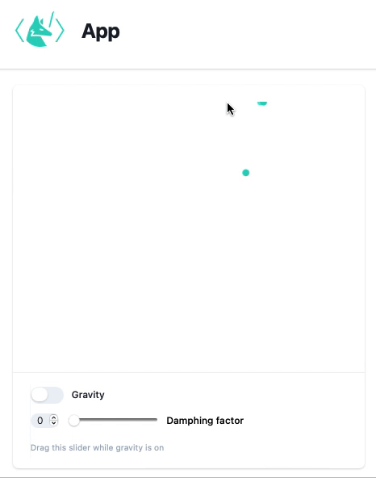

# Bouncing balls

import Theme from "./../theme.js";
<Theme></Theme>

A bouncing balls simulation, that runs in real-time and uses user's mouse to add balls to the simulation.

:::info
It is assumed that you have cloned git repository with examples. If not

```bash
git clone https://github.com/JerryI/wl-wlx
cd wl-wlx
```
:::

## Action
To get the most of your attention I (@JerryI - maintainer) would like to start with a short demo of this application



*a time jitter is due to the recordings issues*

To run this demo 
```bash
wolframscript -f Examples/App.wls
```

## Description

The first example uses HTTP and WS servers and dynamic mode of WLJS Interpreter. The project structure is following

```project
	App.wls 			main startup file
	App/				public directory
	components/
		head.wlx		header component
		logo.wlx		logo of WLX in svg
		styles.wlx		CSS table for styling UI elements
		toggle.wlx		a custom toggle button component
		ui.wlx			UI layout of an app
		
	app.wlx				actual application file with code and logic
	index.wlx			entry point of any request to an app
	main.wlx			main layout
```

This example widely uses event handling and data-binding we talked about in [dynamics](../dynamics.md) section. The whole logic of `app.wlx` file can be exploded into a few groups

1. initialization of variables needed for calculations
2. actual calculations / logic
3. event binding to UI elements
4. layout of an App made out of components

The __first two__ are identical to what you usually do in the notebooks you have, i.e.
```mathematica titile="app.wlx"
(* /* initialization */ *)
dots = {{0.,0.5}};
vels = {0.};
damphing = 0.;

(* /* whatever calculations... */ *)
append[xy_] := With[{}, 
   If[Length[dots] > 100,
      dots = Append[Drop[dots, 50], xy]; vels = Append[Drop[vels, 50], RandomReal[]/5.0];
   ,
      dots = Append[dots, xy]; vels = Append[vels, RandomReal[]/5.0];
   ];
];  
(* /* whatever calculations... */ *)
(* /* whatever calculations... */ *)
manyBodySim := Module[{newState = dots},
   dots = MapIndexed[With[{i = #2[[1]], y = #1[[2]]},
      vels[[i]] = (1.0 - damphing / 10.0) vels[[i]] - Sign[y] 0.1;
      With[{calculated = y + vels[[i]] 0.1},
         (* /* bounce back if hit the ground */ *)
         If[Sign[y] (calculated) < 0, 
            vels[[i]] = - vels[[i]];
            {#1[[1]], Sign[y] 0.001}
         ,
            {#1[[1]], calculated}
         ]
      ]


   ]&, newState];
];
(* /* whatever calculations... */ *)
```

The interesting thing here __is a mouse listener__, that works purely on WLJS Interpreter

```mathematica title="app.wlx"
(* /* mouse listener */ *)
listener = {White, EventHandler[Rectangle[{-10, 10}, {10,-10}], {"mousemove"->append}]};
```

This is a giant rectangle, on which an `EventHandler` was attached, then each time you move your mouse it fires `append` function on Wolfram Kernel.

:::note
More about handlers see [Dynamics](../../frontend/Tutorial/Dynamics.md) (__Inline event handlers__)
:::


An event binding is quite straightforward, for example when a user presses a toggle switch for *gravity* it fires an event with a postfix `-gravity`, for that there is a dedicated event-handler defined

```mathematica title="app.wlx"
EventHandler[StringJoin[RequestID, "-gravity"], Function[start, 
   If[start,
      If[Head[task] === TaskObject, TaskRemove[task]];
      task = SessionSubmit[ScheduledTask[manyBodySim, Quantity[1/27.0, "Seconds"]]];
   ,
      TaskRemove[task];
      task = Null;
   ]
]];
```

and here is the corresponding switch

```jsx title="components/ui.wlx"
(* /* custom built component */ *)
ToggleView = ImportComponent["components/toggle.wlx"];

...

<ul role="list" class="divide-x divide-gray-100">
    <Styles/>
    <li class="flex justify-between gap-x-6 py-1">
       <div class="flex min-w-0 gap-x-4">
          <div class="min-w-0 flex-auto">    
            <ToggleView UID={StringJoin[SID, "-gravity"]} Label={"Gravity"}/>
          </div>
       </div>
    </li>
    
...
```

where `SID` is passed as an argument from `app.wlx`. `SID` is unique for each client or request as well as all variables used in `wlx` scripts.

`ToggleView` component was created, because there is no such nice toggle switch in a standard library [wljs-inputs](https://github.com/JerryI/wljs-inputs) and in general it is good to show how you can construct your own UI element from scratch. Here is a code of it

```jsx title="components/toggle.wlx"
<div class="flex items-center" id="{UID}">
    <style>
        .bg-wlx-500 {
            background-color: #2dd4bf;
        }
    </style>
    <button type="button" class="bg-gray-200 relative inline-flex h-6 w-12 flex-shrink-0 cursor-pointer rounded-full border-2 border-transparent transition-colors duration-200 ease-in-out focus:outline-none focus:ring-2 focus:ring-indigo-600 focus:ring-offset-2" role="switch" aria-checked="false" aria-labelledby="annual-billing-label">
        <span aria-hidden="true" class="translate-x-0 pointer-events-none inline-block h-5 w-6 transform rounded-full bg-white shadow ring-0 transition duration-200 ease-in-out"></span>
    </button>
    <span class="ml-3 text-sm" id="annual-billing-label">
        <span class="font-medium text-gray-900"><Label/></span>
    </span>
    <script type="module">
        const body = document.getElementById("<UID/>");
        const button = body.getElementsByTagName("button")[0];
        const span = button.firstChild;
        let state = false;
        button.addEventListener("click", () => {
            button.classList.toggle("bg-wlx-500");
            span.classList.toggle("translate-x-5");
            state = ~state;
            server.emitt("<UID/>", state ? 'True' : 'False')
        })
    </script>
</div>
```

It uses an embedded Javascript code to animate and fire an event to a server.

The good thing about this __it can be reused in any other app__ by just importing it. So one can build its own library of UI element and not rely on mine (@JerryI) [wljs-inputs](https://github.com/JerryI/wljs-inputs).